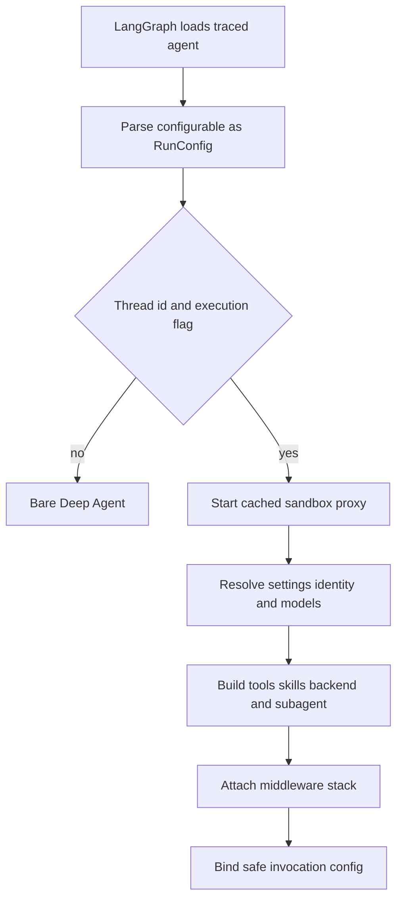

# Coding-agent graph assembly

`get_agent(config)` in `agent/server.py` is the composition boundary for the primary coding agent. An executable thread run resolves its sender authority and durable settings, begins connecting its backend, constructs models, tools, skills and the independently compiled subagent, then passes the resulting surface and middleware stack to `create_deep_agent`. The deployed `agent` graph is `agent.graphs.agent:traced_agent`.

## Load gate and preparation flow

This is the graph-factory preparation flow; per-run prompt and sender context are prepared later by middleware.

The factory sets `DEFAULT_RECURSION_LIMIT`. It only performs thread-bound assembly when both `configurable.thread_id` exists and `__is_for_execution__ is True`; discovery/state reads receive a bare agent with an empty prompt and no supplied tools, backend, or middleware. Before binding either result, `bindable_config` strips `__pregel_*` internals: LangGraph reinjects those runtime values at invocation, and binding a read-time runtime would break later state reads.

`RunConfig` is deliberately a forgiving cross-launcher contract. Its fields are optional, unknown `configurable` keys are retained, and parsing removes individual invalid fields rather than discarding the whole run. It also rejects a boolean where an integer identifier is expected, avoiding a value such as `pr_number=True` silently becoming `1`.

## Authority, sandbox, and durable settings

The triggering `profile_login` determines authorization and personal integrations. Thread settings are a different ownership boundary: they are seeded from the initial sender profile and then retained by the thread, so participation in a later message does not silently change model or repository decisions.

The factory starts a cached `SandboxBackendProxy` while loading settings. Its reconnect callback creates a `LocalShellBackend` for desktop runs; hosted runs call `ensure_sandbox_for_thread` with the selected workspace. Hosted sandbox lifecycle reconnects an existing id and refreshes its proxy, or creates and records a new sandbox. An unreachable existing sandbox is not replaced by default because a replacement could lose uncommitted work; a deleted sandbox is replaced so a stale id cannot permanently block the thread. Desktop validates `local_project_path` against the registered-project allowlist or the desktop worktree root before making a local shell backend.

## Model resolution and routing

The main and general-purpose-subagent model/effort pairs resolve in this order:

1. Workspace defaults (desktop uses the desktop default pair).
2. The triggering profile's main override; it initially applies to both agents, then an explicit profile subagent override can replace the subagent pair.
3. Stored thread settings, including its model-routing preference.
4. A canonical, supported per-run `agent_model_id`/`agent_effort` pair.

For hosted runs the resolved main/subagent settings, routing preference, and repository instructions are stored before the Fable availability gate. Thus the deployment-wide Fable decision is evaluated on every run rather than persisted into a thread. A Slack `/oswe` question overrides the active pair to the fast route after storage and disables adaptive routing for that run.

When routing is enabled, the factory builds the workspace fast, balanced, and performance models and installs `ModelSelectionMiddleware`; routing metadata belongs in `config["metadata"]`, while the resolved primary id is written to `configurable`. Provider keyword arguments are made separately for primary, subagent, and title models. `_make_model_or_defer` allows graph compilation even when provider construction fails, surfacing the failure at model-call time. A fallback is installed only if its model id differs from the selected primary model.

## Prompt and run-local context

The factory gives Deep Agents an empty static `system_prompt`. `PrepareAgentRunMiddleware` instead resolves fresh run inputs and writes `rendered_system_prompt`; `BasePrepareRunMiddleware` prepends that value as the system message on each model request. `construct_system_prompt` renders the ordered main template, including working environment, dashboard and source guidance, plan guidance, repository setup, task/dependency and untrusted-comment guidance, commit/PR guidance, repository/workspace instructions, optional admin guidance, and the shared base. `render_open_swe_shared_base` adds sandbox-download guidance only when that capability is available.

Sender-scoped material intentionally stays out of that durable prompt. Preparation resolves sender identity, commit attribution, user instructions, and participant identities and inserts the resulting generated context after the triggering human input. Dynamic-context hashes prevent duplicating context still visible to the model; summarization-aware visibility means context that has fallen behind a summary cutoff can be introduced again. The input-message helpers serialize messages and identity/context blocks with validated namespaced ids and XML escaping, keeping untrusted channel topic/purpose marked untrusted.

Preparation is checkpointed by a fingerprint of middleware type, latest message, and preparation configuration. A resumed invocation with the same checkpoint skips completed setup, but a later turn prepares fresh credentials, prompts, and context. Since an error before checkpoint persistence can retry setup, implementations must be idempotent.

## Backend and skills

The parent backend is a `CompositeBackend` with the sandbox proxy as default. It overlays read-only skills:

- bundled skills from a virtual `FilesystemBackend`;
- hosted organization skills from a shared LangGraph store namespace;
- hosted personal skills from a credential-verified user's store namespace; or
- desktop personal skills from a read-only `StateBackend` snapshot.

The ordered `skill_sources` are passed to both parent and general-purpose subagent. For hosted runs with unknown credential scope, `WorkspaceSkillsMiddleware` makes workspace skills available without granting personal tools or MCP access. Desktop also routes Deep Agents' virtual `/large_tool_results/` and `/conversation_history/` directories to a per-thread artifact root outside the selected project, so history and tool-result offloads do not become Git changes.

## Static tools and dynamic integrations

The parent starts with a curated static surface: web access, planning, background work, thread and sandbox controls, review/automation tools, and conditionally Slack and admin controls. Personal instruction/skill/settings tools disappear when private credential ownership cannot be verified; channel-history reads require a private thread. Slack tools require trusted Slack/schedule context, and a Slack DM removes DM-inappropriate tools. Incident sessions may add incident tools and automatic incident turns receive a more restrictive surface. Desktop is restricted to `http_request`, `fetch_url`, and `web_search`; stop-summary mode is restricted to Slack thread read/reply.

`DynamicToolMiddleware` carries connected workspace MCP and Notion tool schemas rather than adding them to `static_tools`. They are loaded in parallel during assembly only for non-desktop, non-stop-summary runs with a known credential scope. At run start the middleware resets the selection; the model must call `load_integration_tools` before it may call a dynamic tool. Per-group locks serialize expensive construction, failures become unavailable-tool responses, and reserved/static/Deep-Agent names cannot collide. `IntegrationGroup` can instead advertise names and defer its credential or MCP handshake until selection.

`ExcludeToolsMiddleware` always removes Deep Agents' `grep`; stop summaries and Slack-ask/automatic-incident modes apply their own broader exclusions. `PlanModeMiddleware` additionally filters its excluded set on every model request. It removes delegation and external mutation such as `task`, background execution, HTTP, PR, sandbox, skill, Slack move/start, workspace, and automation operations; it also includes names of loaded workspace MCP tools. File editing and `execute` remain available, so shell read-only behavior is an instruction rather than a hard enforcement boundary.

## Subagent boundary and middleware ordering

`PlanModeMiddleware` is installed unconditionally. Its `before_agent` hook resets state to this factory's initial `configurable.plan_mode` value, preventing a stale state value from leaking into a subsequent run. A mid-run `enter_plan_mode` updates state and restricts the next model call. Excluding `task` matters because the general-purpose subagent is a separately compiled graph and does not inherit its parent's plan filter.

The configured general-purpose subagent receives its own model, the same skills, shared-base/task prompt, and a filtered subset of static tools. It omits background execution and feedback tools, plus parent-context-sensitive Slack, thread, user-settings, and administrative tools. Parent middleware cannot secure it: it is explicitly given its own dynamic-tool/exclusion stack, workflow and hosted PR-creation guards, model sanitization/error handling/timeout, conversation offloading, and incident middleware where relevant.

The parent middleware list is ordered outermost to innermost. `ConversationOffloadingMiddleware` and `PrepareAgentRunMiddleware` are first, followed by optional incident/workspace-skill/dynamic-tool middleware. Input validation, model-call limit, tool errors, exclusions, subdirectory reads, and task retry follow; then PR/workflow guards, proxy refresh, and normally the message-queue check. Timeout wrap-up, step-limit notification, usage recording, optional route selection and fallback, and plan filtering precede provider/thinking sanitizers, stable tool-result ordering, model-error conversion, and the innermost `ModelCallTimeoutMiddleware`. That innermost timeout covers the provider call and can escalate outward to fallback. `create_deep_agent` supplies `PatchToolCallsMiddleware`, so the factory does not install the obsolete custom orphaned-tool-call repairer.

## Change and test guidance

Treat `get_agent` as the integration seam, but preserve the execution gate, sender-versus-thread ownership boundary, backend routing, and separately secured subagent. A parent-only guard is not a security control for delegated work. Test coverage in `tests/agent/test_agent_assembly_context.py` checks assembly context, skill routes, desktop/stop-summary and authority-dependent tool surfaces, parent-only subagent boundaries, backend wiring, and middleware composition. `tests/agent/test_factory_tool_loading.py` checks concurrent MCP/Notion loading and plan-mode interaction; `tests/models/test_agent_subagent_models.py` checks independent profile subagent overrides.

Related material: [Middleware Stack](middleware-stack.md), [Sandbox Lifecycle](sandbox-lifecycle.md), [Models & Profiles](../concepts/models-profiles-instructions.md), [Tools](../concepts/tools.md), and [Context Engineering](../workflows/context-engineering.md).
