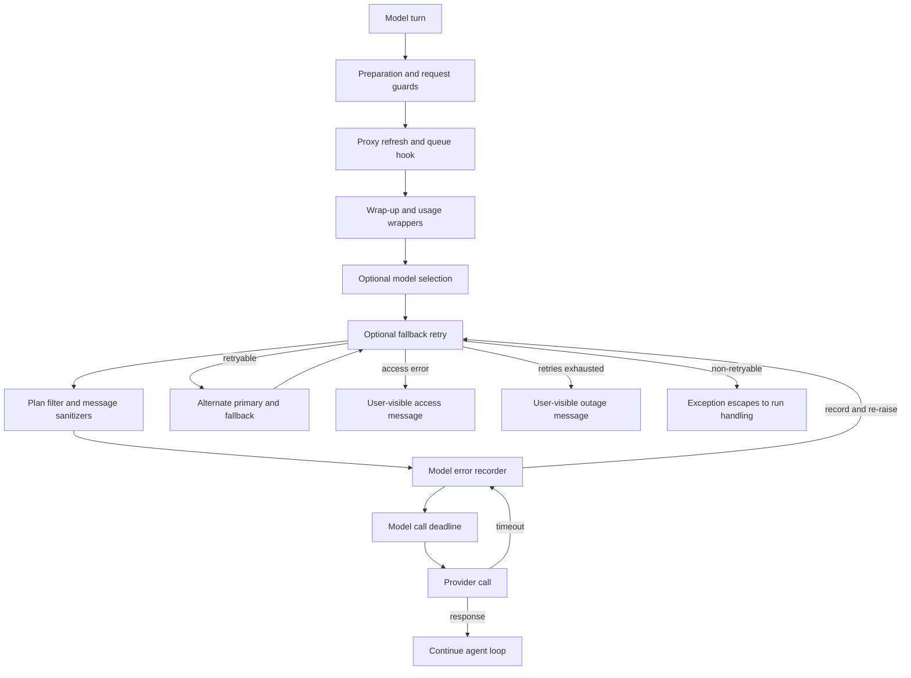

# Middleware stack and failure policy

`get_agent` and `get_reviewer_agent` give ordered lists to `create_deep_agent`. The list is an **outer-to-inner onion**: earlier wrappers see requests first and exceptions last. Consequently, order is a behavioral contract—especially for model deadlines, error recording, fallback, and completion hooks—not merely an implementation detail. See [Agent Graph](agent-graph.md), [Tools](../concepts/tools.md), [Follow-up messages](../workflows/follow-up-messages.md), and [PR creation](../workflows/pr-creation.md) for adjacent behavior.

## Coding-agent ordering

The coding-agent list is assembled outer to inner as follows. Conditional entries are absent when their condition is not met.

1. `ConversationOffloadingMiddleware`
2. `PrepareAgentRunMiddleware`
3. `IncidentMiddleware` for an incident session
4. `WorkspaceSkillsMiddleware` for eligible non-local, non-credential runs
5. `DynamicToolMiddleware` when integration groups exist
6. `SanitizeToolInputsMiddleware`
7. `ValidateImageReadsMiddleware`
8. `ModelCallLimitMiddleware`
9. `ToolErrorMiddleware`
10. `ExcludeToolsMiddleware`
11. `SubdirAgentsReadMiddleware`
12. `ToolRetryMiddleware` scoped to `task`
13. `PullRequestCreationGuardMiddleware`, except locally
14. `WorkflowPushGuardMiddleware`
15. `refresh_github_proxy_before_model`
16. `check_message_queue_before_model`, except in stop-summary mode
17. `TimeoutWrapupMiddleware`
18. `notify_step_limit_reached`
19. `record_run_usage`
20. `ModelSelectionMiddleware` when configured
21. `ModelFallbackMiddleware` when a distinct fallback resolves
22. `PlanModeMiddleware`
23. Fireworks, OpenAI Responses, and thinking-block message sanitizers
24. `StableToolResultOrderMiddleware`
25. `ModelErrorMiddleware`
26. `ModelCallTimeoutMiddleware`

`PrepareAgentRunMiddleware` is the lifecycle entrypoint. Its base class fingerprints the latest message, middleware class, and preparation configuration; checkpointed `run_prepared_for` skips completed setup only for the matching resumed invocation. A failed pre-checkpoint setup can execute again, so specializations must be idempotent. The wrapper then prepends the rendered system prompt to the request’s existing system message.

The early tool wrappers improve request quality before a call reaches a tool: dynamic tools and workspace skills add configured capabilities, `ExcludeToolsMiddleware` removes context-specific forbidden names, and `SanitizeToolInputsMiddleware` turns leading numeric text in `read_file` `offset` or `limit` into integers before validation. Plan mode is always installed later in the model path: it resets the state for the current run, recomputes tools on every turn, and removes its configured external-mutation tools when active. Thus `enter_plan_mode` constrains the next model turn, while stale state from a prior run cannot silently constrain a new run.

## Model-call path and terminal branches

The innermost layers make a provider call safe to observe and recover. Provider-message sanitizers and stable ordering prepare a compatible request. The deadline is innermost, so it covers the call itself; `asyncio.wait_for` turns a stalled transport into `ModelCallTimeoutError`, a `TimeoutError`. `ModelErrorMiddleware` records and re-raises it before the outer fallback gets to decide whether it is transient. `ModelSelectionMiddleware`, when present, sits outside fallback and can choose the route before the retry wrapper alternates models.

This is the coding-agent model path; the fallback branches exist only when fallback middleware is installed.

`ModelCallTimeoutMiddleware` reads `OPEN_SWE_MODEL_CALL_TIMEOUT_SECONDS`, using 900 seconds for missing, invalid, or non-positive values. It is deliberately longer than provider request timeouts, allowing provider-client retries first while still making a wedged websocket visible. `ModelErrorMiddleware` logs classified exception fields, writes the type and classification code to thread metadata when context permits, and re-raises the original exception unchanged.

`ModelFallbackMiddleware` retries only transient failures: connection and timeout errors, retryable `ModelError`, selected provider statuses (408, 409, 425, 429, 5xx, and 529), and overload-classified OpenAI errors. It makes six attempts by default—initial call plus backoffs of 0, 5, 15, 30, and 45 seconds with positive jitter—and alternates the primary and cross-provider fallback. A provider model-access error is immediately returned as a user-facing `AIMessage`; an exhausted transient budget normally returns an outage `AIMessage` so saved progress can be retriggered. Setting `surface_outage_message=False` instead re-raises the final error. Non-retryable errors escape.

## Queue, limits, policy, and bookkeeping

Before every eligible model turn, the proxy hook refreshes the sandbox GitHub-proxy token as needed. The queue hook reads the LangGraph store namespace `("queue", thread_id)`, consumes any auto-fix event, and deletes `pending_messages` *before* constructing updates. It then injects queued human messages oldest first. Delete-before-inject prevents duplicate delivery if the hook runs again; store and hook failures are logged and leave the turn able to continue.

`TimeoutWrapupMiddleware` starts its monotonic clock lazily on the first model call for its per-run instance. After `OPEN_SWE_WRAPUP_TIMEOUT_SECONDS`—45 minutes by default—it adds a completion instruction to the system message, without aborting the run. `ModelCallLimitMiddleware` ends at its configured limit; the after-agent step-limit hook can notify Slack. `record_run_usage` tags model responses with route and invocation identifiers, finalizes usage after completion, and also finalizes an invocation with error status when a wrapped model call raises. Usage persistence is therefore observability/accounting, not a replacement for model failure handling.

The policy wrappers are deliberately outside tool execution. The PR guard blocks shell-based PR creation outside the dedicated PR tool in non-local runs. The workflow-push guard only permits the policy-defined safe rewrite after recorded human approval, otherwise returning a blocked result. These outcomes are tool-level feedback for the model rather than arbitrary shell execution.

## Tool and sandbox failures

`ToolErrorMiddleware` is the primary tool failure boundary. Ordinary unhandled tool exceptions become `ToolMessage(status="error")` JSON with the type, text, and, when discoverable, the tool name, so the model can choose a correction. A `SandboxRetryableConnectionError` instead becomes a `sandbox_transient` error message: the SDK guarantees the WebSocket upgrade failed before the execute frame, so no command ran and retrying cannot duplicate a side effect.

A `SandboxConnectionError` other than `SandboxServerReloadError`, or `ResourceNotFoundError` for the sandbox resource, means the sandbox is unreachable. The middleware posts one user notification and re-raises to terminate the run rather than generating a sequence of failed calls and notifications. Notification selects an active Slack thread first, then Linear, then a configured GitHub issue or PR when a token is available. The coding agent does not automatically replace that sandbox because replacement could hide loss of uncommitted work.

For direct sandbox operations, `retry_transient_sandbox_errors` retries only the SDK-marked pre-start connection error, at most four times, with bounded exponential backoff and jitter. Separately, `ToolRetryMiddleware` wraps delegated `task` calls with two retries, one-second initial delay, and ten-second maximum delay. It accepts retryable HTTP statuses and named transport failures, including a subagent `ModelCallTimeoutError`; subagents lack this agent-level fallback. On exhaustion, invalid-prompt and context-length failures return structured `failed` data to the model, while other failures are re-raised.

## Reviewer differences and completion

The reviewer uses a smaller chain: `PrepareReviewerRunMiddleware`, `SanitizeToolInputsMiddleware`, `ModelCallLimitMiddleware`, `ToolErrorMiddleware`, proxy refresh, queue processing, `TimeoutWrapupMiddleware`, the three message sanitizers, `RepairOrphanedToolCallsMiddleware`, stable result ordering, `ModelErrorMiddleware`, `ModelCallTimeoutMiddleware`, and `settle_review_check_on_exit`.

It does not install conversation offloading, incident or workspace-skill middleware, dynamic tools, image-read validation, exclusion/subdirectory middleware, task retry, PR/workflow guards, usage recording, model selection, plan mode, or fallback. The reviewer-specific repair middleware supplies synthetic error results for orphaned tool calls before a later model call, avoiding provider rejection after interruption. Reviewer sandbox setup may replace an unreachable sandbox because its checkout is re-derived each run; if replacement fails, the error remains a typed `SandboxUnreachableError` and is notified.

`settle_review_check_on_exit` is a best-effort after-agent completion guarantee. If an unpublished tracked review check remains, it closes it as **neutral**, so reviewer infrastructure failure is not presented as a PR code failure. If publishing already completed but the check-completion PATCH failed, stored pending conclusion data is used to retry the real conclusion instead.

## Change and test guidance

Preserve outer-to-inner placement when changing this stack. Moving the deadline outside fallback would prevent deadline recovery; moving error recording outside fallback would miss errors that fallback converts to a message. Keep preparation idempotent and retain queue deletion before injection. Treat a sandbox failure as retryable only when the SDK establishes that execution never began.

Focused tests in `tests/middleware/` cover queue injection, preparation latching, input and provider-message sanitization, deadline cancellation, fallback eligibility and alternation, usage accounting, orphaned-call repair, stable tool ordering, and step-limit behavior. `tests/sandbox/test_reviewer_sandbox_recovery.py` verifies reviewer replacement, the coding-agent default refusal to replace, and preservation of the typed failure when replacement itself fails. Extend the closest of these tests whenever an ordering edge or failure conversion changes.
