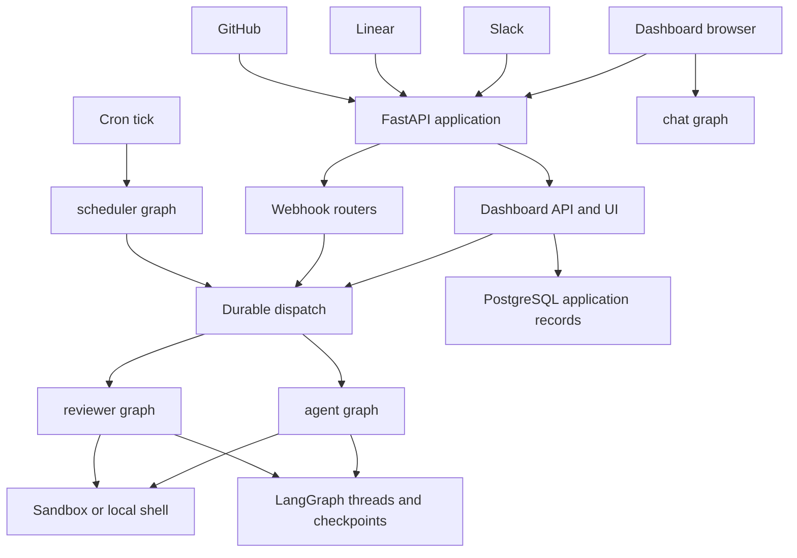

# Runtime architecture and product surfaces

Open SWE is a LangGraph deployment with a custom FastAPI application. FastAPI is the ingress and product-API boundary; LangGraph owns graph execution, threads, runs, and checkpoints. Five graph entrypoints separate coding, code review, review-style analysis, read-only pull-request chat, and scheduled work.

## Runtime map

`langgraph.json` is the cloud manifest. It registers stable, thin `agent/graphs/` entrypoints and mounts `agent.webapp:app`, which re-exports the assembled FastAPI application. The same manifest sets the checkpointer retention policy, loads `.env`, and attempts to bundle the dashboard; a failed UI build leaves the backend deployable.

| Graph | Entrypoint | Runtime responsibility |
|---|---|---|
| `agent` | `agent.graphs.agent:traced_agent` | Per-thread coding-agent factory with a sandbox or desktop backend. |
| `reviewer` | `agent.graphs.reviewer:traced_reviewer_agent` | Pull-request review and finding publication. |
| `analyzer` | `agent.graphs.analyzer:traced_analyzer` | Repository-specific review-style learning. |
| `chat` | `agent.graphs.chat:traced_chat_agent` | Read-only discussion of a pull request without a sandbox. |
| `scheduler` | `agent.graphs.scheduler:get_scheduler` | One-node dispatcher for cron-triggered maintenance and scheduled runs. |

This shows the principal request and ownership boundaries. `dispatch_agent_run` is the shared run-creation path for coding and reviewer work; chat, analyzer, and scheduler are independent registered graph entrypoints.

## HTTP host, startup, and browser API

`create_app` configures credentialed CORS from `DASHBOARD_ALLOWED_ORIGINS` and refuses `*`. It mounts the dashboard, plan, workflow-approval, Linear, Slack, GitHub, and health routers, then the optional static dashboard UI. The lifespan validates login, sandbox, local-LLM, and database configuration; migrates PostgreSQL; imports legacy workspace and user records; starts analytics and transcript listeners; and closes those resources and cached models during shutdown. A failed workspace import is deliberately non-fatal to startup, but repository routing then fails closed so GitHub receives a retryable `503` rather than silently dropping work.

The dashboard aggregate router is rooted at `/dashboard/api` and applies the same-origin mutation dependency to every included router. It is the browser-facing composition point for authentication, profiles and preferences, workspace/repository/review configuration, schedules, skills, threads, transcripts, integrations, incidents, and analytics. Its lazy `agent.dashboard.router` attribute prevents middleware imports of dashboard submodules from loading the entire FastAPI surface.

Webhook routes are separate FastAPI routers. GitHub and Linear verify their signatures before processing; GitHub also checks whether the event repository is routed to a workspace and returns `503` when ownership lookup is temporarily unavailable. Slack maps a channel and conversation timestamp to one agent thread, rejecting conflicting mappings rather than guessing. These controls make retry behavior and conversation continuity explicit at the integration boundary.

## Graph factories and work boundaries

The `agent` graph factory is evaluated for a run, not retained as a global agent instance. For an executable thread, `get_agent` resolves the sender identity, gets or reconnects the thread backend, starts it, normalizes thread settings, resolves models, and assembles tools, skills, subagents, and middleware. Without a thread ID—or when LangGraph loads a graph outside execution—it returns an empty deep agent without provisioning a backend. See [Agent Graph](./agent-graph.md) for the factory and state model.

The reviewer uses the same sandbox lifecycle but has a review-specific tool boundary: findings can be added, updated, listed, and published, while code-changing commit, push, and pull-request-opening tools are absent. It prepares repository and diff state so findings can be validated against changed lines before GitHub publication. The analyzer similarly provisions a workspace-scoped sandbox and creates a per-repository reviewer prompt from historical human reviews and prior finding outcomes. See [Reviewer and Analyzer](./reviewer-and-analyzer.md).

The chat graph has no sandbox. The dashboard chat proxy seeds the PR diff, findings, and overview as virtual `/pr/` files in the `files` state channel. It excludes shell and write/edit/delete filesystem tools, and resolves a repository-scoped GitHub App token for GitHub-backed reads instead of exposing a user credential.

The scheduler compiles a single-node `StateGraph`. Depending on `task`, it reconciles stale runs, evaluates baby-sit or expedited-review watches, monitors background tasks, refreshes workspace, session-cost, feedback, or agent-cost data, or launches a scheduled agent run. Required keys such as a watch key, thread ID, or schedule ID are checked before the corresponding work is launched.

## Durable runs, state, and persistence

`dispatch_agent_run` is the common contract for agent and reviewer triggers. `assistant_id` selects the graph and `source` supplies input identity plus logging/metadata. It rejects ambiguous attempts to combine a prebuilt input with content or identity parameters. The durable run helper defaults to interruption, synchronous checkpoints, resumable streaming, all dashboard stream modes, subgraph streaming, and the event-streaming compatibility marker. Thus a dashboard can attach to a run started by Slack, Linear, GitHub, or a schedule rather than only runs it initiated itself.

Completion notification is optional and fail-safe: dispatch only attaches the completion callback if its secret exists and the configured URL is absolute and non-loopback. Otherwise it creates the run without that webhook. The dispatcher also establishes an invocation ID and start time in both configuration and metadata, preserving an existing valid invocation identity.

LangGraph retains graph checkpoints and thread metadata. The application uses PostgreSQL for its own records, including pull-request and repository records, in an `open_swe` schema. Startup requires `POSTGRES_URI`, normalizes accepted PostgreSQL URI forms to `asyncpg`, runs migrations under a PostgreSQL advisory transaction lock, and disposes the process-cached SQLAlchemy engine on shutdown. Read APIs that need a stable multi-query view can use a repeatable-read, read-only snapshot transaction.

Sandbox connections are process-local, while the thread metadata records `sandbox_id` for reconnecting after a worker recycle. A missing or deleted sandbox is recreated; an existing but unreachable coding sandbox raises by default because replacement would silently discard uncommitted work. The reviewer may opt into replacement because it reconstructs its checkout. A newly created sandbox is written to thread metadata only after initialization, and becomes cache-visible only afterward. See [Threads and State](../concepts/threads-and-state.md).

## Cloud dashboard and desktop local runtime

The cloud manifest pins Python 3.14 and API version 0.13.3. Its checkpointer uses the `delete` strategy, sweeps every 60 minutes, and has a default TTL of 43,200 minutes.

The React dashboard uses TanStack Router, SSR query integration, a Vite-derived router base path, and route-level error handling. Its agent layout requires a session except for enabled desktop-local pages, and chooses the `cloud` or `local` streaming transport from the active route. See [Dashboard UI](../integrations/dashboard-ui.md).

Desktop starts a local `langgraph dev` backend on loopback, using `langgraph.desktop.json` in development or the packaged local backend manifest in production. The supervisor supplies a random bearer token, project allowlist and worktree paths, isolated checkpoint/artifact paths when available, waits for health, and proxies requests under `/local-graph` after stripping browser cookies. The desktop manifest exposes only the main agent, disables bundled UI and Studio authentication, and uses local authentication and a local checkpointer.

A desktop run uses `LocalShellBackend` only when `local_project_path` resolves to an existing allowlisted project or a path underneath `OPEN_SWE_LOCAL_WORKTREES_DIR`. Its shell inherits a narrow environment allowlist. Scratch routes for large tool results and evicted conversation history are outside the project, preventing them from appearing in a user's repository or being included by `git add -A`.

## Operations and focused verification

- Add a deployable graph by exporting it through `agent/graphs/` and registering it in the target manifest. Registration alone does not make it eligible for `dispatch_agent_run`, whose caller selects an assistant ID.
- Preserve the FastAPI composition and startup ordering when adding an ingress surface: migrations and application records are a runtime dependency, while integration failures should retain deliberate retry/fail-closed semantics.
- Treat a coding-sandbox reconnect failure as a recovery decision, not an ordinary cache miss; automatic replacement changes the working tree.
- When changing dispatch configuration, run `tests/agent/test_dispatch.py`; it checks durable defaults, stream compatibility, completion-webhook validation, invocation identity, structured input, and dashboard activity behavior.
- When changing desktop process lifecycle or proxying, run `desktop/test/backend-supervisor.test.cjs`; it covers launch target construction, concurrent start sharing, local thread creation, activity lookup, packaged backend selection, and failure paths.

Related pages: [Agent Graph](./agent-graph.md), [Reviewer and Analyzer](./reviewer-and-analyzer.md), [Threads and State](../concepts/threads-and-state.md), [Dashboard UI](../integrations/dashboard-ui.md), and [Deployment](../operations/deployment.md).
