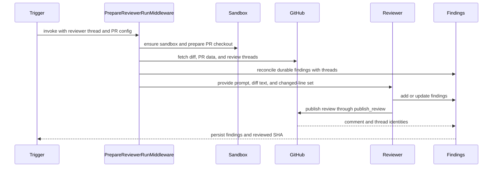
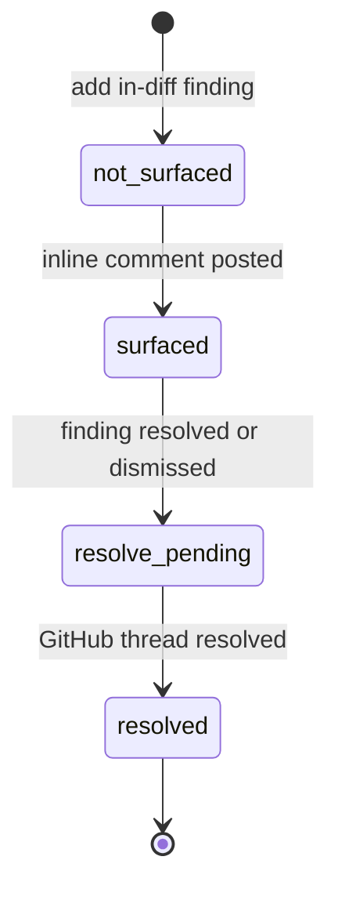

# Review and review-style learning graphs

Open SWE exposes two specialized deep-agent graphs: `reviewer` (`agent.graphs.reviewer:traced_reviewer_agent`) and `analyzer` (`agent.graphs.analyzer:traced_analyzer`). The reviewer assesses a GitHub pull request using durable per-PR findings; the analyzer learns a repository-specific supplement to the review policy. They share sandbox infrastructure but deliberately have different authority, state, and launch paths.

For webhook routing and review-cycle triggers, see [PR Review Workflow](../workflows/pr-review.md). For sandbox provisioning and recovery, see [Sandbox Lifecycle](sandbox-lifecycle.md) and [Sandbox Providers](../integrations/sandbox-providers.md). For the broader tool model, see [Tools](../concepts/tools.md).

## Reviewer: constrained PR assessment

### Authority and construction

The reviewer is read-only with respect to the repository. Its prompt prohibits commits, pushes, and direct `gh pr review` or review-API calls, and its tool set omits coding, commit, push, and PR-opening tools. GitHub review mutation is centralized in `publish_review` and the finding-thread tools rather than being an unrestricted shell capability.

`get_reviewer_agent(config)` builds the graph per run. It copies the outer config and its `configurable` mapping before setting a default recursion limit, so it does not overwrite a caller's mapping. If no `thread_id` is present, or the graph is not loaded for execution, it returns an empty deep agent without provisioning a sandbox.

For an executable run, the factory resolves reviewer and subagent models from run configuration or workspace defaults, applies the Fable model gate, and attaches a cached sandbox backend with a reconnect closure. Its explicit tools are:

- review lifecycle: `fetch_review_diff`, `add_finding`, `update_finding`, `list_findings`, `publish_review`, `resolve_finding_thread`, and `reply_to_finding_thread`;
- read-only helpers: `web_search`, `fetch_url`, and `http_request`.

It permits one `reviewer` subagent. The parent assigns an explicit disjoint file partition; the subagent returns candidate defects only and has neither finding nor publication tools. The parent validates, persists, and publishes.

### Preparation, GitHub access, and context

`PrepareReviewerRunMiddleware` performs deterministic non-LLM setup before the first model call. When a source repository is configured, it mints a repository-scoped GitHub App installation token, caches it as the thread's bot token, and exposes it through the sandbox GitHub proxy. It ensures a sandbox with `allow_replacement=True`, prepares the PR checkout at the head revision, and materializes trusted repository skills from the base revision.

The middleware computes the review range and unified diff, including delta-only re-review ranges, and derives the changed `(file, side, line)` set. It returns `diff_text` and `diff_line_set` in run state, allowing `add_finding` to reject invalid anchors before GitHub publication.

Preparation overlaps independent I/O: PR title and body, existing review threads, saved repository style, organization guidelines, root and scoped `AGENTS.md`/`CLAUDE.md` from the base revision, an API-standards skill, and optional author-trace context. Existing review threads are reconciled before their prompt block is rendered. Once the diff is available, scoped instructions are selected for changed files. The rendered context selects first-review, re-review, or finding-reply guidance. Diff grouping starts as a best-effort background task and never blocks the review.

Reviewer preparation and publication: concurrent context retrieval feeds the prepared prompt, while findings remain durable outside the sandbox.

If replacement itself fails with `SandboxUnreachableError`, preparation posts a typed unreachable-sandbox notification on the PR and fails the run rather than silently leaving it unreviewed. Replacement is safe because the checkout is re-derived each run and findings do not live in the sandbox.

### Prompt and input safety

The prompt requires a concrete, changed-line-anchored failure mode. It rejects speculation, ordinary style or naming nits, pre-existing defects, and duplicate fan-out of one defect across files. Explicit repository-convention violations remain reviewable only when diff-anchored and tied to a concrete failure mode. Suggestions are restricted to small, obvious fixes.

PR title/body, existing review-thread comments, and finding replies are attacker-controlled GitHub content. The renderer wraps them in XML data blocks, validates login attributes against the GitHub login grammar, and uses `_escape_for_data_block` to neutralize wrapper closing tags. A PR body therefore cannot escape its data wrapper and become instructions. Author-trace context is also untrusted and must not be published.

### Durable finding lifecycle

Findings are stored in LangGraph metadata on the canonical reviewer thread, rather than in the sandbox. `set_reviewer_thread_metadata` writes `kind: "reviewer"`; that tag lets finding storage, usage rollups, and the review UI locate reviewer threads across thread queries. Missing durable reviewer state is returned by tools as a structured do-not-retry result, because retry cannot restore a never-created, evicted, or evaluation-mode thread.

A `Finding` records location and side, severity and confidence, title/description/suggestion, diff membership and hunk, status and confirmation SHAs, publication identities, surface state, human-reply and reconciliation fields, fingerprint, and interaction history. Legacy records are normalized on read. Surface state is monotonic, so contradictory legacy values resolve to the furthest-along state.

Surface state moves forward independently of a finding's `open`, `resolved`, or `dismissed` status.

`add_finding` validates title, severity, confidence, side, and ordered line range. It resolves diff context from injected run state first, then `configurable`, then a fresh authenticated PR diff. A line range absent from the requested diff side returns `success: false` and `in_diff: false`; the agent is instructed not to re-anchor or retry. Successful findings retain an extracted diff hunk when diff text is available, clip suggestions beyond four lines, and deduplicate using a content fingerprint.

Before a normal run, `reconcile_findings_with_review_threads` matches tracked findings to GitHub threads first by embedded marker, then by recorded thread or comment identity. It backfills comment and thread IDs and marks matches surfaced. A finding is resolved only when all matched threads are resolved; an outdated-but-unresolved thread does not resolve it. The latest human reply after the bot comment is saved as a `human_reply` interaction with `needs_reassessment`, giving a later review a durable reason to reconsider.

### Publication and failure semantics

`publish_review` filters unpublished, in-diff, open findings at or above its severity threshold (default `medium`) and caps the batch at `REVIEW_FINDING_CAP` (6). It posts one GitHub PR Review with a host-formatted summary and one inline comment per renderable finding. A finding suggestion is appended as a fenced `suggestion` block. Every inline comment embeds an `open-swe-review-comment` JSON marker containing the finding identity and anchor metadata, which enables later reconciliation and recovery of lost identifiers.

After publication, the tool records review, comment, and thread identities on findings; it resolves GitHub threads for resolved findings through the GraphQL `resolveReviewThread` mutation; and it advances `last_reviewed_sha`. On re-review, already-published findings are not reposted. If nothing new is eligible and an Open SWE review already exists, it may intentionally skip a duplicate empty review while still resolving eligible threads and advancing state.

Callers must inspect the structured result. `success: true` with `review_id: null` and `skipped_empty_re_review: true` is a valid no-post result; `dry_run: true` is evaluation simulation. A numeric `review_id` confirms a real review. When GitHub rejects unresolved anchors, the tool filters invalid findings and retries once with valid anchors when possible; otherwise it returns `unresolvable_findings` and a remediation hint instead of inviting blind retries.

## Analyzer: repository review-style learning

### Graph, modes, and sandbox boundary

The analyzer learns a per-repository review-style prompt from historical human PR feedback and the reviewer's recorded outcomes. During preparation it resolves repository identity and mode, ensures a sandbox, and configures repository access through the sandbox GitHub proxy. Its only domain tools are `read_finding_outcomes` and `save_review_style_prompt`; its middleware includes input sanitization, tool-error handling, timeout and response sanitization, and an 80-model-call limit.

Like the reviewer, `get_analyzer` returns an empty agent without a `thread_id` or when execution is disabled. Unlike the reviewer factory, it writes its default recursion limit directly into the incoming config, so callers must not assume reviewer-style config isolation.

`analyzer_mode` selects the authoritative bundled `SKILL.md` procedure:

- **`bootstrap`** selects `bootstrap-repo-analysis`, a cold-start procedure that mines historical merged-PR feedback and synthesizes an initial prompt.
- **`continual`** selects `continual-learning`, which reads finding outcomes and refines an existing prompt by promoting recurring useful patterns and demoting recurring false positives.

The short base prompt directs the agent to the selected playbook and supplies `REVIEWER_STYLE_THEMES`, keeping learned guidance bounded by the reviewer's high-signal, diff-anchored policy.

The playbooks are virtual files, not sandbox files. Launchers seed `build_skill_files()` into the run input's `files` channel, and `get_analyzer` mounts a `StateBackend` at `/skills/` through a `CompositeBackend`. The agent reads `/skills/<name>/SKILL.md`; the state backend receives the prefix-stripped path.

### Style persistence and launch paths

`REVIEW_STYLES` is a typed store in the `review_styles` namespace, keyed by `owner/repo`. Its `ReviewStyle` record tracks analysis status, prompt and summary, reviewer and sample-count metadata, analysis thread/run IDs, cron ID, error, and timestamps. Reviewer prompt lookup is deliberately fail-soft: a style-store failure omits the supplement rather than failing a PR review. When present, `custom_prompt` is appended under **Repository-specific review style** and applies only where it agrees with the global review bar.

`start_bootstrap_analysis` collects samples before starting a durable analyzer run on `review_style_thread_id(owner, repo)`. It passes the samples and counts, OAuth token, bootstrap mode, and virtual skill files. Collection or run-start failure marks the style record failed. `start_continual_run` starts an immediate outcome-driven durable run on the same deterministic style thread.

The terminal tool `save_review_style_prompt` requires a nonempty prompt and repository name. It persists the trimmed prompt, summary, reviewers, and sample counts as a completed record. Empty output marks the record failed. A cron-registration failure does not undo the saved prompt.

### Continual operations

On a successful save, `ensure_continual_cron` idempotently ensures one daily LangGraph continual-learning cron per repository. Its SHA-256-derived schedule staggers repositories from 05:00 through 08:59 UTC. The cron metadata identifies `kind: "analyzer_continual"`; removal is best-effort and clears the stored cron ID.

The scheduled run is threadless, but its configurable explicitly supplies the deterministic `review_style_thread_id`. Without it, `get_analyzer` would return an empty graph. The fresh input carries no accumulating message history, while the deterministic ID keys sandbox and metadata by repository. Because the scheduled configurable has no fresh user token, analyzer preparation resolves repository access with its GitHub App installation token; it also seeds the bundled skills required by continual learning.

## Focused tests

The reviewer suite covers config isolation, diff and tool validation including LEFT-side anchors, durable findings, marker rendering and publication, reconciliation, background diff groups, style synchronization, triggers, watches, API, and chat paths. In particular, `test_factory_config_isolation.py` protects the reviewer config-copy invariant; `test_reviewer_tools.py` exercises validation and persistence; `test_reviewer_reconcile.py` covers marker backfill and terminal-thread behavior; and `test_reviewer_publish.py` covers publication markers, suggestions, error handling, and re-review behavior.

`tests/analyzer/test_analyzer_cron.py` covers cron creation, idempotence, removal, the seeded continual skill files, explicit thread configuration, and the deterministic schedule window.
