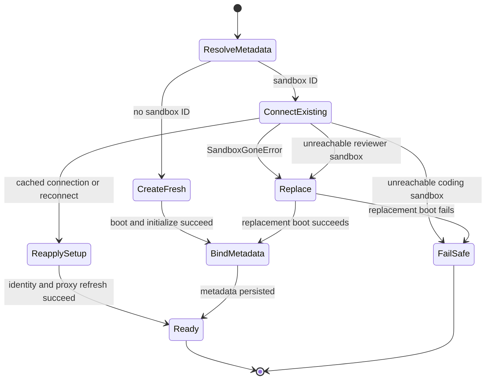

# Thread Sandbox Lifecycle

A normal agent thread is bound to a durable sandbox so its checkout and uncommitted working tree can survive separate runs and worker changes. The design separates durable identity from process-local connections, and treats a merely unreachable coding sandbox as data that must be preserved rather than silently replaced.

Related: [Agent graph](agent-graph.md), [Threads and state](../concepts/threads-and-state.md), [Auth and security](../concepts/auth-and-security.md), and [Sandbox providers](../integrations/sandbox-providers.md).

## Binding, cache, and stable tool handle

`thread.metadata["sandbox_id"]` is the durable binding. `get_sandbox_metadata` prefers inline run metadata when it contains a string ID, then reads the live LangGraph thread; callers therefore do not use the worker cache as the source of truth. A metadata-read failure is not converted to an unbound thread: it propagates, preventing a failed read from binding a replacement over an existing working tree.

Two worker-local maps complement that durable binding:

- `SANDBOX_BACKENDS` maps a thread to its stable `SandboxBackendProxy`, the object held by middleware and filesystem tools.
- `SANDBOX_CONNECTIONS` maps a sandbox ID to a live provider connection. It is keyed by sandbox rather than thread, so a rebinding cannot accidentally reuse the old box.

The proxy is deliberately async-only: synchronous filesystem and command methods raise `NotImplementedError`, while `a*` methods resolve the current backend and delegate. When empty, it starts the registered reconnect callback; absent that callback, it reads the durable ID and calls `create_sandbox`. Its per-proxy lock, one shared startup task, and `asyncio.shield` collapse concurrent first operations into one connection attempt without letting one cancelled waiter cancel startup for all callers. Publishing a replacement updates the target of the existing proxy, not its identity.

`SandboxBackendProxy` subclasses `BaseSandbox` rather than merely implementing the backend protocol. That preserves FilesystemMiddleware's capture-at-source path and its in-sandbox output cap. Its offload method delegates to a capable backend, or reports `offloaded=False` after ordinary execution when the provider lacks that extension.

## Provisioning boundary and workspace image

`create_sandbox` is the provider-neutral creation/reconnection boundary. `SANDBOX_TYPE` selects a lazily imported factory: `langsmith`, `daytona`, `modal`, `runloop`, `e2b`, or `local`. Only LangSmith receives snapshot, VM-resource, and create-body overrides; native async factories are awaited and synchronous factories run in `asyncio.to_thread`.

For new thread sandboxes, `SandboxCreateConfig.resolve` loads the requested workspace (unless explicitly asked for the `base` source). It uses the workspace ready snapshot when available, otherwise `None`, which makes LangSmith use its root snapshot; workspace resource settings and create parameters travel into provisioning. If the captured workspace snapshot has become stale, its update script runs before the first model call with a bounded timeout; failure merely logs a freshness warning. A background update trigger prepares a later snapshot.

At application lifespan startup, `validate_sandbox_startup_config` validates the active LangSmith numeric capacity and retention settings, rejects negative idle/delete TTLs, and parses extra create JSON. This makes invalid configuration a boot failure rather than a first-run surprise. LangSmith creation applies configured retention and retries only configured transient creation errors. Command retries are narrower: `SandboxRetryableConnectionError` means the WebSocket upgrade failed before the command frame was sent, so retrying cannot double-run the command; there are at most four attempts with exponential jittered backoff.

The `local` provider is for local development, not isolation: it runs a `LocalShellBackend` on the host. It directs global Git writes to `.gitconfig-sandbox` (which includes the developer config) and explicitly removes model and provider API-key variables from the child environment.

## Create, reconnect, replace, or fail safe

`get_agent` installs a per-thread proxy and starts it early. For non-desktop runs its reconnect callback calls `ensure_sandbox_for_thread`; desktop runs instead create their desktop backend and bypass this remote lifecycle. Normal dispatch's interrupt strategy is relied on to avoid concurrent thread provisioning, rather than maintaining a cross-process “creating” sentinel.

*The source-backed lifecycle distinguishes confirmed deletion from reachability failure, and permits the latter replacement only for re-derivable reviewer checkouts.*

`ensure_sandbox_for_thread` first reads the durable ID. Without one it boots and initializes a new box. With one, it prefers a live `SANDBOX_CONNECTIONS` entry and otherwise reconnects through the selected provider. It does not add a separate health ping: on LangSmith, refreshing proxy configuration already must reach the box. Every reused or reconnected sandbox also receives bot Git identity again, because global configuration may have been lost; identity configuration runs concurrently with proxy work once the box exists.

The publication ordering is an invariant. Creation configures proxy access, runs the optional workspace update, and only then writes `sandbox_id` (and, when present, base proxy configuration) to thread metadata. Only after that write succeeds does `set_sandbox_backend` publish the backend to the stable proxy. An initialization or metadata failure therefore does not expose an unbound, half-initialized target to the run.

### Why coding and review recover differently

- `SandboxGoneError` is a confirmed provider deletion. The stale ID can never reconnect and the deleted box holds no working tree, so it is always replaced and rebound.
- `SandboxUnreachableError` means this run could not connect or reconfigure the existing box. It may recover later and may contain the only uncommitted coding work. Default agent behavior raises the error rather than swapping in an empty filesystem. If a selected replacement cannot be created, that failure is normalized as `SandboxUnreachableError`.
- The reviewer alone passes `allow_replacement=True`. Reviewer preparation clone-or-fetches and force-checks out the PR head on every run, so its filesystem is re-derivable. Review threads are reused for subsequent pushes, making replacement necessary to avoid permanently blocking a PR after an unreachable box.

## GitHub credential proxy and refresh

GitHub proxy setup is LangSmith-specific. At creation and reuse, lifecycle code obtains workspace-scoped GitHub access and configures the provider proxy rather than placing the real token in the sandbox. The managed rules inject `Authorization: Bearer` for `api.github.com`, and Basic authentication for `github.com` and `*.github.com`; `GH_TOKEN` inside the sandbox is only the `proxy-injected` placeholder required by `gh`.

Workspace create parameters can contain a base proxy configuration. It is preserved in thread metadata after successful creation and used on reconnection. `configure_github_proxy` removes/replaces managed rules but preserves unrelated custom rules. Its PATCH retries retryable transport and status failures; when LangSmith reports that the sandbox is not ready, it best-effort starts the stopped sandbox and retries. A stopped sandbox is deliberately not treated as deleted because its filesystem may still contain work.

Proxy-token tracking is worker-local and records expiry, record time, repository scope, permission scope, workspace, and base configuration per thread. Before each model call, middleware invokes `maybe_refresh_proxy_token`: known expiry refreshes within five minutes, while unknown expiry refreshes after 50 minutes. Refresh uses the recorded scope (or intersects a newly requested repository set), so routine rotation does not broaden access. Middleware logs refresh failure and continues the model call.

## Explicit recreation and repository preparation

`recreate_sandbox_for_thread` is the explicit clean-slate operation. It requires an old binding, creates a new sandbox from either the workspace image or explicitly selected base source, rejects a provider result with the same ID, persists the new ID and base proxy configuration, then switches the stable proxy. It never deletes the old provider sandbox. If metadata persistence fails, the proxy still targets the old sandbox; the new resource may be detached, but the thread never observes a split binding. The user-facing `recreate_sandbox` tool restricts booting another workspace image to the private admin surface.

Repository paths are provider-portable. The resolver tests provider-reported work directories, `pwd`, provider home/root paths, and `$HOME` in order, accepts only a writable directory, caches it on the backend, and appends a validated repository name.

Before a reviewer model call, `prepare_review_repo` clones or fetches the repository, fetches relevant base/head references, force-checks out the requested head SHA, and verifies `HEAD`. It is best effort: failure returns `False` while leaving the sandbox usable for a diff-based review. Reviewer skill content has a different trust boundary: `materialize_trusted_skills` extracts skill directories from a trusted base ref into `.review-skills` outside the PR checkout, never from PR-head content.

## Focused verification

The state tests cover proxy capture/offload behavior, default command timeout, metadata fallback reconnect, and concurrent reconnect coalescing. Recreation tests assert distinct IDs, workspace-versus-base source selection, and the crucial metadata-before-handoff ordering. Together with lifecycle and repository-preparation tests, these are the regression points to preserve when changing recovery semantics: do not publish early, do not replace an unreachable coding worktree, and do not trust reviewer skills from a PR head.
