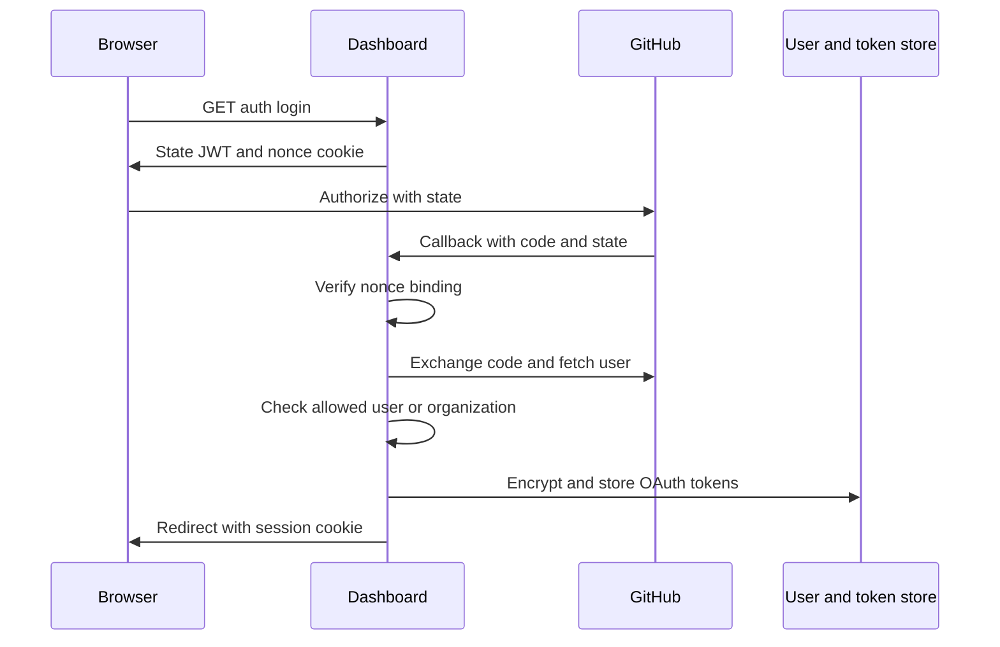

# Authentication, authorization, and credential boundaries

Open SWE separates **caller authentication**, **authorization**, and the credential an agent may use. A signed-in dashboard identity does not by itself authorize a repository or permit personal credentials in a run; the persisted thread scope, workspace ownership, and GitHub checks are separate gates. This page complements [sandbox lifecycle](../architecture/sandbox-lifecycle.md), [sandbox providers](../integrations/sandbox-providers.md), [configuration](../operations/configuration.md), and [invocation](../workflows/invocation.md).

## Dashboard login and browser protections

The dashboard authenticates through the GitHub App OAuth code flow. `GET /dashboard/api/auth/login` creates a random nonce, stores its HMAC in an HS256 state JWT, and puts the raw nonce in `osw_oauth_state`. The callback decodes the state and constant-time compares the cookie-derived HMAC before exchanging the code, fetching the GitHub identity, applying the GitHub authorization gate, storing the OAuth tokens, and creating the local user/session.

The session is an HS256 JWT signed with `DASHBOARD_JWT_SECRET`, placed in the `HttpOnly` `osw_session` cookie for seven days. `require_session` rejects a missing or invalid cookie. `/me` returns the signed-in identity and evaluates admin status from the current configured-admin list rather than trusting a claim embedded in the session.

The browser OAuth flow binds the callback to the browser nonce before it creates a session or persists a credential.

`sanitize_redirect_to` permits a relative non-protocol-relative path, or an absolute URL whose normalized origin is `DASHBOARD_BASE_URL` or one of `DASHBOARD_ALLOWED_ORIGINS`. It rejects dashboard login/API paths as destinations as well as unlisted origins. This prevents both an external open redirect and redirect loops.

Cookie flags depend on deployment topology: an HTTPS split-origin dashboard gets `Secure; SameSite=None`; same-origin and local HTTP use `SameSite=Lax`. The state cookie is `HttpOnly`, `SameSite=Lax`, scoped to `/dashboard/api/auth`, and limited to the ten-minute state lifetime. Unsafe cookie-authenticated HTTP requests must carry an allowed `Origin` or `Referer` when dashboard origins are configured. Safe methods are exempt. A bearer-only request with no session cookie is exempt because that header is not an ambient browser credential. With no configured dashboard origins the origin check intentionally does nothing for local development; credentialed CORS is enabled only for explicit origins and rejects `*`.

### Who may sign in and administer

At startup, production authentication requires `ALLOWED_GITHUB_USERS`, `ALLOWED_GITHUB_ORGS`, or `OPEN_SWE_LOCAL_AUTH_TOKEN`; an absent configuration is a startup error. A GitHub login is authorized if it constant-time matches the user allowlist or is an active member of an allowlisted organization. Organization membership uses the GitHub App path and does not turn lookup failures into authorization. This is a fail-closed change from configurations that allowed every GitHub account.

`CONFIGURED_ADMINS` is a comma-separated, case-insensitive set of GitHub logins and emails. Dashboard admin dependencies re-evaluate it from the session identity, and startup synchronizes configured admins into local user records. Administration should therefore be granted by configuration, not by editing thread metadata.

The desktop flow never puts the dashboard session on its loopback callback. Instead it sends a 120-second signed handoff code containing inert identity claims and the desktop application's S256 PKCE challenge to a fixed `127.0.0.1` callback. `/auth/desktop/exchange` mints the session only after a constant-time verifier comparison. Cloud-terminal tickets are distinct 60-second JWTs bound to the terminal audience and requested `thread_id`; the terminal connection is additionally authorized for that thread before the WebSocket is accepted.

Slack account linking uses Slack OpenID Connect with `openid email profile`, obtains the Slack-verified user and workspace claims from `userinfo`, and can restrict linking to `SLACK_TEAM_ID`. A cross-workspace identity, including one reached through Slack Connect, is rejected. Shared Slack auth-failure notices deliberately point only to the token-free settings URL, not to a user-specific authorization URL that another participant could complete.

## Thread scope determines agent authority

`credential_scope` reads the saved thread metadata rather than accepting scope from the run configuration. Visibility must be `public` or `private`; owner type may be absent, `user`, or `system`; and a system thread may not be private. Metadata that violates any of these invariants fails before a personal credential is read.

For a **public** thread, `resolve_github_token` invalidates the thread cache and resolves a GitHub App installation token. For a **private** thread, the initiating login must match the saved `owner_login` case-insensitively; only then does it retrieve that owner's dashboard OAuth token. A missing credential raises `GitHubUserAuthRequired`—it never degrades a private run to the workspace bot, even if bot-token-only deployment settings are present.

This boundary also applies to personal integrations and pull-request authorship. Personal integration loaders receive a login only for a private thread owned by the current requester. For PR publication, a private thread uses its owner; a public user-owned or legacy owned thread uses the authenticated requester rather than the saved owner; a system thread uses bot authority. Background completion refuses to publish for a user-associated thread because it cannot identify the requester.

## GitHub credentials, repositories, and sandboxes

GitHub App installation tokens are obtained through the App SDK only when the app ID, private key, and positive installation ID are configured. The in-process App-token cache is keyed by installation ID, repository IDs or names, and normalized permissions, so a less-restricted request cannot reuse a differently scoped token. A token is cached only until ten minutes before its GitHub expiry; minting/configuration failures return no token rather than making an unauthenticated request.

Dashboard repository actions use the signed-in user's OAuth token to call GitHub's repository endpoint. A 401 forces one refresh-and-retry; 403 and 404 become explicit no-access/not-found responses. Workspace checks use the GitHub App installation token and distinguish unavailable App authentication from a repository unavailable to the workspace.

For sandbox traffic, `workspace_token` intersects an optional requested repository set with the saved workspace repository set. `repository_token` then enumerates repositories accessible to the App installation and requests a token by matched repository IDs. If there is no match it returns no sandbox credential; the installation-wide discovery token remains server-side. Thus a snapshot fallback or client repository request cannot expand a sandbox's repository authority.

A LangSmith sandbox receives GitHub authentication through proxy configuration, not an environment secret: `GH_TOKEN` is the fixed placeholder `proxy-injected`, while opaque proxy rules attach the actual token as `Bearer` authentication for `api.github.com` and Basic `x-access-token` authentication for `github.com` hosts. The proxy records the token expiry, repository scope, permission scope, workspace, and base proxy configuration per thread. Near expiry it remints and reconfigures using the recorded scope; an explicitly requested refresh can only intersect, never broaden, the recorded repositories.

### Credential persistence and caching

Dashboard OAuth access and refresh tokens are encrypted before persistence. `TOKEN_ENCRYPTION_KEY` accepts a newest-first comma- or newline-separated Fernet key list: the first key encrypts and `MultiFernet` tries each key to decrypt, enabling key rotation. Invalid ciphertext or an unavailable key decrypts as an empty value rather than raising. Tokens near expiry are refreshed under a per-login lock. A permanent GitHub refresh error (`bad_refresh_token` or `unauthorized_client`) deletes the old authorization unless a concurrent callback already stored a newer refresh token.

Resolved run tokens are process memory only, keyed by `(thread_id, principal)`. `login:` and `email:` principals isolate user tokens; `bot` is separate, and caching a user token without a principal is refused. Entries are discarded within 60 seconds of token expiry or after a 24-hour hard cap; invalidation clears all entries for a thread. A downstream GitHub 401 is represented as `GitHubAuthError` so callers can invalidate and resolve again rather than continue with a revoked token.

## Inbound and prompt trust boundaries

GitHub and Slack webhook routes read the raw body and authenticate it before processing the payload. GitHub requires `sha256=HMAC(GITHUB_WEBHOOK_SECRET, body)` in `X-Hub-Signature-256`; Slack requires a constant-time HMAC over `v0:timestamp:body` and rejects timestamps outside the 300-second replay window. Both reject when the respective signing secret is absent. GitHub deliveries are also ignored when their repository belongs to no workspace; temporary workspace-ownership lookup failures return 503 so GitHub retries rather than silently dropping work.

External GitHub comments are not automatically trusted prompt instructions. Reserved `<dangerous-external-untrusted-users-comment>` tags are stripped from raw input, then comments whose author is not in the trusted login set are wrapped in those tags. An external author therefore cannot manufacture the delimiter used to identify untrusted content.

## Focused verification and safe changes

`tests/auth/test_thread_credential_scope.py` exercises public-versus-private authority, ownership mismatch failures, system-thread invariants, PR authorship, and the no-bot-fallback rule. `tests/auth/test_github_token_ttl.py` covers principal cache isolation, expiry/24-hour eviction, invalidation, downstream 401 behavior, and private-thread webhook rejection before credentials or dispatch. `tests/dashboard/test_dashboard_oauth_redirect.py` covers redirect, state, and desktop PKCE protections; `tests/dashboard/test_github_token_auth.py` verifies bearer parsing and the CSRF exception only when no session cookie is present.

When changing these boundaries, preserve the ordering: validate external signatures before parsing; validate thread scope before resolving personal credentials; constrain repository scope before giving a token to the proxy; and re-check user/repository authority at the request that performs the action. Add focused tests for both the authorized path and the failure path—especially scope broadening, stale tokens, and cross-user/thread access.
