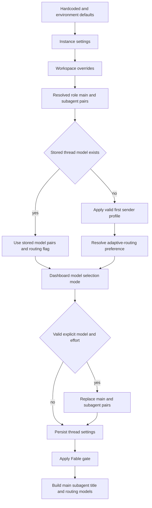

# Model selection, profiles, and instructions

A hosted agent run resolves a valid model-and-effort pair, repository instructions, and an adaptive-routing policy before constructing its models. The choices that define how a long-lived conversation operates are snapshotted on its first run; identity, personal instructions, and PR preference are evaluated for the sender of each subsequent message. This keeps a multi-party thread stable without attributing one participant's preferences or credentials to another. See [Agent graph](../architecture/agent-graph.md), [Authentication and security](auth-and-security.md), [Configuration](../operations/configuration.md), and [Context engineering](../workflows/context-engineering.md).

## Model registry and recovery

`SUPPORTED_MODELS` in `agent/dashboard/options.py` is the curated registry for selectable models. A `ModelOption` contains its provider-prefixed id, label, allowed `efforts`, `default_effort`, image support, and, when applicable, whether it can be stored as a default. `SUPPORTED_MODEL_IDS` is the membership check shared by settings and override resolution.

Effort is model-specific, not a universal enum. For example, Kimi K3 accepts `low`, `high`, and `max`; Haiku accepts only `none`; Gemini uses `minimal` through `high`; and other entries may allow `xhigh` or `max`. Validate a stored or requested pair with `model_supports_effort`; use `model_supports_images` before accepting image content.

The `/options` endpoint returns copies enriched with context-window information. It prefers explicit Codex overrides, then LangChain provider-profile data, then a fallback table; it does not add context-window fields to the canonical registry. The endpoint resolves defaults for the requested workspace and hides Fable models when that workspace disables Fable.

### Defaults, stale ids, and validation

`default_model_pair()` is the final deployment fallback. It reads `LLM_MODEL_ID` and `LLM_REASONING_EFFORT`; absent values fall back to a credential-sensitive built-in model and an appropriate effort. The result must be supported, eligible as a default, and valid for its effort. Invalid environment settings raise `ValueError` rather than producing an arbitrary model. Localhost startup separately checks that the configured default has the required provider credential.

A stale selection and an explicitly deprecated selection have intentionally different outcomes:

- For an unsupported, non-deprecated id, `provider_fallback_pair()` chooses the first supported entry for the same provider, preferring the same Claude family. It preserves a supported effort, maps Gemini `none` to `minimal` where applicable, and otherwise uses the fallback's default effort.
- An unknown provider has no same-provider fallback. Explicitly deprecated ids are also excluded from recovery and defer to a workspace or deployment default.
- `DEPRECATED_MODEL_REPLACEMENTS` currently contains empty values and `canonical_model_pair()` returns `None`; there is no automatic canonical migration.

Workspace role resolvers enforce the terminal invariant: valid configured pair, then same-provider recovery, then `default_model_pair()`. A stale stored default therefore still resolves to a constructible pair.

## Workspace and profile layers

Workspace settings resolve in three tiers: hardcoded defaults, an instance record, then a sparse workspace override record. The backwards-compatible instance record is the `"default"` key in `['team_settings']`; workspace records normally live in `['workspace_settings']`. A missing or `None` field inherits from the lower tier. Reads fail soft to hardcoded defaults if the store is unavailable, preventing a settings outage from failing every agent or reviewer run. Factory reads are cached for 60 seconds with the workspace slug in the cache key so one workspace cannot populate another's result.

The workspace supplies main and subagent defaults for agent and reviewer roles, three adaptive-routing pairs (`fast`, `balanced`, and `performance`), review-chat and diff-grouping choices, and a title model. Review chat inherits the agent default when absent or invalid; diff grouping inherits the reviewer subagent pair. The title resolver can substitute Haiku for an OpenAI title model on an Anthropic-only deployment without usable gateway routing or desktop OpenAI OAuth.

Profiles are per-user records in `['profiles']`. They hold a main model pair, optional subagent pair, default repository and branch preferences, PR/CI preferences, and an optional adaptive-routing preference. Editable profile data is deliberately separate from encrypted GitHub OAuth records in `['oauth_tokens']`: profile saves and OAuth refreshes write distinct namespaces and cannot clobber each other. Run-start profile reads use a fail-soft helper, while dashboard profile reads surface store errors. A valid profile main pair replaces both agent and subagent defaults unless the profile supplies its own valid subagent pair.

Profile and workspace update validation rejects unsupported pairs and Fable as a persisted default. When profile normalization encounters a stale non-deprecated provider id, it uses the same-provider recovery rule; absent or unknown-provider values defer to the workspace default.

## Hosted-run precedence and persistence

*Caption: model settings resolve from deployment through workspace and profile layers only until a thread snapshot exists; a valid explicit pair is the normal mechanism for changing that snapshot.*

`get_agent` obtains the workspace by the run's slug, starts from its agent main/subagent defaults, and reads a profile only when no thread `model_id` is already stored. `agent_settings` in thread metadata then wins over those defaults. It holds the main and subagent pairs, `model_routing_enabled`, and `repo_instructions`; strict typed normalization drops malformed or obsolete metadata. Loads are cached for five minutes and failed reads/writes are logged without aborting the run.

A valid `configurable.agent_model_id` and `agent_effort` replaces both the main and subagent pair, then the newly resolved settings are saved. The dashboard's `model_selection` mode can independently set whether adaptive routing is enabled for that run and snapshot. A Slack `/oswe` question is a special ephemeral fast-route: it disables adaptive routing after persistence and uses the workspace fast pair without changing the saved choice.

For callers that need an id alone, `resolve_agent_model_id()` applies supported per-thread id over a valid profile id over the workspace agent default. Dashboard thread creation resolves a full pair in workspace, profile, request order, except that a deprecated request deliberately leaves the workspace default instead of applying the profile. If the dashboard message has images and the resolved model is text-only, it switches to `default_vision_model_pair()`; content construction still returns HTTP 422 if asked to use a missing or text-only model.

### Adaptive routing

Adaptive routing is opt-in at the workspace layer and can be overridden by a profile's `model_routing_enabled` value. Once a thread has a snapshot, the saved routing flag wins. When enabled, `ModelSelectionMiddleware` receives separately constructed fast, balanced, and performance models from the workspace settings. The deterministic routing mode is derived from a SHA-256 bucket of the thread id, selecting `auto` below the configured split and `performance` otherwise. Run metadata records whether routing was applied and the mode.

This routing layer is distinct from model selection persistence: it selects among the workspace's routing models at runtime, while the thread's main/subagent pair remains the snapshot described above.

### Fable gate

Fable is a workspace-wide ZDR gate. Fable models are selectable only when the effective workspace setting enables them and cannot be saved as regular profile or workspace defaults. When disabled, saving a Fable setting rewrites it to a safe non-Fable Anthropic fallback. The factory gates main, subagent, and title ids after resolving the snapshot, while the dashboard picker and request resolver also gate their outputs. This defense in depth prevents stale data from advertising or constructing a disabled Fable model.

## Construction, gateway, and runtime fallback

`provider_model_kwargs()` translates the resolved effort at the provider boundary:

- OpenAI receives a `reasoning` dictionary and requests `summary: "auto"` for efforts other than `none`.
- Anthropic receives adaptive, summarized `thinking` and a supported `effort`.
- Gemini 3-family models receive `thinking_level`.
- Fireworks receives `model_kwargs.reasoning_effort`.
- Baseten receives `reasoning_effort` only for `low`, `high`, or `max`.

`make_model()` calls `init_chat_model` with six retries and a 600-second timeout for shipped provider prefixes. It caches constructed clients by model id, requested gateway setting, token limit, frozen keyword arguments, and event-loop id; `close_cached_models()` clears the cache and calls `aclose` or `close` when available. Codex context-window variants inject a provider profile override at construction.

OpenAI defaults to the Responses API with `store=False`, `output_version="responses/v1"`, and encrypted reasoning content included. With no gateway and no `OPENAI_API_KEY`, it can use desktop OpenAI OAuth. Baseten is configured as OpenAI-compatible; direct Baseten construction requires `BASETEN_API_KEY` and the Baseten base URL.

Gateway routing is tri-state. A `True` or `False` workspace value is authoritative; `None` inherits `LANGSMITH_GATEWAY_ENABLED`, or the presence of `LANGSMITH_GATEWAY_API_KEY` when that variable is unset. For routable providers with a LangSmith key, gateway overrides supply `base_url`, `api_key`, and OpenAI Responses API behavior. An unroutable provider or absent key logs a warning and remains direct rather than failing the run.

Provider gateway routing is also separate from runtime fallback. `ModelFallbackMiddleware` prefers `LLM_FALLBACK_MODEL_ID` when configured; otherwise Anthropic primaries fall back to OpenAI and OpenAI primaries to Anthropic. Google, local, and self-hosted provider ids have no automatic cross-provider fallback.

## Instruction sources, scope, and authority

Repository custom instructions are records in `['agent_instructions']`, keyed by `owner/name`. Dashboard access to these records requires repository access; the system-prompt lookup is fail-soft. On the first hosted run, the factory resolves instructions for the effective default repository and saves the resulting text in the thread snapshot. `construct_system_prompt()` renders it as **Repository-specific Custom Instructions**, so it is shared by the entire thread and remains stable if the record later changes.

Workspace instructions are separate workspace data, loaded during run preparation and rendered into the shared system prompt for the workspace in which the sandbox booted. Unlike repository instructions, they are not stored in `agent_settings`; current workspace instructions are therefore evaluated for every prepare-run.

Personal instructions are records in `['user_instructions']`, keyed by GitHub login and capped at 20,000 characters. The dashboard Profile tab and the `save_user_instructions` tool can both write them, so they are isolated from `['profiles']` to avoid competing read-modify-write flows. For each run preparation, the factory loads the credential-owning triggering user's current instructions and passes them to `construct_sender_context()`. That trusted sender-context message says the instructions apply only to the current turn; they are not shared thread policy.

The prompt explicitly establishes this conflict order:

1. Repository `AGENTS.md` overrides default prompt behavior and repository custom instructions.
2. Repository-specific custom instructions override workspace instructions and sender-level instructions.
3. Workspace instructions yield to repository custom instructions and `AGENTS.md`.
4. Sender-level personal instructions yield to repository-specific custom instructions and `AGENTS.md`.

The repository setup guidance requires the agent to read a root `AGENTS.md` before work. Directory-scoped `AGENTS.md` handling is supplied by middleware as files are read. Do not treat personal instructions as authorization to override repository policy or as preferences belonging to other thread participants.

## Change and test guide

When changing model ids, effort support, stale-id behavior, Fable, or context metadata, update `tests/models/test_model_fallback_resolution.py`. It covers environment defaults, provider-preserving recovery, deprecated-id deferral, profile/workspace validation, Fable, and context-window enrichment. `tests/dashboard/test_workspace_settings_tiers.py` covers instance-to-workspace inheritance, legacy-record compatibility, cache isolation, and workspace-scoped options. `tests/dashboard/test_dashboard_thread_api.py` covers workspace/profile/request precedence and image fallback or rejection. `tests/models/test_agent_subagent_models.py` exercises factory-level profile subagent inheritance and the Fable construction guard. Update focused tests whenever changing precedence, snapshot fields, or a provider capability.
