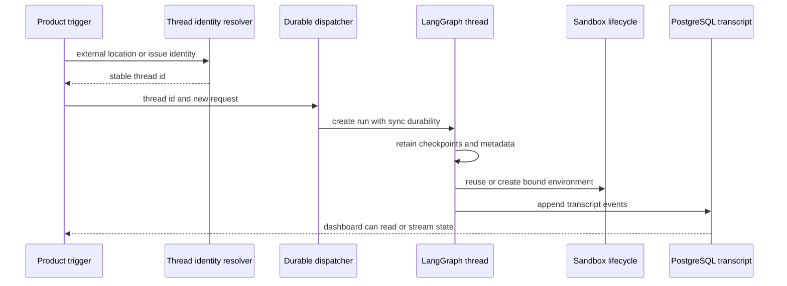

# Threads, runs, and durable state

A **thread** is the durable LangGraph conversation identity: its checkpointed graph state and history continue across runs. A **run** is one execution appended to that thread. This distinction is the foundation for follow-ups: an integration must resolve the established `thread_id`, create a run with new input, and leave the existing thread state intact.

State is deliberately split by owner:

- **LangGraph thread state** holds graph checkpoints, status, and mergeable thread metadata.
- **LangGraph Store** holds independently namespaced application records such as Slack mappings and pending dashboard messages.
- **PostgreSQL transcript** is a dashboard-serving, append-only event log and derived read model; it is not the LangGraph checkpoint store.
- A thread metadata `sandbox_id` associates the conversation with a working environment, but the live backend is a process-local proxy/cache.

This shows the ownership boundary: runs operate on one LangGraph thread, while sandbox association and dashboard transcript state are attached to that identity without replacing its checkpoints.

## Thread identity is a persistence contract

`agent/thread_ids.py` is the single home for deterministic derivation. Webhooks, the dashboard, and reviewer code must independently re-derive the same IDs from external identifiers; changing a key or namespace orphans existing threads from their normal routing path.

| Purpose | Stable key | Derivation |
| --- | --- | --- |
| Slack location | `slack:{channel}:{timestamp}:{nonce}` | URL-namespace UUIDv5 |
| Agent PR comment | `{owner}/{repo}/pr/{pr_number}` | URL-namespace UUIDv5 |
| PR reviewer | `{owner}/{repo}/pr/{pr_number}/reviewer` | URL-namespace UUIDv5 |
| Per-user PR review chat | `{owner}/{repo}/pr/{pr_number}/chat/{login.lower()}` | URL-namespace UUIDv5 |
| Review style | `{owner}/{repo}/review-style` | URL-namespace UUIDv5 |
| Baby-sit lock | `open-swe:baby-sit-lock:{key}` | URL-namespace UUIDv5 |
| Linear issue | `linear-issue:{issue_id}` | SHA-256-derived UUID |
| GitHub issue | `github-issue:{issue_id}` | SHA-256-derived UUID |

The reviewer suffix intentionally makes a reviewer thread distinct from the agent PR-comment thread. For an Open SWE-created PR, GitHub comment handling first scans its branch name for the embedded thread UUID and only falls back to the PR key. Linear deliveries route with `linear_issue_thread_id(issue_id)`, so redelivery remains in the issue conversation.

### Slack location mappings and code-channel sessions

Slack resolution first reads the explicit Store mapping in a per-channel namespace. If absent, `resolve_slack_thread_id` searches thread `source_context` metadata for the location, rejects ambiguity, then binds either that matching thread or the deterministic Slack fallback. Binding rejects a conflicting existing mapping and verifies the persisted value. Detaching a location writes a new nonce rather than merely deleting it, so future deterministic fallback cannot collide with the retired thread.

A Slack code channel is a whole-channel agent session, represented by `CODE_CHANNEL_SESSION_TS = "0"` rather than a Slack reply timestamp. Moving into one binds `(channel_id, "0")` to the existing thread and updates its source context. The sentinel selects channel history retrieval rather than replies for a normal thread. Its Slack-facing `processing`, `active`, `suspended`, and `closed` statuses are UI/session state, not LangGraph thread status.

## Metadata, Store, and configuration

Thread metadata is a small, queryable cross-surface index. `SourceContext` records the opening Slack, Linear, GitHub, or PR context; it preserves unknown supplied fields and turns malformed historical context into an empty context rather than failing a run. Participant logins and emails are key-per-person objects, not lists, because JSONB containment can match a single object key. Reviewer threads use `kind = "reviewer"` to distinguish reviewer state and completion behavior from ordinary agent work.

Thread-level model and repository settings are a separate `agent_settings` metadata snapshot. They are resolved on the first run, while sender identity and personal instructions remain per-message; subsequent profile changes do not alter the thread unless a caller explicitly rewrites the snapshot. Settings are strictly normalized, cached for five minutes, and load/store failures fail soft.

The LangGraph Store is not metadata. `agent/store.py` is the sanctioned namespaced key/value wrapper: a missing item is `None`, while another failure propagates. `TypedStore` validates records with Pydantic; an unreadable requested record raises, but listings log and skip malformed records. The dashboard's deliberate follow-up injection uses a Store FIFO at `("queue", thread_id)`: `queue_id` makes repeated injections idempotent and the queue retains only the newest 100 messages.

`configurable` is per-run transport rather than durable thread state. `RunConfig` preserves unknown keys, drops only invalid fields during tolerant parsing, and emits only supplied values. Dispatch establishes one invocation identity in both configurable data and metadata, along with an invocation start time, so downstream work and completion telemetry can correlate the execution.

## Inputs, runs, and checkpoint continuation

Each run contributes a normalized request while the thread retains history. `build_run_input` serializes authored content into escaped `<input-message>` envelopes and can prepend validated person, channel, and system `<dynamic-context>` introductions. Dynamic contexts are content-hashed and not reinjected when already visible; after summarization hides an earlier block, it becomes eligible for introduction again.

`dispatch_agent_run` is the common trigger entrypoint for agent and reviewer work. It rejects a prebuilt input combined with source content or identities, builds an input when needed, and delegates to `create_durable_run`. Defaults are `multitask_strategy="interrupt"`, `durability="sync"`, `if_not_exists="create"`, resumable streams, and the v3 streaming modes and subgraphs. Interrupt preserves the sync checkpoint of active work before processing the follow-up; background work may opt into `enqueue`.

`prepare_run_config` adds the v3 compatibility marker and invocation metadata. `stream_resumable=True` retains events so the dashboard can attach to a run started by another surface and replay enough state to show it as running. A completion webhook is attached only when a secret exists and its URL is absolute HTTP(S) and non-loopback; invalid deployment configuration degrades to no webhook instead of failing every run creation.

The deployment checkpointer deletes dormant checkpoint state using a 43,200-minute default TTL with an hourly sweep. Desktop development differs: `agent/local_checkpointer.py` installs an SQLite saver through `langgraph.desktop.json`, commits checkpoints as written, and imports old pickled in-memory checkpoints once. The import completion marker is created only after a successful copy, so an interrupted migration retries safely on the next start.

## Sandbox continuity and recovery

A thread metadata `sandbox_id` points to the working environment. `ensure_sandbox_for_thread` uses a cached connection when available, otherwise reconnects by that ID; it creates an environment only if none is bound. A deleted sandbox is replaced, but an unreachable existing agent sandbox raises `SandboxUnreachableError` rather than silently discarding potential uncommitted work. `allow_replacement` extends replacement to unreachable sandboxes for re-derivable read-only reviewer checkouts.

Creation ordering is an invariant: the lifecycle creates and initializes the sandbox, writes `sandbox_id` metadata only after success, then publishes the backend through the thread-keyed proxy. A failed earlier attempt leaves no half-built ID for a later run to adopt, and no partially initialized backend becomes visible.

## PostgreSQL transcript: dashboard state, not graph state

When PostgreSQL is configured, the transcript subsystem provides a durable dashboard read model independent of LangGraph reads. Its engine is the only writer: it takes a per-thread advisory lock, assigns gapless versions, makes `command_id` receipts idempotent, writes events/projections/blobs and the new head in one transaction, then notifies subscribers. The log is authoritative; projections can be deleted and rebuilt in version order under the same lock, while attachment and full tool-output blobs remain alongside the log.

Transcript reads use projected data and a PostgreSQL `REPEATABLE READ` snapshot. The API authorizes against its mirrored subset of thread metadata inside that same snapshot, avoiding a LangGraph request and preventing a private-state change from producing a refused-but-served read. Live SSE first subscribes, then replays events by version; it rechecks authorization while streaming and ends with `revoked` or `deleted` when appropriate. PostgreSQL `LISTEN`/`NOTIFY` distributes thread/version signals across processes; subscribers read the rows themselves, and local publication is merely a latency optimization.

Turn checkpoints are transcript observability, not LangGraph checkpoints: at a turn end, the live sandbox captures its complete working tree in a scratch-index commit and records a hidden ref named by thread and turn ID. Capture failures become checkpoint status/error data and never fail the agent run.

## Operations and focused tests

- Treat thread-ID formulas, Slack mapping behavior, and source-context identity as long-lived routing contracts.
- Test `queue_id` deduplication and the 100-item queue cap when changing dashboard follow-up injection.
- Test dispatch's incompatible-input rejection, interrupt/enqueue behavior, webhook degradation, stream resumability, and invocation propagation.
- Verify desktop checkpoint persistence/import separately from deployed TTL behavior.
- Test transcript append idempotency, ordered replay/rebuild, authorization snapshot consistency, and reconnect behavior for PostgreSQL notifications.
- Test sandbox create/bind/publish ordering and the distinction between gone and unreachable environments. See [Sandbox Lifecycle](../architecture/sandbox-lifecycle.md).

For caller-facing flows, see [Invocation](../workflows/invocation.md), [Follow-up Messages](../workflows/follow-up-messages.md), and [Dashboard UI](../integrations/dashboard-ui.md).
