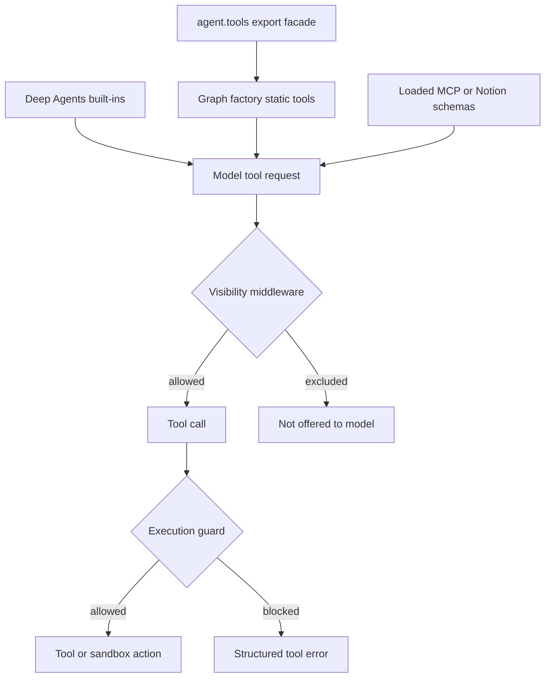

# Tool composition and authorization

A name in `agent.tools` is not a capability grant. Open SWE separates the import catalog, graph-specific wiring, context-dependent visibility, and enforcement at a tool or middleware boundary. This matters because the main coding graph, reviewer, analyzer, and PR chat have deliberately different authority.

## From catalog to an executable tool

`agent/tools/__init__.py` is a lazy facade over curated local, GitHub, Slack, and incident tools. `_TOOL_MODULES` maps each public name to its implementation; access imports and caches the exported object. `_LazyToolsModule` deliberately returns that export rather than an identically named submodule created by `importlib`.

The main graph is a Deep Agents graph. Deep Agents contributes `delete`, `edit_file`, `execute`, `glob`, `grep`, `ls`, `read_file`, `task`, and `write_file`; `DEEP_AGENT_TOOL_NAMES` reserves those names so a static or integration tool cannot collide with one. `ExcludeToolsMiddleware` runs after tool-injecting middleware and filters every model request, which is how the main graph hides `grep` and stop-summary mode additionally hides deletion, edits, shell execution, delegation, and writes.

This flow distinguishes discoverability and per-turn visibility from enforcement when a tool call is made.

## Main-agent composition and conditional visibility

`agent.server:get_agent` builds the normal static surface: web access; plan lifecycle; background execution; user instructions and skills; thread and baby-sit operations; PR creation/review; scheduling; reporting; Slack; and feedback tools. Signed sandbox download, iframe, and port helpers appear only for eligible hosted sandbox runs.

The factory then narrows that set according to trusted runtime context:

- Desktop `local_run` is only `http_request`, `fetch_url`, and `web_search`. `stop_summary` is only Slack thread reading and reply.
- No verified personal credential scope removes user instruction/skill mutations and `read_user_settings`. Channel reading is offered only for private threads; Slack tools require trusted Slack source context, and Slack DMs remove reactions.
- `expedite_pr_approval` additionally needs a Slack token and a workspace feature flag. Automatic incident turns are filtered to a research-oriented subset and omit posting, PR, HTTP, delegation, and incident-control actions.
- `admin_thread` is computed by rechecking the current actor against administrator membership, not by trusting a metadata flag. It adds automation, workspace, and organization-skill operations. The more sensitive `read_only_sql` and review-approval-policy controls require an admin thread on a private dashboard or Slack-DM surface.

The general-purpose subagent receives a filtered copy of the applicable static tools: background jobs and feedback tools are removed, as are tools that rely on parent-only source context. A subagent is its own compiled graph, so it does not inherit parent middleware; the factory explicitly installs its dynamic loader, Deep Agents exclusions, workflow-push guard, model guards, and (outside local runs) PR-creation guard.

## Deferred integrations and credential scope

For an eligible non-desktop, non-summary run, the factory fetches workspace MCP tools and personal Notion tools, then exposes them through `DynamicToolMiddleware` as `MCPs` and `Notion` groups. The MCP sources are loaded in instance, workspace, then personal order; a later same-named connection replaces an earlier one. Loading is time-bounded by `TOOL_LOADER_TIMEOUT_SECONDS` (default five seconds), cached, and degrades to an empty list on timeout or error.

The model initially sees only `load_integration_tools` and a catalog of names, not the integration schemas. It must load named tools; a successful command records `loaded_integration_tools`, so schemas are appended on the next model turn. Calling an integration before loading returns a recoverable error. Group names must be unique and cannot collide with the loader, a Deep Agents built-in, or a static tool. Each group resolution is lock-serialized and cached—including failure—for the middleware instance; run start overwrites the loaded-name state, preventing a prior run's selection from leaking forward.

Notion is a personal credential boundary rather than a sandbox credential. It is loaded only for the verified private credential owner with a connected account. Each discovered MCP schema is wrapped with required `on_behalf_of`; invocation resolves that participant, verifies it is the private owner, obtains a fresh token, rebuilds the requested MCP tool server-side, and invokes it without exposing the token.

## Specialist graphs

| Graph | Curated surface and boundary |
| --- | --- |
| Main coding | Conditional static tools, Deep Agents built-ins, and eligible dynamically loaded MCP/Notion tools. |
| Reviewer | Review diff and finding lifecycle tools plus `web_search`, `fetch_url`, and `http_request`; it does not wire `open_pull_request`. |
| Analyzer | Only `save_review_style_prompt` and `read_finding_outcomes` for review-style guidance. |
| PR chat | Sandbox-less, read-only PR chat with GitHub-backed repository reads, findings, and web tools. |

PR chat does not receive a sandbox. Its factory supplies `read_repo_file`, `search_repo_code`, `list_review_findings`, `web_search`, and `fetch_url`, while its exclusion middleware keeps shell and write-style built-ins out of the chat experience.

## State-aware planning gate

`PlanModeMiddleware` is always installed in the main graph. At run start it resets `plan_mode` to the configured initial value, rather than retaining stale checkpoint state. `enter_plan_mode` persists planning status where possible and emits a `Command` that sets `plan_mode` in run state. Because the middleware filters every model call, that command restricts the next turn; plan approval can similarly turn the state off.

When active, the gate removes delegation, background jobs, port exposure, mutable HTTP, PR actions, thread/baby-sit mutations, sandbox recreation, personal skill mutations, Slack moves/new threads, workspace publication/refresh/deletion, and automation mutations. It also excludes all loaded workspace MCP tools. `read_file`, `write_file`, `edit_file`, and `execute` remain technically available for plan artifacts; the system prompt, rather than this middleware, imposes the no-mutation shell and repository-edit discipline. Excluding `task` is important: a delegated subagent has an independently assembled graph and would otherwise bypass this parent gate.

## Enforcement after selection

Selection gates improve least privilege but are not the final security control.

- `read_user_settings` accepts no target identity. It resolves verified active-thread participants from runtime configuration and returns selected profile preferences, instructions, a Notion connection status, and an unresolved count—not tokens or credentials.
- Automation tools repeat `require_admin` at invocation. Scheduled runs are accepted only when their stored schedule has authorized admin provenance; interactive runs recheck administrator identity. Calls return `{ok: false, error: ...}` for authorization and service failures. Creation records the verified identity, update rejects contradictory clear/set arguments, and triggering does not require an automation to be enabled.
- `PullRequestCreationGuardMiddleware` intercepts `execute` and `background_execute`. It blocks `gh pr create`, POST/body requests to the GitHub pulls endpoint via `gh api` or `curl`, and nested-shell variants, returning a non-recoverable structured error directing the agent to `open_pull_request`. Local desktop runs intentionally omit this guard.
- `WorkflowPushGuardMiddleware` intercepts standalone, safely parseable `git push origin` commands executed in the sandbox. If the exact current-branch push includes `.github/workflows/` changes, it computes a fingerprint from the inspected diff and refs, persists/looks up approval state, optionally notifies the Slack thread, and returns an approval-required error. Approval permits a reconstructed push pinned to the inspected commit and remote ref; a changed diff gets a new fingerprint and needs approval again. Non-workflow pushes and unparsable commands continue normally.

## Safe extension checklist

1. Implement and export a curated tool only if it belongs in the common catalog, then wire it explicitly into each eligible graph.
2. Decide context filters first: desktop, summary, Slack/privacy, credential scope, incident turns, admin/private-admin surface, and subagent context are separate decisions.
3. Reserve names against `DEEP_AGENT_TOOL_NAMES` and existing static names. Use `DynamicToolMiddleware` for expensive or credentialed integration schemas; make loading failures usable errors.
4. Put identity, scope, and side-effect controls in the tool or a call-time guard. Treat model arguments and thread metadata as untrusted for authorization; keep credentials server-side.
5. For mutations, add the tool to `PLAN_MODE_EXCLUDED_TOOLS` where planning must prevent it, and test both visibility and direct guard behavior. Focused coverage exists for dynamic loading, plan-mode state changes, PR fallback detection, workflow approval, and Notion token refresh.

## Related pages

- [Agent graph](../architecture/agent-graph.md) — factories and graph lifecycle.
- [Middleware stack](../architecture/middleware-stack.md) — middleware ordering.
- [Observability and MCP](../integrations/observability-and-mcp.md) — MCP operations.
- [PR creation](../workflows/pr-creation.md) — attributed PR workflow.
