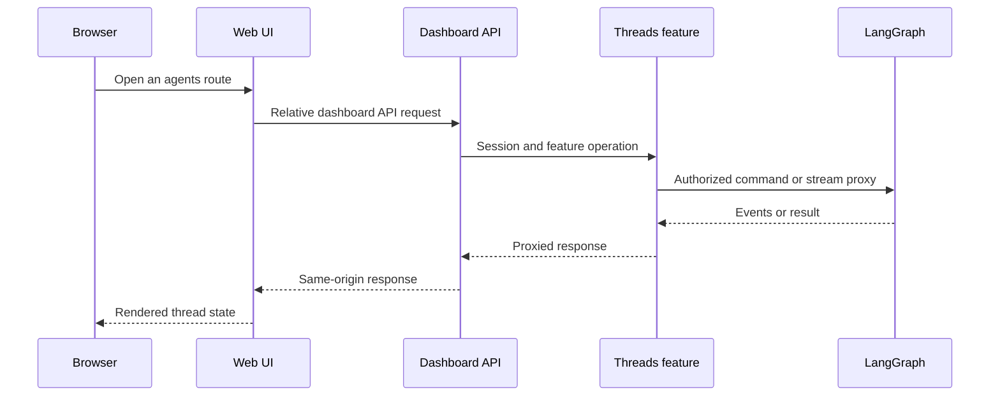
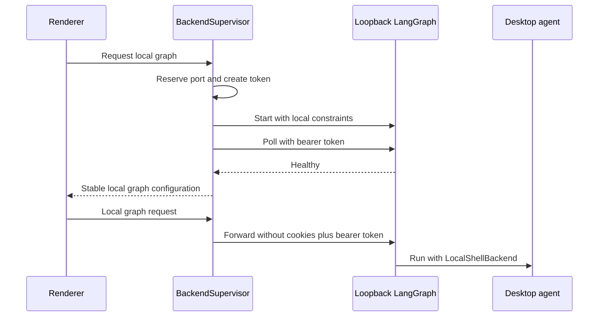

# Dashboard, web API, and desktop UI

The dashboard is the human-facing control plane for Open SWE. Its Python API owns browser sessions, authorization and dashboard-specific operations; it composes feature routers rather than being a single monolithic endpoint module. The React/TanStack Start application and the Electron renderer consume that API through same-origin proxy boundaries, so they do not need direct LangGraph or deployment credentials.

## Mount and API composition

`agent.api.app.create_app()` configures credentialed CORS from `DASHBOARD_ALLOWED_ORIGINS`, rejects `*` with credentials, includes the dashboard router with the other application routers, and finally calls `mount_dashboard_ui(app)`. The dashboard router is mounted at `/dashboard/api`, applies `require_same_origin_for_mutations` to every included feature router, and composes authentication, profiles, workspace settings, repositories, reviews, skills, schedules, threads, transcripts, MCP, analytics, and integration routers. `agent.dashboard.router` is imported lazily, so non-web users of dashboard submodules do not also load the router and its API dependencies.

The static UI mount deliberately leaves server-owned prefixes such as `/dashboard/api`, `/threads`, `/runs`, `/webhooks`, `/health`, and `/docs` alone. If `DASHBOARD_STATIC_DIR` contains `_shell.html`, it is preferred; otherwise an in-repository `ui/.output/public` build is used when available. Hashed assets receive immutable one-year caching and navigations that accept HTML receive the no-cache shell. Unknown non-HTML paths fall through instead of returning the shell. `DASHBOARD_DEV_SERVER_URL` replaces the static handler with a streaming reverse proxy to Vite while retaining the backend origin; it preserves redirects and filters hop-by-hop headers. Because the UI route is a catch-all, it must be registered after API routes; call `keep_dashboard_ui_last(app)` after adding routes later.

A build served under a LangGraph mount prefix needs a matching `DASHBOARD_BASE_PATH`; the client router uses Vite's `BASE_URL` as its TanStack Router base path.

## Authentication and request safety

GitHub login at `GET /dashboard/api/auth/login` creates signed state containing a hash of a nonce held in a short-lived state cookie, then redirects to GitHub. The callback verifies browser state unless it is a desktop handoff, exchanges the code, enforces the GitHub login gate, persists the GitHub token response, and signs in the application user. Normal browser login returns a signed session cookie; desktop login instead redirects a PKCE-bound handoff code to the desktop loopback listener. `POST /auth/desktop/exchange` accepts that code and verifier and returns the signed session plus its expiry.

`require_session` decodes the dashboard session cookie or returns `401`; `ADMIN_DEP` adds the administrator check. The router-level CSRF dependency allows safe methods and bearer-token-only requests, but requires an allowed `Origin` or `Referer` for cookie-authenticated mutations. It applies the origin check to WebSockets too. This is a CSRF boundary rather than an authority substitute: feature endpoints still apply administrator, repository, or thread-level access controls.

## Threads, streaming, and terminal access

The threads feature owns thread discovery, summaries, pinned lists, details, commands, state/history and stream proxies, thread mutations, recovery patches and diffs. Its public HTTP routes require a session; `all=true` is administrator-only. The page-list endpoint validates mutually exclusive repository and ownerless filters and passes the remaining filtering and summary work to the listing service. The UI uses dashboard API calls for dashboard-owned operations; the thread routes proxy the LangGraph command, history, stream-event and cancellation surfaces behind dashboard authorization.

Cloud terminal access is a two-step, short-lived capability: the terminal connection endpoint checks the caller's access and returns a WebSocket URL, `open-swe-terminal` protocol, and thread-bound ticket with `Cache-Control: no-store`. The WebSocket takes the ticket in its subprotocol, so it can authenticate without sending the dashboard cookie over that connection. The terminal implementation remains the owner of sandbox/readiness and PTY bridging behavior.

Diagram: web thread operations cross the dashboard policy boundary before reaching LangGraph.

## Feature-owned configuration and operations

The aggregate dashboard router is intentionally only a composition point. Individual features own their records and routes:

- **Workspace settings** have an instance record and sparse workspace override records. Effective settings merge hard-coded defaults, instance values, then workspace values; absent or `None` workspace fields inherit. Reads fail soft to defaults if the store is unavailable, because runs and webhooks depend on settings. The API exposes session-protected reads and admin-only writes at `/settings` and `/workspaces/{workspace}/settings`; workspace names are normalized and must exist. Validation normalizes deprecated model pairs, rejects invalid model/effort combinations, bounds review text, and applies the Fable policy before persistence.
- **Schedules** permit any session to list, but require an administrator to create, update, trigger, or delete. The schedule router delegates persistence, cron coordination, and execution to `agent.schedules.store` rather than embedding those concerns in the dashboard aggregate router.
- **Reviews** scope styles and review material to repository access. For example, listing styles filters every stored style through current repository access and reconciles running style analysis; fetching a review, diff, image, or re-review explicitly checks access to its `owner/repo`. Administrators alone can change enabled review repositories.
- **Repository-scoped records** use shared dashboard helpers to filter lists by the caller's current repository access. This keeps a stored record from becoming visible merely because it was visible when it was created.

## Web client and deployment proxy

`ui/` uses TanStack Router and its SSR query integration. Browser code forms `/dashboard/api` URLs from a relative base, which keeps cookies same-origin. During SSR, it instead targets `DASHBOARD_API_URL` and explicitly copies the incoming `cookie` header because server-side `credentials: "include"` does not forward browser cookies.

In development, Vite proxies backend prefixes to `DASHBOARD_API_URL` or `http://localhost:2024`, retaining OAuth redirects. In deployed builds, Nitro directs `/dashboard/api/**` and `/webhooks/**` to `ui/server/backend-proxy.ts`. That handler reads `DASHBOARD_API_URL` for every request and fails without it, streams request bodies, retains 3xx responses with `redirect: "manual"`, removes hop-by-hop and reframed headers, and emits each upstream `Set-Cookie` as a separate header line.

The Agents layout normally requires a session. Electron's explicit local-only mode is the exception: an unauthenticated user may use `/agents` or `/agents/local/{sessionId}` when desktop local mode is enabled. The shared stream provider uses local transport only for a local session and cloud transport for a normal thread.

## Electron local mode and supervisor

The experimental Electron client serves the compiled UI at `open-swe://app`. It proxies `/dashboard/api/*` to the user-selected backend, keeping the renderer away from raw LangGraph and LangSmith credentials; packaged builds have no hosted-backend default. It separately proxies `/local-graph` to a private local graph. A user can continue in local mode without GitHub, but cloud threads, settings, and other account-backed features remain behind sign-in.

`BackendSupervisor` starts that local graph lazily and coalesces simultaneous starts. It reserves a random loopback port on `127.0.0.1`, generates a random bearer token, requires a projects allowlist and worktree directory, and launches `langgraph dev` using `langgraph.desktop.json` in development or the bundled runtime/configuration when packaged. It passes the token, project/worktree constraints, and state-directory artifact/checkpoint locations to the child, then polls the authenticated loopback root until it is healthy or the startup timeout expires. The renderer receives only `{ apiUrl: "/local-graph", graphId: "agent" }`; the supervisor proxy removes renderer cookies and injects the bearer token. Shutdown clears supervisor state, sends `SIGTERM`, and escalates to `SIGKILL` after its timeout.

A run with `source == "desktop"` selects `LocalShellBackend`. Its `local_project_path` must resolve to an existing allowlisted project or a worktree below the desktop-managed worktree directory. Desktop artifact routes put `large_tool_results` and `conversation_history` in sanitized per-thread directories outside the project, avoiding accidental working-tree changes from agent scratch data.

Diagram: Electron owns the loopback token and port while the renderer sees only a stable local proxy URL.

## Focused verification

Dashboard tests exercise static-shell routing, reserved-path precedence, cache headers, mount-prefix handling, reverse-proxy streaming and redirect behavior, and moving the catch-all after later routes. CSRF tests cover allowed, missing, malformed and cross-site origins plus the router-wide mutation guard. Thread tests cover command/message behavior and terminal tests verify thread-bound, expiring tickets and WebSocket subprotocol authentication. Workspace-setting tier tests cover inheritance, migration compatibility, clearing overrides, Fable policy, per-workspace cache isolation, and API validation.

## Related

- [Auth and security](../concepts/auth-and-security.md)
- [Threads and state](../concepts/threads-and-state.md)
- [Deployment](../operations/deployment.md)
- [Invocation](../workflows/invocation.md)
