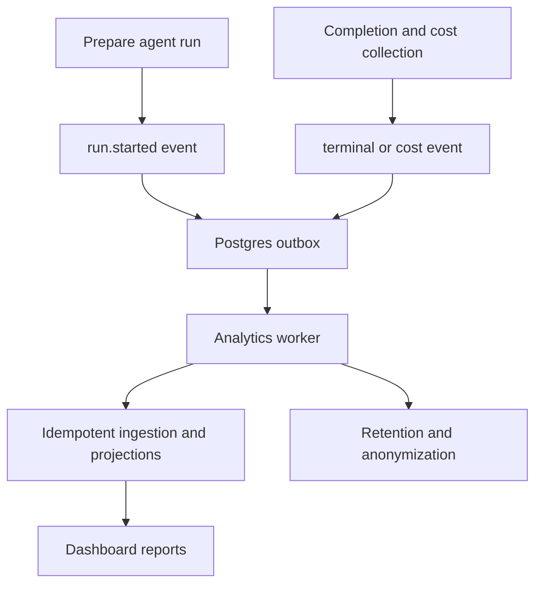
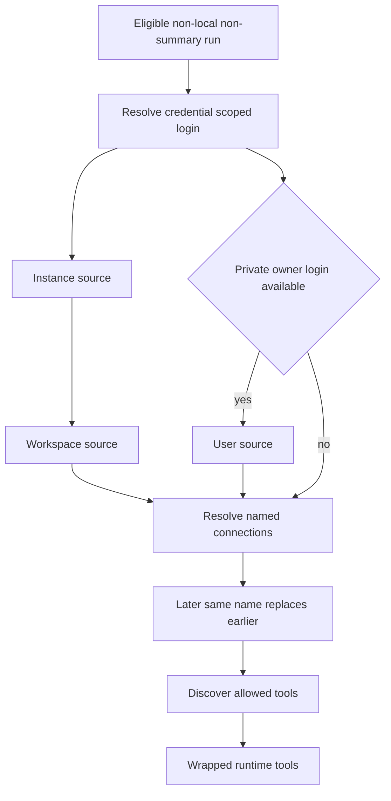

# Observability and connected tools

The current connected-tool implementation has two general mechanisms rather than dedicated Datadog, LangSmith, Corridor, Currents, or Stagehand loaders: configurable remote MCP connections and the hosted Notion MCP integration. Model routing can still optionally use the LangSmith LLM Gateway, but it is not an agent tool surface. This distinction matters when operating or extending the system: references to the former provider-specific tool integrations do not describe loaders in the current `agent/tool_loaders/` tree.

The server also emits durable product analytics independently of tool loading. Analytics capture is optional and fail-soft; MCP and Notion failures remove only the affected optional tools.

See [Agent graph](../architecture/agent-graph.md) for agent construction, [Authentication and security](../concepts/auth-and-security.md) for the trust model, [Tools](../concepts/tools.md) for dynamic tool availability, and [Configuration](../operations/configuration.md) for deployment settings.

## Analytics lifecycle

When preparation has an invocation ID, `PrepareAgentRunMiddleware` records a run start with the selected model, effort, source, repository, thread, and resolved person identity. It stores opaque IDs in the event envelope rather than raw run, thread, model, repository, or person keys. The configured model is deliberately not claimed to be the effective executed model because routing, fallback, and subagents can differ.

Analytics is an event pipeline:

The diagram shows durable capture: producer operations enqueue events first, and a background worker delivers and projects them later.

Events have strict, payload-specific schemas that reject unrecognized fields, including a forbidden-key guard for content such as prompts, responses, source code, diffs, paths, email, and display names. Capture functions first check that the database is configured and catch/log exceptions, so analytics outages must not interrupt product operations.

Enqueueing inserts the serialized envelope into `outbox` transactionally with `ON CONFLICT DO NOTHING`. The worker claims bounded batches using row locks, hands each to idempotent ingestion, then acknowledges it. Failed delivery is rescheduled with exponential jitter; after `ANALYTICS_OUTBOX_MAX_ATTEMPTS` it becomes a dead letter. The worker also recomputes dirty summaries and applies retention. Raw events, receipts, acknowledged outbox rows, personally identifying directory fields, and aggregates each have independently configured retention windows. Administrators can inspect readiness and outbox backlog; dashboard reports return unavailable rather than fabricated data when the database or reporting system is unavailable.

## Configurable MCP connections

### Scopes, precedence, and loading

An MCP connection is a named, admin- or user-configured remote server with an HTTPS URL, `streamable_http` or SSE transport, an enabled flag, an explicit allowlist of remote tool names, optional authentication headers, and optional OAuth client-credentials settings. Connections are stored in three scopes:

- **Instance** connections are the inherited baseline for every workspace.
- **Workspace** connections belong to a workspace and are managed by administrators.
- **User** connections belong to one dashboard login and are included only when a credential-scoped login is available for the run.

The agent factory constructs sources in that order: instance, workspace, then user. Later sources replace an entire same-named connection, not merely overlapping tools. Therefore a disabled or empty personal override intentionally suppresses an inherited connection instead of falling back to it. If any source catalog cannot be read, loading returns no MCP tools at all: exposing a lower-precedence connection after a failed higher-precedence lookup would violate the override boundary.

This flowchart shows both source precedence and credential-scoped loading. MCP and Notion groups are loaded concurrently only for non-summary, non-local runs whose credential scope is known.

Discovery initializes a remote session, follows paginated tool lists while rejecting repeated cursors and duplicate names, and caches a catalog for 600 seconds under the source namespace, connection name, and connection revision. Only definitions in `allowed_tools` become local tools. Generated names include a normalized connection/tool name and a hash suffix to prevent collisions.

The returned tool does **not** retain unrestricted access to the originally discovered connection. At invocation it resolves the connection again across the original source sequence and verifies the resolved source, enabled state, URL, transport, and allowlist entry match the loaded definition. A connection that was disabled, changed, or moved to another scope asks the caller to start a new run rather than switching credentials or endpoint beneath an existing tool.

### Credential and network controls

Connection validation accepts only HTTPS URLs without embedded credentials, fragments, control/whitespace characters, or secret-looking query parameters. Header names and values are bounded and validated; hop-by-hop, host, length, and proxy-authorization headers are blocked. Header maps and OAuth client secrets are encrypted at rest, while public dashboard records expose header names rather than values. Reusing saved authentication is restricted to the prior record in the same scope; changing a URL requires replacing or explicitly clearing existing headers.

The transport pins each request to the configured HTTPS origin, resolves and validates public addresses, then connects to the checked IP while preserving the original Host header and TLS SNI name. Redirect following and environment proxy trust are disabled. Thus an MCP server cannot redirect credentials to another host, and DNS rebinding cannot turn a validated public name into a private-address request.

A connection may instead use OAuth `client_credentials` with either `client_secret_post` or `client_secret_basic`; it cannot combine that mode with an Authorization header. The runtime caches tokens by scope, connection, settings, and encrypted secret, refreshes before expiry, and retries once after a 401 with a newly acquired token. Tokens are consequently not shared between otherwise identical user scopes, and rotating a secret produces a new cache entry. User-facing discovery and invocation failures are normalized so remote responses and credentials are not leaked.

### Failure behavior and extension points

Discovery has a 30-second timeout and translates common HTTP, timeout, OAuth, duplicate-catalog, and connection errors into safe diagnostics. A discovery failure is logged and produces an empty group. A call failure becomes a `ToolException` with a generic connection-and-credentials message. This is deliberate graceful degradation: a remote integration should not prevent agent creation.

The dashboard API provides scoped list, save, delete, header-reveal, and discovery endpoints. Instance and workspace routes require administrator authorization; personal routes use the authenticated session. Discovery can validate an unsaved draft but only lists tool descriptions—it never invokes a tool. To add another source tier or policy, supply an `MCPSource` with an isolated namespace and authorize it before passing it to `load_mcp_tools`; the runtime's source ordering then defines precedence.

## Notion MCP and personal credential scope

Notion remains a dedicated hosted MCP integration at `https://mcp.notion.com/mcp`. It connects from the server process using a bearer access token, not from the task sandbox. Unlike configurable MCP connections, it uses a user OAuth authorization-code flow with PKCE and dynamic client registration. Discovery requires the protected-resource and authorization-server metadata plus every returned authorization, token, and registration endpoint to be HTTPS on `mcp.notion.com`; network failures and malformed metadata become controlled OAuth errors.

The OAuth flow record is stored below the initiating login and includes an encrypted verifier and, where supplied, encrypted client secret. Reading the flow deletes it. The resulting user credential record encrypts access token, refresh token, and client secret. A status response shows connection state and timestamps but never tokens.

Personal credentials are stronger than a thread-participant hint: `private_credential_login` permits them only on a private thread when the saved owner login matches the authenticated run requester. Public threads, system-owned private threads, missing ownership, or a mismatch cannot load or call personal Notion tools. `load_notion_tools` checks that boundary before catalog discovery. Each exposed schema adds required `on_behalf_of`, and each call resolves that participant then rechecks the private owner, obtains a current token, rebuilds the named MCP tool, and invokes it without passing `on_behalf_of` upstream. This prevents a catalog loaded earlier from becoming durable authority for a stale token or another user.

Credential lookup is intentionally fail-soft because it gates optional tool availability. Expiring tokens refresh under a per-login lock; an `invalid_grant` refresh removes the stale connection unless another concurrent refresh has already replaced it. Missing credentials, failed catalog retrieval, or later missing authorization result in no tools or a reconnect error, rather than failing the run.

## LangSmith Gateway versus observability tools

`make_model` can route supported provider model calls through the LangSmith LLM Gateway when the deployment or workspace setting enables it. Gateway overrides are applied centrally and unsupported providers simply continue with direct model configuration. This optional routing path is distinct from both analytics storage and an agent-accessible LangSmith run-inspection tool. The current repository does not provide the earlier dedicated Datadog, LangSmith inspection, Corridor, Currents, or Stagehand browser loader implementations; use a configured MCP connection when an approved remote MCP server supplies an equivalent tool surface.

## Focused verification

The focused tests exercise source replacement and fail-closed lookup behavior, catalog isolation by owner, runtime scope-change rejection, OAuth token reuse and rotation, request-origin and public-address pinning, Notion wrapper refresh behavior, and analytics event capture. These tests are particularly useful when changing source precedence, credential caching, error redaction, or lifecycle durability.
