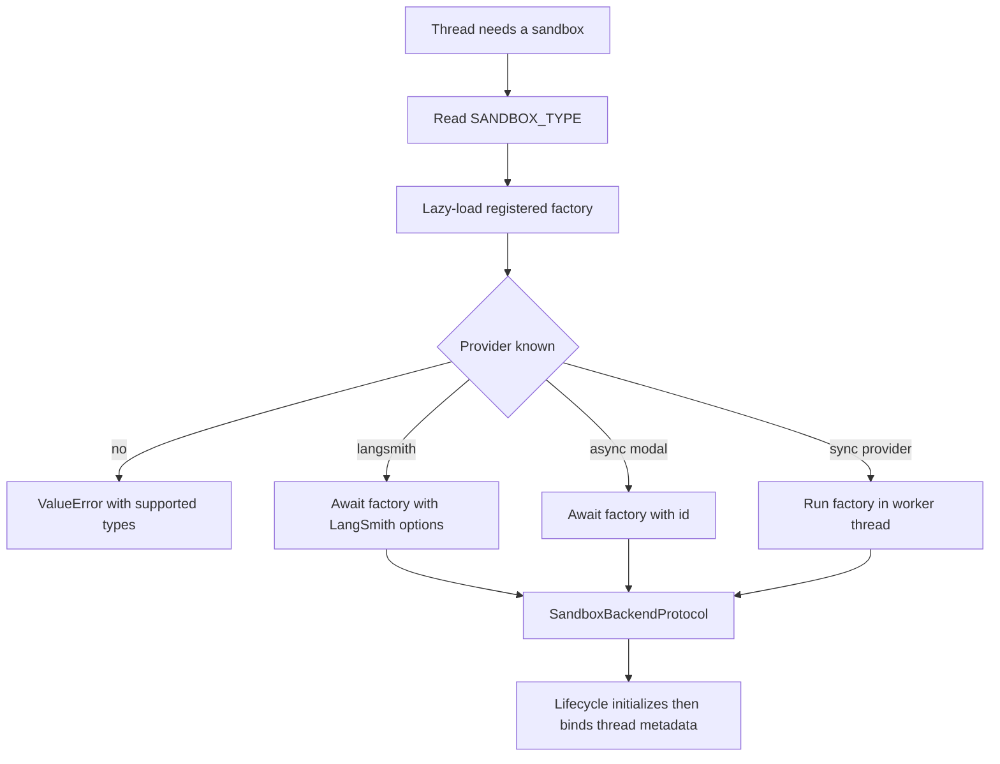

# Sandbox Provider Integration

Open SWE runs repository work through a `SandboxBackendProtocol`. Provider selection is operational configuration rather than an agent-graph change: `create_sandbox()` resolves the active provider, while the sandbox lifecycle owns the thread binding, safe reconnection, and replacement policy. See [sandbox lifecycle](../architecture/sandbox-lifecycle.md) for the broader thread lifecycle and [configuration](../operations/configuration.md) for environment variables.

## Registry, contract, and startup validation

`SANDBOX_TYPE` defaults to `langsmith`. The registry supports `langsmith`, `daytona`, `modal`, `runloop`, `e2b`, and `local`, mapping each name to a module and factory name. The selected module is imported lazily, so unselected provider SDKs are not loaded. An unrecognized value raises `ValueError` and lists the supported types.

Every factory accepts `sandbox_id: str | None`: a supplied id reconnects and an omitted id creates. Factories return a `SandboxBackendProtocol`; the agent lifecycle relies on its async file and command operations as well as its stable `id`. `create_sandbox()` passes snapshot, CPU, memory, filesystem, and arbitrary create-body options only to LangSmith; other providers receive only the id. LangSmith and Modal factories run natively async. Synchronous provider wrappers—Daytona, E2B, Runloop, and Local—run through `asyncio.to_thread`, keeping blocking SDK or filesystem setup off the event loop.

Provider resolution and the point at which a successfully initialized backend becomes eligible for thread binding.

The FastAPI lifespan hook calls `validate_sandbox_startup_config()` before serving. Validation is currently provider-specific only for LangSmith: configured resource and TTL values must be integers, the TTLs must be non-negative, and `SANDBOX_CREATE_EXTRA_JSON` must parse as a JSON object. Other provider credentials are checked when their factory is invoked.

## Thread binding and failure semantics

`ensure_sandbox_for_thread()` reads thread metadata and either creates a backend or reconnects to the metadata id, reusing a process-local connection when available. A new backend is booted from the selected workspace's ready snapshot and resource/create settings; without a workspace snapshot it uses the provider's base behavior. It reapplies the bot Git identity on new, cached, and reconnected backends.

A missing LangSmith box is deliberately distinct from an unreachable box. `ResourceNotFoundError` becomes `SandboxGoneError`, so the lifecycle recreates the deleted box. Other reconnection failures become `SandboxUnreachableError` and normally stop the run rather than silently replacing the working tree with an empty sandbox. `allow_replacement=True` permits that trade-off for reviewer threads because their checkout is regenerated on every review run.

Initialization precedes persistence: the lifecycle updates thread metadata with `sandbox_id` only after creation, identity setup, proxy work, and a best-effort workspace update finish. It publishes the backend proxy last. Recreate also requires a distinct new id and retains the old binding until metadata persistence succeeds. This ordering prevents later work from adopting an incompletely initialized or unpersisted sandbox.

The provider interface intentionally has no delete operation. A sandbox can contain the agent's only working tree, and failed metadata reads can look like no sandbox; cleanup is instead a platform responsibility controlled by creation-time idle and delete-after-stop TTLs.

## Provider capabilities

| Provider | Create or reconnect behavior | Credentials and configuration | Important limitation |
|---|---|---|---|
| `langsmith` | Async client creates or gets a box, then wraps its synchronous form | `LANGSMITH_API_KEY` and `LANGSMITH_ENDPOINT`; snapshots, resources, TTLs, extra create fields | The only selector-level snapshot/resource provider and the only provider with lifecycle-managed GitHub proxy refresh |
| `daytona` | Gets an id or creates from a snapshot | `DAYTONA_API_KEY`; `DAYTONA_SANDBOX_SNAPSHOT` defaults to `daytonaio/sandbox:0.6.0` | Uses a synchronous SDK wrapper |
| `modal` | Reattaches by id or creates in the configured app | Modal credentials; `MODAL_APP_NAME` defaults to `open-swe` | No selector-level resource or snapshot forwarding |
| `runloop` | Retrieves an id or creates a devbox | `RUNLOOP_API_KEY` | Uses a synchronous SDK wrapper |
| `e2b` | Connects by id or creates a sandbox | `E2B_API_KEY`; optional `E2B_TEMPLATE`; one-hour timeout | Uses a synchronous SDK wrapper |
| `local` | Creates a host-backed `LocalShellBackend`; ignores ids | Optional `LOCAL_SANDBOX_ROOT_DIR`, defaulting to the current directory | No isolation; development only |

### LangSmith provisioning and configuration

Sandbox provisioning, connection, proxy configuration, and workspace snapshot captures use the deployment's `LANGSMITH_API_KEY` and `LANGSMITH_ENDPOINT`. The SDK client endpoint is normalized to `/v2/sandboxes`, including when the configured endpoint already has that suffix. `SANDBOX_LANGSMITH_API_KEY` and `SANDBOX_LANGSMITH_ENDPOINT` are not used.

A new box uses its supplied workspace snapshot when one is available; otherwise the create request omits `snapshot_id`, which selects the platform root snapshot. Defaults are 4 vCPUs, 16 GiB memory, 128 GiB filesystem capacity, a two-hour idle TTL, and a 30-day delete-after-stop TTL. Setting either CPU or memory per call leaves the other as `None`, rather than mixing a partial override with the deployment default. Zero disables either TTL.

`SANDBOX_CREATE_EXTRA_JSON` supplies deployment-level JSON object fields, and per-workspace `create_params` override conflicting fields. The implementation sends recognized SDK fields normally and wraps the SDK HTTP `POST /boxes` call to inject unsupported fields into that create request only. Normal LangSmith creation retries retryable failures up to three attempts.

### LangSmith execution and egress credentials

`TimeoutLangSmithSandbox` adapts the synchronous LangSmith object to the async agent use case. With an effective command timeout, it starts a non-blocking command, waits for the command timeout plus `SANDBOX_EXECUTE_CLIENT_GRACE_SECONDS` (30 seconds by default), and converts the result to `ExecuteResponse`. A server `CommandTimeoutError` returns exit code 124 without a kill; expiry of the client deadline triggers a best-effort kill and returns exit code 124. WebSocket setup or supported midstream failures fall back to the base HTTP-capable `aexecute()` path. With no effective timeout, it delegates directly to that base path.

Only `SandboxRetryableConnectionError` is retried for command execution: it denotes a rejected WebSocket upgrade before the execute frame was sent, making a retry safe from double execution. Retries are capped at four attempts with jittered exponential backoff.

For LangSmith thread creation and reuse, the lifecycle obtains workspace-scoped GitHub access at runtime and configures proxy rules. The proxy injects Basic authentication for `github.com` and `*.github.com`, and Bearer authentication plus a placeholder `GH_TOKEN` for `api.github.com`; the real token is not written into the sandbox environment. A not-ready proxy update starts the box best-effort and retries. Caller-provided proxy rules are preserved except obsolete built-in credential rules. Non-LangSmith providers skip this integration.

## Local and desktop exceptions

`local` executes directly on the host and must be used only for local development with human oversight. It creates the root directory, constructs an environment without selected model, LangSmith, and OAuth broker secrets, and uses `inherit_env=False`. Unless the operator explicitly provides `GIT_CONFIG_GLOBAL`, it writes a root-local `.gitconfig-sandbox` that includes the host configuration; this preserves aliases and helpers while preventing bot identity writes from overwriting the developer's `~/.gitconfig`.

Desktop routing is not a sandbox-provider selection. `ReadOnlyBackend` delegates async listing, read, grep, glob, and download operations while rejecting synchronous calls; it supplies read-only skill routes without exposing mutation operations.

## Reviewer repository preparation

Reviewer sandboxes are reusable but their repository content is deliberately re-derived. The reviewer requests `allow_replacement=True` because its checkout can be recreated. Before the first model call, `prepare_review_repo()` clones or fetches the target repository, fetches the base and PR head (including the pull ref for fork PRs), force-checks out the expected head SHA, and verifies `HEAD`. It has a 240-second command timeout and returns `False` rather than failing the review when preparation cannot complete; the reviewer can still use fetched diff context.

When preparation succeeds, `materialize_trusted_skills()` copies `.agents/skills` and `.claude/skills` from the PR base SHA—not the PR head—into a sibling `.review-skills` directory. This prevents a PR author from injecting new reviewer instructions through a changed `SKILL.md`.

## Adding a provider

Add a provider as a registry extension:

1. Implement `agent/sandboxes/providers/<name>.py` with `create_<name>_sandbox(sandbox_id: str | None = None)`. It must reconnect when given an id, create otherwise, and return a `SandboxBackendProtocol`. A factory may be synchronous or `async def`.
2. Add `"<name>": ("agent.sandboxes.providers.<name>", "create_<name>_sandbox")` to `SANDBOX_FACTORIES` in `agent/sandboxes/providers/registry.py`.
3. Define credential validation and failure classification. In particular, do not mask a reconnect failure by returning an empty replacement: persistent working trees make unreachable and deleted states materially different.
4. Test factory creation/reconnection and registry dispatch. Decide explicitly whether provider-specific capabilities such as snapshots, resource overrides, proxy credential refresh, and browser tooling are unsupported or need an equivalent implementation.

A custom backend can extend `deepagents.backends.sandbox.BaseSandbox`, whose file operations delegate to execution; the provider then supplies an `id` and shell execution implementation. Ensure the actual backend supports the async operations used by the agent lifecycle.

## Focused verification

`tests/sandbox/test_langsmith_sandbox_config.py` exercises endpoint and create-body behavior, default-root snapshot omission, validation, retry, and missing-box classification. `test_langsmith_sandbox_timeout.py` covers deadline, kill, server timeout, response conversion, fallback, and retry behavior. `test_proxy_auth.py` checks proxy payloads and custom-rule preservation. Provider-focused tests cover Daytona and E2B defaults plus Local root, environment, and Git-config isolation. Lifecycle tests cover safe recovery, recreate handoff ordering, and reviewer replacement policy.
