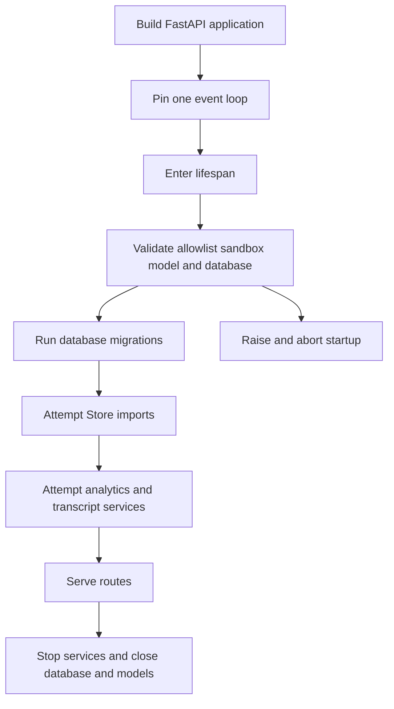

# Configuration and settings surfaces

Open SWE deliberately separates **deployment configuration** from mutable settings:

- The `ENV` registry in `agent/config.py` owns every application environment variable: service endpoints, provider selection, credential *names*, deployment defaults, and feature switches. Treat these values as deployment-owned; use the registry rather than a new direct environment read.
- Persisted settings express choices made after deployment. Instance settings apply to all workspaces; workspace records contain only overrides; profiles are per user. OAuth and third-party tokens are separate encrypted records, not profile fields.

This page maps ownership, precedence, validation, and operational failure modes rather than reproducing secret material. `agent/config.py` is the exhaustive environment catalog. See [Deployment](deployment.md), [Authentication and security](../concepts/auth-and-security.md), [Models, profiles, and instructions](../concepts/models-profiles-instructions.md), and [Sandbox providers](../integrations/sandbox-providers.md) for deeper domain guidance.

## Environment registry and deployment boundary

`ENV` reads lazily, so late secret injection, rotation, and test patches are observed. A blank or whitespace-only value is unset. Canonical names beat aliases; aliases and deprecated names are declared in one place, and an undeclared name raises rather than silently becoming a new configuration surface. The registry offers required, optional/defaulted, integer, boolean, and comma-separated-list accessors. Integer conversion fails explicitly; an unrecognized boolean falls back to the accessor's supplied default.

The registry also marks secret-bearing variables. Keep such values in the deployment secret mechanism or encrypted credential storage, never in documentation, settings records intended for ordinary display, or URLs. Relevant categories include LangSmith and model-provider credentials, GitHub and Slack app credentials, dashboard signing, token encryption, sandbox-provider credentials, and database connection strings.

`langgraph.json` is the platform deployment descriptor. It registers `agent`, `reviewer`, `analyzer`, `chat`, and `scheduler`, mounts `agent.webapp:app`, reads `.env`, and sets a delete-based checkpointer policy: a 60-minute sweep and a 43,200-minute default TTL. In standalone operation, the application additionally requires its database configuration: lifespan calls `database.require_configured()` before migrations. The installation guide identifies the runtime infrastructure and the required external integration categories.

### Public URL and dashboard settings

`LANGGRAPH_URL` is the LangGraph server URL used by dispatch. Dashboard base/API URLs normally derive from it when the UI and backend share an origin; `DASHBOARD_STATIC_DIR` selects a bundled build and `DASHBOARD_DEV_SERVER_URL` is for local development forwarding. `DASHBOARD_ALLOWED_ORIGINS` is an explicit comma-separated CORS allowlist. `create_app()` rejects `*` because the middleware enables credentials; when the list is empty it does not install that CORS middleware.

## Startup lifecycle and what can fail

The FastAPI app pins a single event loop before queue construction and again at lifespan entry. Before it serves, it validates the GitHub login allowlist, validates the active sandbox configuration, validates local-development model credentials, verifies database configuration, and runs migrations. Workspace and user Store-to-database imports are attempted but failures are logged rather than aborting startup; failed workspace import means repository routing fails closed until a later import succeeds. Analytics worker and transcript listener failures also log and leave the server running. Shutdown stops those services, closes the database, and closes cached model clients.



This shows the distinction between startup-blocking dependencies and best-effort migration or auxiliary services.

Sandbox boot validation is provider-specific: the registry currently invokes LangSmith validation only for `SANDBOX_TYPE=langsmith`. It checks configured numeric resource fields, rejects negative TTLs, and requires `SANDBOX_CREATE_EXTRA_JSON` to be a JSON object. `validate_local_dev_llm_config()` is deliberately scoped to a configured `DASHBOARD_BASE_URL` beginning `http://localhost`; it does not validate all choices that might later come from a workspace, profile, or thread.

## Sandbox configuration and snapshots

`SANDBOX_TYPE` defaults to `langsmith`. The lazy factory registry supports `langsmith`, `daytona`, `modal`, `runloop`, `e2b`, and `local`; an unknown type produces `ValueError` with the supported set. Only the LangSmith path accepts the optional snapshot, resource, and arbitrary create parameters passed to `create_sandbox`; other providers receive an optional existing sandbox ID. The local provider runs on the host without isolation and is therefore development-only.

For LangSmith, a missing snapshot ID lets the service boot its root snapshot. Default resource values are 128 GiB filesystem, 4 vCPUs, 16 GiB memory, 7,200 seconds idle TTL, and 2,592,000 seconds deletion-after-stop TTL. The TTL settings accept `0` to disable their respective expiry behavior. Sandbox provisioning, snapshots, and proxy setup use `LANGSMITH_API_KEY` and `LANGSMITH_ENDPOINT`; the former `SANDBOX_LANGSMITH_*` override names are not configuration surfaces.

Workspace snapshots are distinct from deployment resource defaults. A workspace record can hold a base snapshot and a captured ready snapshot; refresh uses the ready snapshot for an update and the base snapshot otherwise. The workspace model validates a supplied base snapshot identifier as bounded, opaque provider-scoped text. Do not infer a global `DEFAULT_SANDBOX_SNAPSHOT_ID`: it is not registered by the current application.

## Model catalog, defaults, and routing

The supported dashboard catalog is the authority for selectable model identifiers, supported reasoning efforts, image support, and whether a model may be a default. `LLM_MODEL_ID` and `LLM_REASONING_EFFORT` form the deployment fallback pair. If no model is supplied, an Anthropic-only deployment selects `anthropic:claude-opus-5`; other deployments select `openai:gpt-5.6-sol`. The fallback effort is `medium` when supported, otherwise the catalog default; unsupported default models or model/effort pairs raise when defaults are resolved.

`LLM_FALLBACK_MODEL_ID` optionally specifies the resilience fallback. If absent, an Anthropic primary maps to the OpenAI default and an OpenAI primary maps to the Anthropic default; other providers do not receive an implicit cross-provider fallback. Model construction gives every request six retries, and gives OpenAI, Anthropic, Baseten, Google GenAI, and Fireworks a 600-second default request timeout. Clients are cached by event loop and construction options, then closed at shutdown.

LangSmith Gateway routing is an optional deployment default. `LANGSMITH_GATEWAY_ENABLED` is authoritative when set; otherwise the presence of `LANGSMITH_GATEWAY_API_KEY` enables it. A gateway-specific key is preferred for authentication, with `LANGSMITH_API_KEY` as fallback. The gateway supports OpenAI, Anthropic, Baseten, Fireworks, and Google GenAI; unavailable gateway credentials or an unroutable provider cause a logged direct-provider fallback rather than a run failure. Direct Baseten is the exception: it requires `BASETEN_API_KEY` when gateway routing did not apply.

## Persisted settings and precedence

### Instance and workspace settings

The legacy `team_settings/default` record is now the **instance** tier. A workspace has a sparse record in `workspace_settings/<slug>`: missing or `None` fields inherit the instance tier. Effective workspace settings merge in this order:

```text
hardcoded defaults → instance settings → workspace overrides → caller-specific profile or thread/run choices
```

The last layer is applied only by callers that honor it. Workspace resolution slugifies an explicit workspace; otherwise it uses the running configuration's workspace or the default workspace. A Store read failure returns hardcoded defaults so an unavailable settings Store does not fail every run.

Settings cover review behavior and instructions, repository default, gateway/Fable/adaptive-routing switches, and model-and-effort pairs for agent, subagent, reviewer, grouping, chat, and thread titles. Writes reject unsupported or incomplete model/effort pairs and review instructions over 10,000 characters. Deprecated models are cleared; unknown stale models resolve to a same-provider supported fallback where possible, then the deployment default. When unset, chat inherits the agent pair and review grouping inherits the reviewer subagent pair. Disabling Fable replaces persisted Fable defaults with a safe non-Fable pair, and the construction boundary also gates Fable selections.

`GET`/`PUT /dashboard/api/settings` reads or writes the instance tier (writes require an administrator); the legacy `/team-settings` paths remain hidden compatibility aliases. `GET`/`PUT /dashboard/api/workspaces/{workspace}/settings` exposes effective values plus explicit overrides for an existing workspace, with administrator-only writes.

### User profiles and credentials

A signed-in user reads and writes a profile at `GET`/`PUT /dashboard/api/profile`. A profile stores editable defaults: main and subagent model pairs, repository and branch preferences, CI and PR preferences, adaptive-routing preference, and direct-message preference. Its model validation forbids non-default-only models, rejects invalid pairings, and normalizes stale supported-provider choices.

Profiles and GitHub OAuth tokens deliberately use separate Store namespaces (`profiles` and `oauth_tokens`) so a profile update cannot overwrite a concurrent token refresh. OAuth records encrypt access and refresh tokens, refresh proactively near expiry under a per-login lock, and remove a permanently invalid refresh authorization so the user must log in again. Notion credentials are separate per-user records; status is redacted, credential lookup is fail-soft, and a permanent refresh failure disconnects that integration instead of failing a run.

`TOKEN_ENCRYPTION_KEY` accepts one Fernet key or a comma/newline-separated newest-first list. Encryption uses the first key; decryption tries the list, which permits staged rotation. An absent encryption key prevents encryption and makes decryption return no token after logging.

## Integration configuration and safe operating practice

- GitHub app, webhook, OAuth, allowlist, repository policy, and dashboard session values are deployment configuration. `CONFIGURED_ADMINS` identifies dashboard administrators; it is not a replacement for authentication or an OAuth credential store.
- Slack and Linear webhook credentials configure inbound integration verification. The dashboard's public API/callback URL and the Slack public base URL must be reachable from their providers.
- A completion reply needs both `RUN_COMPLETE_WEBHOOK_SECRET` and an absolute, non-loopback `COMPLETION_WEBHOOK_URL`. The completion endpoint fails closed when its secret is absent. Dispatch omits a relative or loopback callback so platform rejection cannot prevent run creation.
- Workspace MCP connections are shared deployment/workspace configuration. Their credential fields are encrypted with `TOKEN_ENCRYPTION_KEY`; normal responses expose names rather than values, and an administrator may reveal saved headers only on demand.

When adding configuration, declare it in `agent/config.py`, give it ownership and secret metadata, and consume it through `ENV`. Test blank values, aliases, type failures, startup behavior for the active sandbox, CORS wildcard rejection, tier merging and Store outage fallback, model-pair validation/inheritance, profile/token isolation, key rotation, and webhook fail-closed behavior.

## See also

- [Deployment](deployment.md)
- [Authentication and security](../concepts/auth-and-security.md)
- [Models, profiles, and instructions](../concepts/models-profiles-instructions.md)
- [Sandbox providers](../integrations/sandbox-providers.md)
