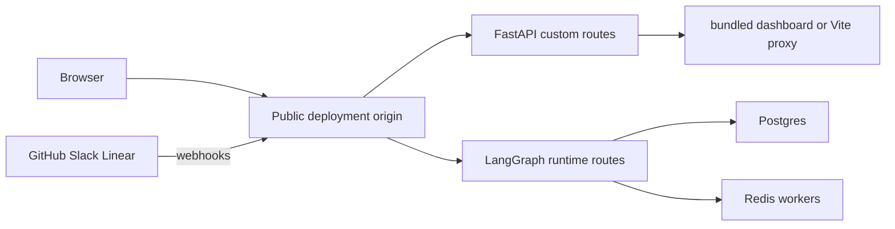

# Development, deployment, and release topology

Open SWE normally runs as one LangGraph deployment: the `agent`, `reviewer`, `analyzer`, `chat`, and `scheduler` graphs, plus `agent.webapp:app`. The FastAPI app owns the dashboard API, plan and workflow-approval APIs, health routes, and GitHub, Slack, and Linear webhook routers; LangGraph owns runtime routes. A dashboard build can be served at that same public origin, avoiding cross-origin session-cookie and CORS setup.



This topology shows the same-origin production arrangement and the boundary between custom FastAPI routes and LangGraph runtime routes.

See [Configuration](configuration.md) for the full environment contract, [Dashboard UI](../integrations/dashboard-ui.md) for browser behavior, and [Sandbox providers](../integrations/sandbox-providers.md) for sandbox configuration.

## Local development

Install the backend development extra with `make install` (`uv sync --extra dev`). `langgraph.json` is the full-serving manifest: Python 3.14, LangGraph API 0.13.3, all five graphs, `agent.webapp:app`, `.env`, and delete-on-TTL checkpoint cleanup (60-minute sweep and 43,200-minute default).

```bash
make build-dashboard
make dev
```

`make dev` first starts the local Postgres Compose service unless `POSTGRES_URI` is already set, refuses to start if port 2024 is occupied, then runs `uv run langgraph dev --no-browser --port 2024 --n-jobs-per-worker 10`. The Compose database is Postgres 16 on loopback port 5433 with a named volume; it preserves local application data when its container stops. LangGraph local state is separately persisted under `.langgraph_api` in the working directory, so only one backend should use a shared state directory at a time.

The backend's in-repository dashboard lookup is `ui/.output/public`, produced by `make build-dashboard`; `DASHBOARD_STATIC_DIR` selects another build directory. The UI catch-all declines custom API and LangGraph-owned prefixes such as `/dashboard/api`, `/webhooks`, `/health`, `/threads`, and `/runs`, preventing it from shadowing those endpoints. It serves only existing files or HTML navigation: hashed assets are immutable-cacheable and the client shell is `no-cache` so it can reference a new asset hash after deployment.

`make run` is deliberately narrower: it runs `uvicorn agent.webapp:app --reload --port 8000`, without the LangGraph runtime. Use it for FastAPI-only work; dashboard features that create LangGraph runs require `make dev`.

### Dashboard development

Use `make dev-ui` for same-origin hot reload. It runs `make web` and `make dev` concurrently, supplies `DASHBOARD_DEV_SERVER_URL=http://localhost:3000` to the backend, and keeps the browser at `http://localhost:2024`. The backend reverse-proxies non-reserved UI requests to Vite, while API and runtime routes stay local; the HMR WebSocket connects directly to port 3000.

`make web` alone invokes the dashboard's Turbo/Vite development task on port 3000. In that mode its development proxy forwards backend prefixes to `DASHBOARD_API_URL`, defaulting to `http://localhost:2024`. Opening Vite directly changes the browser origin: set `DASHBOARD_BASE_URL` and `DASHBOARD_API_BASE_URL` to `http://localhost:3000`, register `http://localhost:3000/dashboard/api/auth/callback` with the GitHub App, and configure any additional credentialed caller in `DASHBOARD_ALLOWED_ORIGINS`. The FastAPI app rejects `*` in that setting because credentialed CORS cannot safely use a wildcard.

The dashboard build invariant is that `DASHBOARD_BASE_PATH` equals the LangGraph `http.mount_prefix` where it is served. That value controls both client routing and asset URLs. For a local mounted deployment, pass `DASHBOARD_BASE_PATH=/<prefix>/ make build-dashboard` and use the mounted `LANGGRAPH_URL`; the platform build derives it from the manifest's mount prefix. A mismatch breaks asset or client-route resolution.

### Local webhook exposure

`langgraph dev` does not authenticate raw runtime routes. Do not publish port 2024 broadly. `make tunnel NGROK_DOMAIN=<name>.ngrok-free.dev` exposes port 2024 through the ngrok policy in `examples/ngrok/webhooks-only.yml`, which returns 404 outside `/webhooks/*`. This allows integration delivery while keeping dashboard and raw LangGraph access local. When Slack OAuth is configured, retain a policy that relays its callback to localhost without exposing dashboard routes. Restart `make dev` after editing `.env`, because code reload does not reload environment configuration.

## Production backend

Two backend paths are supported:

- **LangGraph Platform:** connect the repository in LangSmith Deployments and set the application environment. The `dockerfile_lines` in `langgraph.json` build the dashboard for the manifest mount prefix, copy it to `/opt/open-swe-dashboard`, stamp backend build info, and set `DASHBOARD_STATIC_DIR`. The dashboard build is best-effort, so an error leaves the backend deployable without bundled UI.
- **Standalone Docker:** run `docker build -t open-swe .`. The root image is a LangGraph API server, not a sandbox image. It uses `langchain/langgraph-api:0.13.3-py3.14`, installs the repository, registers the five graphs, FastAPI app, and checkpoint TTL through environment variables, and exposes port 8000. Unlike the platform build, it does not build the dashboard; build `ui/.output/public` before the Docker build or point `DASHBOARD_STATIC_DIR` at a supplied build.

A standalone Agent Server needs `DATABASE_URI`, `REDIS_URI`, `LANGSMITH_API_KEY`, `LANGGRAPH_CLOUD_LICENSE_KEY`, and public `LANGGRAPH_URL`, as well as the normal application configuration. Keep workers available: scale-to-zero hosting is unsuitable because background work relies on Redis- and Postgres-backed workers. When application analytics is enabled, application migrations use `POSTGRES_URI`, not `DATABASE_URI` alone.

The standalone image defaults to `LANGGRAPH_AUTH_TYPE=noop`; network clients could call raw `/threads`, `/runs`, `/assistants`, and `/store` routes. Prefer `LANGGRAPH_AUTH_TYPE=langsmith` with `LANGSMITH_AUTH_ENDPOINT` and `LANGSMITH_TENANT_ID`, or enforce an authenticated private-network/gateway boundary. Dashboard sessions and webhook signature validation protect custom routes only.

When the public URL changes, update `LANGGRAPH_URL`, webhook URLs, and the GitHub callback at `<dashboard API base URL>/dashboard/api/auth/callback`.

## Separate dashboard deployment

A separate frontend is optional. Build it from the repository root with `docker build -f ui/Dockerfile .`. The multi-stage Node 24 image does a frozen pnpm workspace install, builds the Nitro output, and serves it as user `node` on port 8080. It reads `DASHBOARD_API_URL` at request time, permitting the same image to front different backends; it throws rather than guessing a backend if the variable is absent.

In production, the Nitro proxy forwards the original path and query, streamed non-GET bodies, and distinct `Set-Cookie` headers. It preserves OAuth redirects rather than following them server-side. The separate deployment proxies `/dashboard/api/*` and `/webhooks/*` to the backend, so set the backend's `DASHBOARD_BASE_URL` and `DASHBOARD_API_BASE_URL` to the frontend origin and register that origin's GitHub callback. Alternatively, build with `VITE_DASHBOARD_API_BASE_URL` pointing directly to the backend, retain the backend API base URL, and add the frontend origin to `DASHBOARD_ALLOWED_ORIGINS`. `VITE_*` values are browser-visible build inputs and must not contain secrets.

The pnpm workspace contains `ui`, `desktop`, and `tests/e2e`. Turbo orchestrates package development, build, typecheck, test, and check tasks. Its build cache outputs include `.output/**`, `.vercel/output/**`, and `build/**`, and it treats `DASHBOARD_API_URL`, `SOURCE_COMMIT`, `VERCEL`, `E2E_HARNESS`, and `VITE_*` as build inputs. Root `lint` and formatting scripts instead run oxlint and oxfmt directly.

## Desktop packaging and boundary

The experimental Electron client bundles the compiled dashboard and a local backend resource. Packaged users choose and store a compatible organization backend URL; no maintainer-hosted backend is selected by default. Its `open-swe://app` UI proxies dashboard API traffic to that selected backend, while a private loopback LangGraph server provides **This Mac** local-agent work and stops with Electron. The desktop client does not expose the shared backend's raw LangGraph API to its browser UI.

For source development, run `make dev` and `make desktop`; the shared-backend default is `http://localhost:2024`. `--backend-url` or `OPEN_SWE_BACKEND_URL` overrides it before saved first-launch configuration and the development default. `pnpm --dir desktop run pack` creates an unpacked app and `pnpm --dir desktop run dist` creates an installer; both build the UI and package local-backend resources, rather than deploying the web application.

On macOS, `make install-desktop` rejects a dirty working tree, fast-forwards `main`, and calls `scripts/install_desktop.sh`; `make install-checkout` packages the current checkout without changing Git state. The script is macOS-only, verifies Node, `ditto`, uv, and pnpm or Corepack, runs the frozen workspace install and pack, then stages and swaps the app into `/Applications` or `~/Applications`.

`langgraph.desktop.json` is distinct from the hosted manifest: it exposes only the agent graph, uses `agent.local_auth:auth`, disables Studio authentication and the built-in UI, and configures a local checkpointer. This is the local-agent runtime boundary, not a general hosted deployment manifest.

## Operational scripts and focused checks

- Backend verification: `make test [TEST_FILE=...]` and `make integration_tests` run pytest through uv and skip a missing requested path; `make lint`, `make format`, `make format-check`, and `make typecheck` use Ruff and `ty check agent tests`. `make swagger` regenerates `swagger.json` from `agent.webapp:app`.
- `scripts/create_sandbox_snapshot.py` creates a LangSmith sandbox snapshot with `SandboxClient`. It accepts name, Docker image, filesystem capacity, and API-key options; it prints the new identifier and directs operators to set it on a workspace through the dashboard.
- `scripts/purge_wakeup_crons.py` is a one-time cleanup for expired one-shot `thread_wakeup` crons. Start with `--dry-run`; it resolves the target from `--url` or `LANGGRAPH_URL` and the key from `LANGGRAPH_API_KEY` or `LANGSMITH_API_KEY`.
