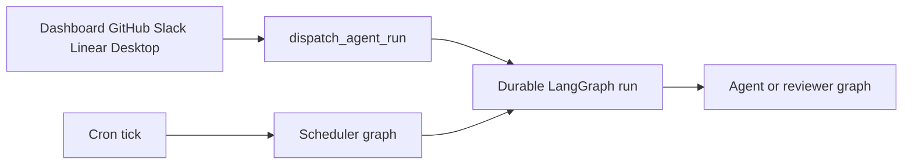

# Open SWE change guide

Open SWE is an asynchronous coding agent and software factory. A coding thread has an isolated sandbox; separate read-only reviewer and review-style analyzer graphs handle pull-request review concerns. Start with the changed code and its closest tests. Use this page to find the owner and linked context—not as a replacement for repository evidence.

## Before changing code

- Keep implementations async-only. If an interface requires a synchronous method, implement it as `raise NotImplementedError`; do not create a second sync implementation.
- Use strong Python and TypeScript types, absolute imports (apart from same-package single-dot imports), structured logging, and explicit error propagation or logging. Do not use `Any`/`any` merely to silence a type error.
- Put model-facing prompts in `agent/resources/prompts/` and load them through `load_prompt` or `render_prompt`; do not inline them in Python.
- Put a dashboard endpoint in the feature package that owns it, not in `agent/dashboard/routes.py`. A UI-exposed write operation also needs an appropriately authorized agent tool.
- Do not run the full suite locally. Add deterministic tests only for meaningful observable behavior and use the narrowest validation that proves the changed boundary.

## Local developer loop

Python requires 3.14 or later and uses `uv`; the `ui`, `desktop`, and `tests/e2e` workspace uses `pnpm`.

```bash
make install            # uv sync --extra dev
make dev                # LangGraph server on :2024
make run                # FastAPI only on :8000
make dev-ui             # Vite plus backend, served through :2024
make web                # dashboard Vite server
make desktop            # Electron wrapper; backend must already run
```

Use `make dev` for any graph or durable-run change. It starts local PostgreSQL on loopback port 5433 when `POSTGRES_URI` is absent, then serves all registered graphs, the FastAPI app, and a built dashboard when one exists. `make run` starts only `uvicorn agent.webapp:app`: it cannot create LangGraph runs. For dashboard work, `make dev-ui` runs Vite on `:3000` and has the backend front it at `:2024`, keeping browser API calls same-origin.

Follow [`docs/DEVELOPMENT.md`](../docs/DEVELOPMENT.md) for prerequisites, local credentials, state across worktrees, and webhook setup. A local tunnel must expose only `/webhooks/*`: `langgraph dev` has unauthenticated LangGraph runtime endpoints. Use the existing static ngrok domain and `make tunnel NGROK_DOMAIN=<name>.ngrok-free.dev`; preserve the Slack OAuth callback relay when it is configured.

## Find the owning boundary

`langgraph.json` is the deployment registration point. It declares five graph entrypoints and `agent.webapp:app`; each graph target is a thin `agent/graphs/` re-export, so normally change the owning module rather than its shim.

| If the change concerns… | Begin in | Then read |
| --- | --- | --- |
| Main coding-agent assembly, tools, skills, prompts, model/profile resolution, or middleware | `agent/server.py`, `agent/middleware/`, `agent/tools/` | [Coding-agent graph assembly](architecture/agent-graph.md), [Middleware stack and failure policy](architecture/middleware-stack.md), [Tool composition and authorization](concepts/tools.md), [Model selection, profiles, and instructions](concepts/models-profiles-instructions.md) |
| Thread-bound sandbox creation, reconnection, snapshots, credentials, or provider behavior | `agent/sandboxes/` | [Thread sandbox lifecycle](architecture/sandbox-lifecycle.md), [Sandbox provider integration](integrations/sandbox-providers.md) |
| Pull-request findings, reviewer preparation, review publication, analyzer behavior, or PR chat | `agent/reviewer.py`, `agent/analyzer.py`, `agent/chat.py`, `agent/review/` | [Review and review-style learning graphs](architecture/reviewer-and-analyzer.md), [Pull-request review and re-review](workflows/pr-review.md) |
| An inbound dashboard, GitHub, Slack, Linear, desktop, or automation request | trigger package and `agent/dispatch.py` | [Inbound invocation to durable run](workflows/invocation.md), [Follow-up, interruption, and completion handling](workflows/follow-up-messages.md) |
| Commits, PR delivery, workflow approval, or user continuation | `agent/github/`, `agent/threads/` | [Pull-request delivery and approval](workflows/pr-creation.md) |
| Cron work, schedules, watches, reconciliation, background tasks, or cost/feedback refresh | `agent/scheduler.py`, `agent/schedules/`, `agent/baby_sit.py` | [Scheduling, background work, and CI monitoring](workflows/scheduling-and-baby-sit.md) |
| Dashboard API, UI mount/proxy, Electron, or local-project behavior | owning feature package, `agent/dashboard/`, `ui/`, or `desktop/` | [Dashboard, web API, and desktop UI](integrations/dashboard-ui.md) |
| Webhook verification, tokens, repository/workspace access, or sandbox credential scope | trigger owner plus `agent/auth/`, `agent/github/`, or credential code | [Authentication, authorization, and credential boundaries](concepts/auth-and-security.md) |
| Environment settings, startup requirements, deployment, dashboard build, or release topology | `agent/config.py`, `langgraph.json`, `docs/` | [Configuration and settings surfaces](operations/configuration.md), [Development, deployment, and release topology](operations/deployment.md) |
| Tracing, analytics, MCP, browser, or connected-service loading | owning integration and `agent/mcp/` | [Observability and connected tools](integrations/observability-and-mcp.md) |



The diagram shows the main dispatch boundary: interactive product triggers create durable agent or reviewer runs, while scheduler ticks either perform maintenance or launch scheduled work.

## Entrypoints and invariants

| Entrypoint | Responsibility and safe-change constraint |
| --- | --- |
| `agent.graphs.agent:traced_agent` | Main coding graph. Its factory is stateless; thread continuity lives in sandbox and thread metadata. Do not automatically replace an unreachable coding sandbox because it can contain uncommitted work. |
| `agent.graphs.reviewer:traced_reviewer_agent` | Read-only review graph. It prepares a checkout and works with findings tools; it intentionally has no commit, push, or PR-opening tools, so it may replace its recreatable checkout. |
| `agent.graphs.analyzer:traced_analyzer` | Review-style analysis graph. See the reviewer/analyzer guide before altering learned review guidance. |
| `agent.graphs.chat:traced_chat_agent` | Sandbox-less PR chat. It receives virtual `/pr/` files and has GitHub-backed, repository-scoped reads; shell and file mutation tools are excluded. |
| `agent.graphs.scheduler:get_scheduler` | One-node scheduler router for stale-run reconciliation, watches, background tasks, workspace refresh, cost/feedback work, or a scheduled agent run. Preserve its explicit missing-identifier result statuses. |
| `agent.webapp:app` | Compatibility export of the composed FastAPI app. The app mounts dashboard, plan, workflow-approval, Linear, Slack, health, and GitHub routers plus the dashboard UI. |

All Slack, Linear, GitHub, and dashboard triggers use `dispatch_agent_run` for the `agent` or `reviewer` graph. It creates a durable run with `interrupt` as its default multitask strategy. A caller must provide either a prebuilt run input or source content/context/identities, never both.

The FastAPI lifespan pins the event loop and validates GitHub-login, sandbox, model, and database configuration; it migrates the database and imports legacy workspace/user store records. Failed workspace import keeps repository routing closed, while analytics and transcript-listener startup degrade with logging. At shutdown it stops those services, closes the database, and closes cached models. Credentialed CORS is installed only for configured dashboard origins and rejects `*`.

## Focused validation

Run the closest existing test first, then only the check relevant to the files changed:

```bash
make test TEST_FILE=tests/github/test_open_pull_request.py
uv run pytest -vvv tests/path/to_test.py::test_name
make lint
make format-check
make typecheck
```

`make test` runs only an existing file or directory supplied in `TEST_FILE`; direct `pytest` is best for a node id. Pytest is configured for asyncio auto mode. The shared test configuration uses an in-memory store through the production serialization path, clears process-global TTL cache and sandbox registries around each test, and enables automatic review by default. Tests that exercise PostgreSQL need `TEST_ANALYTICS_POSTGRES_URI`; without it, those paths skip.

For frontend work, run the narrow package script rather than a workspace-wide command. Escalate to one Playwright spec only when the change crosses real product boundaries:

```bash
pnpm install --frozen-lockfile
pnpm run test:e2e:install
pnpm exec playwright test tests/full_flow.spec.ts
```

The E2E harness drives real agent code, local sandbox and git, dashboard, and Electron paths, while scripting the LLM and faking external SaaS HTTP boundaries. Browser Playwright runs serially with one worker; the separate desktop configuration selects `desktop.spec.ts`. See [Focused testing and evaluation strategy](testing/overview.md) for test-family ownership, fakes, artifacts, and focused frontend commands.

## Cross-cutting context

When a change changes state shape, message construction, or policy rather than a single endpoint, read [Threads, runs, and durable state](concepts/threads-and-state.md) and [Context assembly and prompt engineering](workflows/context-engineering.md). When it changes product behavior across surfaces, use [Runtime architecture and product surfaces](architecture/overview.md) to check the host, client, dispatch, persistence, and integration boundaries before implementing.
