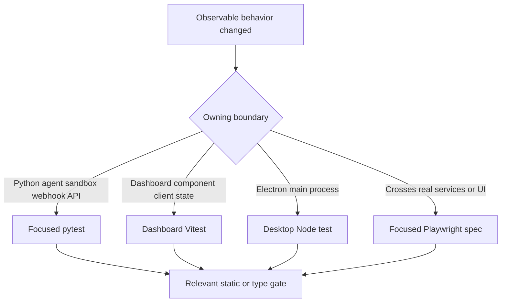
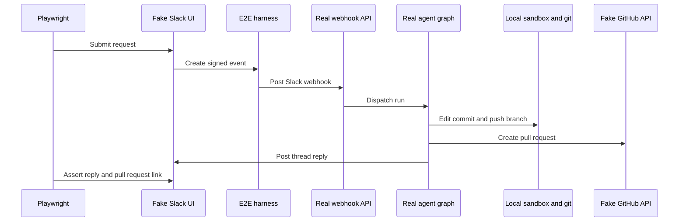

# Focused testing and evaluation strategy

Validate at the lowest layer that owns the changed **observable contract**. Start with one deterministic test or test file: pytest for Python behavior and HTTP/API policy, Vitest for dashboard rendering or client state, and the desktop Node suite for Electron main-process behavior. Use a focused Playwright spec only when the behavior depends on a real boundary crossing—webhook delivery, authenticated server-rendered dashboard, local git/sandbox execution, or Electron IPC.

Do not run the full suite locally. Tests should cover meaningful outcomes and edge cases, rather than prompt text, source layout, private call ordering, or incidental interactions that a behavior-preserving refactor would change.



The decision flow maps a change to its narrowest credible validation layer; escalation is for an integration contract, not for routine coverage.

## Python: behavior and boundary semantics

Pytest collects from `tests/` and uses asyncio auto mode, so async tests and fixtures do not need a per-test asyncio marker. The test tree is organized by owner: `tests/agent/` covers graph assembly, dispatch, settings, prompts, and run behavior; `tests/dashboard/` covers authenticated dashboard API and policy; `tests/reviewer/` covers review lifecycle and outcomes; `tests/sandbox/` covers provider and reconnect semantics; and `tests/webhooks/` covers inbound and completion handling.

Use the family that owns the failure behavior:

| Change | Focused test location and contract |
| --- | --- |
| Agent graph construction, skills, tools, middleware, model configuration, or backend wiring | `tests/agent/test_agent_assembly_context.py`. Its assertions protect the initialized `CompositeBackend` with a `SandboxBackendProxy`, which enables deepagents context eviction and summarization, as well as source-sensitive skill/tool and parent/subagent boundaries. |
| Dashboard route authorization, session behavior, CSRF/origin policy, or API response behavior | `tests/dashboard/`. For example, `test_dashboard_csrf.py` checks accepted configured, backend, and desktop origins and rejects missing, malformed, or hostile mutation origins. |
| Reviewer findings, publication, reconciliation, check runs, or feedback learning | `tests/reviewer/`. `test_reviewer_outcomes.py` maps resolved/dismissed state and GitHub/Slack feedback to true- or false-positive outcomes, including safe no-op behavior when configuration is absent. |
| Sandbox lifecycle, proxy execution, recovery, or provider behavior | `tests/sandbox/`. `test_sandbox_state.py` focuses on capture offload, lazy reconnect, concurrent startup, cancellation, retry, and metadata recovery. See [Sandbox lifecycle](/openwiki/architecture/sandbox-lifecycle.md) for the runtime model. |
| Completion failures and notification/cleanup behavior | `tests/webhooks/test_completion_webhook.py`, which covers failure replies, run bookkeeping, reviewer check cleanup, missing metadata/token, and cleanup failure isolation. |

### Shared fixtures: isolate state deliberately

`tests/conftest.py` makes ordinary Python tests independent of a running LangGraph Store and a locally built dashboard:

- `fake_store` routes `agent.store` through an in-memory `FakeStore`, but preserves the real `model_dump`/`model_validate` round trip. Seed it only when persistence is part of the behavior under test.
- Autouse fixtures point `DASHBOARD_STATIC_DIR` at a nonexistent temporary path, clear the process-global TTL cache before and after each case, and clear both global sandbox registries before and after each case. A local `ui/.output`, cached settings, or a leaked sandbox must not influence the next test.
- The default GitHub allowlist is installed for tests. The autouse auto-review stub enables every repository because the dashboard opt-in list is otherwise empty without a live Store. A test of the real opt-in gate must replace that stub with the policy it intends to prove.
- `registry_db` is an opt-in integration fixture: it creates a fresh migrated schema when `TEST_ANALYTICS_POSTGRES_URI` is configured and otherwise skips. `registry_db_if_available` lets code that degrades without PostgreSQL exercise both configured and unconfigured paths.

## Focused local commands and independent gates

Install Python development dependencies with `make install` (`uv sync --extra dev`). Pytest, pytest-asyncio, Ruff, and ty are development extras; Pygments is a runtime dependency. `make test` and `make tests` run `uv run pytest -vvv $(TEST_FILE)` only when `TEST_FILE` is an existing file or directory; otherwise they print a skip message. Since its guard cannot recognize a `file.py::test_name` node id, use direct pytest for a single test.

```bash
make install
make test TEST_FILE=tests/sandbox/test_sandbox_state.py
uv run pytest -vvv tests/sandbox/test_sandbox_state.py::test_sandbox_proxy_retries_failed_startup
```

`make integration_tests` follows the same guarded pattern for `tests/integration_tests/`; it is not a substitute for selecting an owner test, and that directory is not present in this checkout. Run static gates relevant to the edited Python surface separately: `make lint` performs Ruff checking and a format diff, `make format` fixes formatting and lint issues, and `make typecheck` runs `ty check agent tests`.

For frontend changes, target the owning workspace—not root `pnpm test`, which delegates every workspace test task to Turbo:

```bash
pnpm --filter open-swe-dashboard run test
pnpm --dir desktop run test
```

The dashboard command is `vitest run` for component and client tests. The desktop test command builds the main bundle then runs `node --test test/*.test.cjs`. Prefer those layers for rendering, client state, API-client transformation, or Electron main-process behavior before escalating to browser automation. For dashboard/backend interaction, pair the focused UI test with the owning `tests/dashboard/` API test; see [Dashboard UI](/openwiki/integrations/dashboard-ui.md).

## Controlled end-to-end evaluation

The Playwright harness exercises the real agent rather than live SaaS. It mounts the real `agent.webapp` with fake GitHub/Slack REST endpoints, mock views, and control routes. A signed simulated Slack event is posted to the real webhook route. The real graph, tools, middleware, local temp-directory sandbox, local git remote, and webhook paths execute; the scripted `BaseChatModel`, external SaaS HTTP/token boundaries, and snapshot service are replaced. The in-memory fake Slack/GitHub stores are the single source rendered by the mock UIs, so assertions observe what the real agent wrote.



This flow is the focused Slack-to-PR evaluation embodied by `full_flow.spec.ts`; it includes same-thread reply and fake-GitHub PR assertions. Other browser specs isolate dashboard/thread behavior, SSR, sandbox identity, plan approval, Slack redelivery, and workspace cases. Select the one matching the change.

The dashboard is also real: global setup builds `ui/`, starts its Nitro server, and drives that server origin rather than bypassing it through the harness. The real signed session cookie, root session gate, SSR, hydration, same-origin `/dashboard/api/*` calls, and the app server proxy are therefore exercised. Set `E2E_FORCE_UI_BUILD=1` after a UI or port change; otherwise setup reuses the built server. For invocation entrypoints and expected request context, see [Invocation workflow](/openwiki/workflows/invocation.md).

### Browser and desktop entrypoints

Install Chromium before an initial browser run, then target a spec:

```bash
pnpm install --frozen-lockfile
pnpm run test:e2e:install
pnpm exec playwright test tests/full_flow.spec.ts
pnpm run test:e2e:desktop
```

The root scripts route `test:e2e` to the browser suite and `test:e2e:desktop` to the Electron/dcode-ACP suite. Browser Playwright is serial, uses one worker and a 90-second test timeout, excludes `desktop.spec.ts`, and reuses its server outside CI. The desktop configuration selects only `desktop.spec.ts`, with 180-second test and 120-second expectation timeouts.

The Electron spec resets harness state, clones the seeded local bare remote into an isolated temporary project, injects a harness-issued `osw_session` cookie, and verifies the local file edit plus fake-GitHub PR fields. It tests the real Electron context, main process, UI, and local-agent path—not merely a mocked renderer.

## Diagnose a focused e2e failure

Browser Playwright captures screenshots on failure and retains trace/video for failed local attempts or the first CI retry. `E2E_ARTIFACTS=1` captures trace and video for every attempt under `test-results/` and `playwright-report/`. The desktop configuration disables automatic media because its spec explicitly records the Electron context trace and attaches screenshots for the unified and completed local-agent views. It removes temporary desktop state unless `E2E_KEEP_TMP` is set.

```bash
pnpm exec playwright show-report
pnpm exec playwright show-trace test-results/<test>/trace.zip
SLOW_MO=700 pnpm exec playwright test --headed
```

Inspect the trace, screenshots, and harness/fake-boundary state before extending timeouts or weakening assertions. If the behavior can be made deterministic below the browser boundary, add or adjust that narrower test instead.

## Related pages

- [Sandbox lifecycle](/openwiki/architecture/sandbox-lifecycle.md)
- [Dashboard UI](/openwiki/integrations/dashboard-ui.md)
- [Quickstart](/openwiki/quickstart.md)
- [Invocation workflow](/openwiki/workflows/invocation.md)
