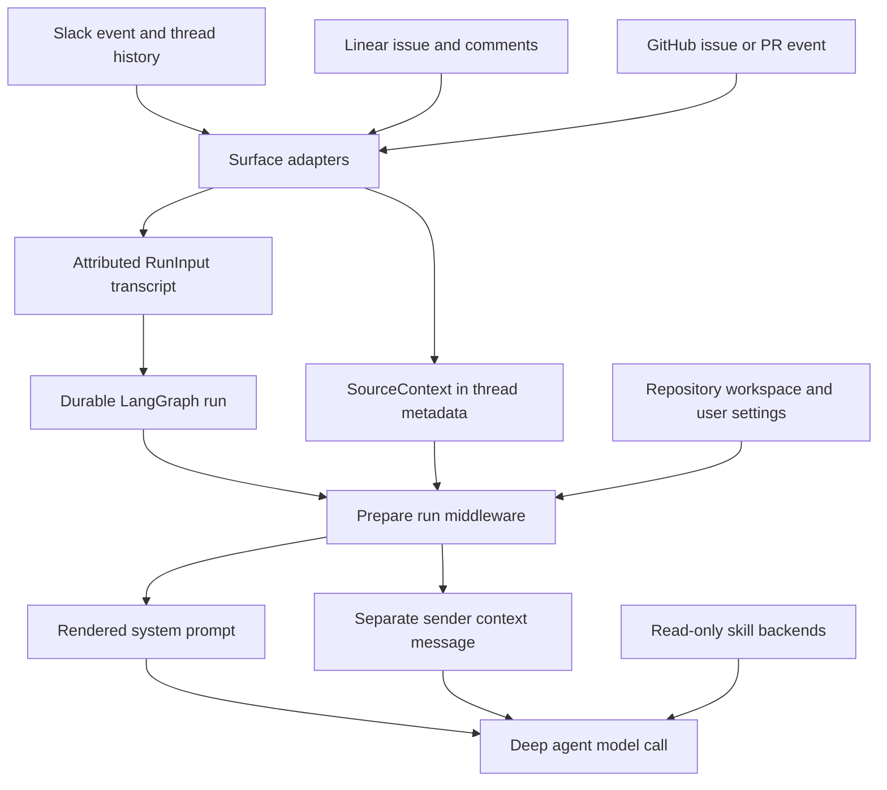

# Context assembly and prompt engineering

Open SWE keeps **what happened** separate from **what is rendered for this execution**. Webhook adapters normalize event history into a `RunInput` transcript; the thread retains routing provenance in metadata. When the graph runs, preparation resolves the current sandbox, settings, identity, and instructions, then supplies a fresh system prompt and (when needed) a separate sender-context message. This avoids changing historical user content merely because present-day context has changed.

*Context sources become a durable transcript and provenance record, while per-run preparation renders fresh prompt material without rewriting the transcript.*

[Invocation](invocation.md) describes durable run creation; [Threads and state](../concepts/threads-and-state.md) describes the state that survives between turns.

## From surface events to an attributed transcript

`dispatch_agent_run` is the common boundary for agent runs. Callers either provide a complete ordered `RunInput`, or provide raw content and identities for serialization—not both. The latter is rejected to prevent an adapter's carefully ordered transcript from being mixed with inferred identities. When it builds the input itself, the dispatcher derives Slack people and channel context from `RunConfig`, otherwise a GitHub login or Linear email, and finally a synthetic system sender. It then creates the durable run with the configured streaming and durability defaults.

The transcript is not an unstructured prompt string. `human_input` and `system_input` serialize authored text in escaped `<input-message>` envelopes containing a namespaced sender, surface, kind, optional channel, and structured data. For multimodal content, only text blocks are enveloped; non-text blocks remain intact. Entity introductions precede messages as content-hashed `<dynamic-context>` blocks for people, channels, and systems. Slack channel `topic` and `purpose` are explicitly marked `trust="untrusted"`.

Adapters retain source-specific ordering and attribution rather than relying on the generic fallback:

- **Slack** introduces the channel and each previously unseen participant, distinguishes Open SWE and third-party bots from humans, adds operational context, then appends the triggering request. For edits and button interactions, the separately known triggering user prevents attributing the request to the bot or an unknown sender.
- **Linear** makes the issue description a system message with issue data, then adds attributed comments and comment IDs. It selects comments from the trigger when possible, filters known bot responses in the recent-comment fallback, and retains downloaded image blocks alongside text.
- **GitHub** creates structured human or webhook messages with issue, PR, comment, timestamp, and message-type data. A new issue thread fetches comments to establish the initial context; an existing one uses the new follow-up or update instead.

### Identity survives compaction safely

A dynamic-context hash is SHA-256 over canonical XML, not a claimed hash supplied by input. Context construction suppresses introductions already recorded for that construction and returns the newly injected hashes so callers can persist them. However, the visible-context check starts at the deepagents summarization cutoff: an identity that remains in state but is no longer in the model-visible message suffix is eligible for reintroduction. XML parsing helpers validate namespaced IDs and ignore malformed XML rather than accepting it as identity metadata.

## Durable provenance is metadata, not model history

`SourceContext` records where a thread originated: Slack location and trigger data, a Linear issue, a GitHub issue, and/or a PR number. Surface handlers upsert it under `source_context` in LangGraph thread metadata. On later activity, `upsert_agent_thread_metadata` preserves a nonempty existing origin instead of repointing the thread, and enriches a Slack context with a permalink when available.

This model is deliberately resilient to old and distributed writers. The context and nested references allow unknown fields; `dump()` excludes unset defaults, so a read-enrich-write cycle does not manufacture fields or discard extensions. `parse()` accepts mappings and returns an empty context after validation failure, logging rather than failing a run. Provenance therefore supports routing, dashboard categorization, and replies without becoming an instruction-bearing transcript.

## Per-run prompt rendering and history integrity

The main graph is created with an empty static system prompt. `PrepareAgentRunMiddleware` runs before the agent to obtain a sandbox and work directory, resolve a GitHub token and default repository, load workspace and sender data, schedule title generation, and record run metadata. It renders `construct_system_prompt` from source guidance, setup and task instructions, default prompt configuration, repository custom instructions, workspace instructions, and relevant run options such as plan mode.

Preparation is checkpointed with a fingerprint of the middleware class, latest message, and subclass configuration. A resumed attempt whose fingerprint matches the `run_prepared_for` latch skips setup; a later message prepares fresh credentials and prompt data. Implementations must consequently be idempotent, including when an earlier execution failed before checkpointing. A sandbox-unreachable error posts its notification and is re-raised rather than producing a run without a workspace.

The middleware appends the rendered prompt to an existing system message for each model call. Sender-specific data is different: it is built as a `system:sender-context` introduction and system input after the run input. Its hash includes the current sender context, and it is not appended when already visible. This preserves cached historical message bytes and scopes identity, commit attribution, PR mode, participant identities, and personal instructions to the relevant turn.

## Instruction sources and precedence

`construct_system_prompt` conditionally inserts a configured default prompt, source guidance, repository custom instructions, and workspace instructions. The templates make repository custom instructions mandatory and give them precedence over workspace instructions; `AGENTS.md` overrides both. User standing instructions are rendered only into the per-turn sender context and explicitly lose to repository-specific instructions and `AGENTS.md`.

After synchronizing or cloning a repository, the main prompt requires reading the root `AGENTS.md` in full before other work. `SubdirAgentsReadMiddleware` adds narrower conventions dynamically: after a successful string-valued `read_file`, it reads unread ancestor `AGENTS.md` files from the sandbox, shallowest first, and appends a `<system-reminder>` saying deeper scopes win. A direct read of `AGENTS.md` marks it loaded. Each candidate is attempted once per thread; missing backends, failed reads, non-UTF-8 or blank content, and unsuitable results are ignored so the requested read still succeeds. Loaded content is limited to 1,000 lines and 64 KiB, with truncation.

Review context uses a different path because the reviewer may not have a clone. It fetches root `AGENTS.md` at the selected GitHub ref and tries `CLAUDE.md` only when the first request is a 404. HTTP errors, transport failures, and content over 64 KiB result in no root conventions rather than a potentially inappropriate fallback. For changed files, it derives ancestor paths, fetches scoped `AGENTS.md` or `CLAUDE.md` candidates concurrently with a semaphore, skips each failed candidate independently, and returns paths in shallow-to-deep order for precedence-aware rendering.

## Skills are readable extensions, not prompt bulk

The main agent mounts skills through a `CompositeBackend`: the sandbox remains the default backend while skill routes are read-only. Bundled skills are always exposed at `/bundled-skills/`. Hosted runs add organization skills at `/organization-skills/` and add user skills at `/skills/` only when the credential scope resolves a login; user skills are listed first. Desktop runs instead expose user skills from `StateBackend` and add desktop artifact routes, keeping scratch artifacts out of the project backend. `create_deep_agent` receives these route prefixes as `skills`, allowing the model to discover a skill and read its `SKILL.md` on demand.

The review-style analyzer has an independent skill route. Its launcher seeds `RunInput.files` with prefix-stripped bundled playbooks, while the analyzer maps `/skills/` to a `StateBackend`; the composite route removes that prefix before lookup. The preparation middleware chooses `bootstrap-repo-analysis` or `continual-learning` via `skill_path_for_mode` and renders an analyzer prompt that points at that playbook. The playbook is therefore available as a virtual file rather than copied into the sandbox.

## Safe changes and focused checks

Preserve the boundaries between event content, attributed transcript messages, durable provenance, and fresh system context. In particular, do not treat Slack channel fields as trusted instructions, mutate old user messages to add current sender information, or assume a dynamic identity remains visible after summarization.

Focused coverage is in `tests/agent/test_input_messages.py`, `tests/agent/test_source_context.py`, `tests/agent/test_dispatch.py`, `tests/agent/test_agents_md.py`, `tests/middleware/test_subdir_agents_middleware.py`, `tests/slack/test_slack_context.py`, and `tests/agent/test_skills.py`. These are the first checks to update for envelope escaping and reintroduction, malformed provenance, dispatch ambiguity, convention-document failures, scoped reminders, Slack attribution, and virtual-skill routing.
