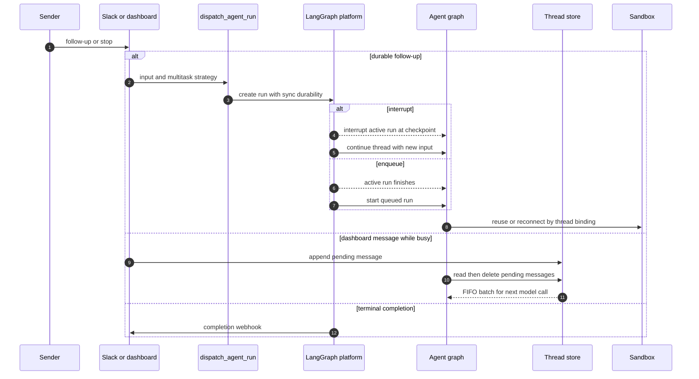

# Follow-up, interruption, and completion handling

A thread is the continuity boundary for the conversation checkpoint and its bound sandbox. New work arriving on that thread takes one of two deliberately different paths:

- A **durable follow-up run** uses a LangGraph multitask strategy. `interrupt` supersedes active work; `enqueue` waits for it. This is the normal path for externally triggered turns.
- A **store-backed pending message** is injected into an already busy run at its next before-model boundary. It is the dashboard's live-handoff path and is also used for Slack message edits.

An enqueued *run* and a queued *message* are therefore not interchangeable: the former begins after a run completes, while the latter becomes input to the run currently executing. See [Invocation](invocation.md), [Threads and state](../concepts/threads-and-state.md), [Middleware stack](../architecture/middleware-stack.md), and [Scheduling and baby-sit](scheduling-and-baby-sit.md) for their surrounding contracts.

## Durable dispatch and sandbox continuity

`dispatch_agent_run` is the shared agent/reviewer dispatch boundary. It accepts a prebuilt `RunInput` or constructs one from content and source identities, then delegates to `create_durable_run`. The durable defaults are `multitask_strategy="interrupt"`, `durability="sync"`, a resumable Protocol-v3-compatible stream configuration with subgraphs, and a fresh/resolved invocation identity in both configurable data and metadata. `sync` checkpoints before steps; resumable streaming lets a dashboard attach to a run it did not create.

Dispatch only attaches the completion webhook when `RUN_COMPLETE_WEBHOOK_SECRET` exists and `COMPLETION_WEBHOOK_URL` is absolute and non-loopback. The secret is added as a query token unless the configured URL already has a query string. This avoids a platform-rejected webhook causing `runs.create` to fail; the receiving endpoint independently fails closed on an invalid or absent token.

The follow-up continues the same thread, so sandbox acquisition is thread-bound too. It reuses a cached backend where available or reconnects using persisted `sandbox_id`. A normal agent thread does not replace a merely unreachable sandbox—replacement could hide uncommitted work. A deleted sandbox is recreated, while callers such as the read-only reviewer can opt into replacing an unreachable one.

This shows the distinct dispatch, live-message, and terminal-completion paths on one thread.

### Selecting a multitask strategy

Slack chooses urgency from the request classification: `_dispatch_or_queue_slack_run` dispatches an explicitly tagged request with `"interrupt"` and an untagged follow-up with `"enqueue"`. A Slack `message_changed` event instead queues the corrected text, avoiding a new run. Automation avoids preempting interactive work: `/baby-sit` terminal/failure follow-ups and sandbox background-task completion notifications use `"enqueue"`.

## Live message queue and middleware drain

`send_dashboard_message` is a continuation endpoint, not an idle-thread start endpoint. It authorizes posting, requires the platform thread status to be `busy`, returns 409 for an idle thread and 502 when activity cannot be determined. It updates handoff metadata and queues a payload containing text, dashboard/web identity, an attributed `github:<login>` sender, stable `queue_id`, and non-text image blocks.

`queue_message_for_thread` stores `{"content": ...}` entries in `("queue", thread_id)` under `pending_messages`. It is FIFO, caps storage at the newest 100 entries, drops older entries on overflow, and treats a duplicate dictionary `queue_id` as already queued. Queueing also records feedback activity.

`check_message_queue_before_model` runs before every model call in the reviewer graph and in normal agent mode; the agent omits it in `stop_summary` mode. It first reads the batched `("autofix", thread_id) / "pending_event"` record, clears it, and turns it into a system instruction. It then reads `pending_messages` and deletes that record before conversion, preventing duplicate delivery on a later middleware invocation. The middleware returns a `messages` state update in queue order.

Messages are rebuilt through `build_input_messages`, not appended as raw text. Ordinary blocks become an automation system message attributed to `system:thread-queue`. Dashboard content first emits a dashboard-handoff system message, then an attributed web human message. Visible dynamic-context hashes suppress context already visible to the model while honoring the summarization cutoff. Separate structured envelopes remain separate messages because the transcript parser expects one envelope per message.

For queued image URL payloads, middleware resolves the thread model once. If that model lacks vision support, it retains supplied image blocks but omits fetched URLs and adds a warning to text. A failed queue read still flushes any already assembled autofix instruction; other middleware errors are logged and let the model call proceed.

## Stop semantics

Both Slack and dashboard stop enumerate every `pending` and `running` run for the thread and call `runs.cancel_many(..., action="interrupt")`, rather than trusting possibly stale `latest_run_id`. Their treatment of deferred work intentionally differs.

### Slack emergency stop

The Slack route places a `:x:` reaction into background processing. The processor resolves a mapped agent reply to its root Slack thread (or treats the clicked message as the root), finds the mapped Open SWE thread, validates the thread's Slack channel and timestamp metadata, and only then claims a required unique event ID. Missing IDs, duplicate deliveries, unknown mappings, and metadata mismatch have no side effects.

After cancellation, Slack stop deletes both pending-message and autofix records, marks metadata with `latest_run_status="interrupted"` and `stop_requested_at_ms`, and dispatches a `stop_summary` run mapped back to the Slack thread. That specialized mode has only Slack thread reading/reply tools and excludes queue middleware, so it can summarize the interruption rather than resume work. Cancellation or cleanup failure prevents the status update and summary dispatch.

A code-channel `agent_session_stopped` event follows the same live-run cancellation and deferred-work cleanup, marks the thread interrupted, and returns the session to `active`; it deliberately does not dispatch a summary.

### Dashboard cancellation and preserved continuation

The authorized dashboard cancellation also marks the thread interrupted, but preserves `pending_messages`. If messages are present, it dispatches an empty-input agent run after cancellation and records the new pending run ID; middleware then drains the preserved queue. Failure to create that continuation produces HTTP 502 after cancellation has been requested. The administrative cancellation endpoint has its own visibility/read authorization logic and does not perform queued continuation.

## Completion webhook and user-facing settlement

`POST /webhooks/run-complete` verifies the shared query token, parses only object JSON payloads, and delegates to `handle_run_completion`. Completion finalizes invocation usage telemetry for terminal `success`, `error`, `timeout`, and `interrupted` statuses when an invocation ID is present.

`error` and `timeout`, but not `interrupted`, are terminal failures: interruption is expected when a replacement follow-up uses `interrupt`. Except for automated `thread_wakeup` failures, the handler loads thread metadata, best-effort settles reviewer and Slack status state, and posts a failure reply to the originating Slack, Linear, or GitHub location when it can identify one. Failure replies are idempotent per run ID (retaining up to 20 IDs); legacy payloads without a run ID use a thread-level flag.

On successful non-reviewer agent runs, completion clears Slack/code-channel loading state only after confirming no pending or running run remains. It schedules answer feedback except for automated wakeups. Eligible Slack runs with a valid invocation ID schedule session-cost refresh once per run and persist a bounded run-ID deduplication record.

## Operational checks and focused tests

To enable completion callbacks in a deployment, set both `RUN_COMPLETE_WEBHOOK_SECRET` and an externally reachable absolute, non-loopback `COMPLETION_WEBHOOK_URL`. Without the secret, the receiver rejects every call; with a relative or loopback URL, dispatch omits the webhook rather than risking run-creation failure.

`tests/slack/test_slack_stop.py` covers root and mapped-reply stops, cancellation of pending/running runs, deferred-work deletion, interruption metadata, summary dispatch/mapping, duplicate and missing-event safety, metadata mismatch rejection, cleanup failures, and code-channel stop without a summary. `tests/slack/test_slack_untagged_flag.py` covers tagged versus untagged Slack classification plus message-update routing, delivery mapping retries and validation, and corrected-text extraction.
