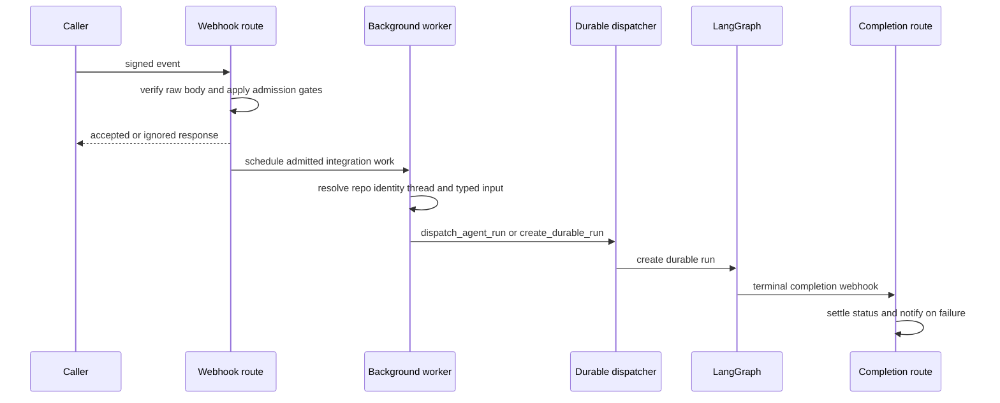

# Inbound Invocation to Durable Run

Open SWE has several ways to start work, but integration workers converge on a small durable-run contract. A trigger is admitted and attributed at its boundary, a worker resolves repository and thread context, writes source metadata where needed, constructs a typed `RunInput`, and calls `dispatch_agent_run` or `create_durable_run`. The latter is the only layer that sets the run's shared durability and stream behavior.

The FastAPI app mounts dashboard APIs, plan and workflow-approval APIs, the three integration routers, and health/completion routes. Dashboard APIs are protected by the dashboard router's same-origin mutation dependency; schedule creation, modification, manual triggering, and deletion additionally require an administrator. The dashboard run-start proxy described in earlier versions is not present in this repository: dashboard-managed invocation here is through schedules, while the dashboard UI is mounted by the application.

## End-to-end path

This sequence shows the asynchronous webhook path. Schedule ticks use the same dispatcher directly after the scheduler graph invokes `launch_scheduled_agent_run`.

## Admission is deliberately cheap and fail-closed

GitHub, Linear, and Slack read raw request bytes, validate the platform signature before JSON parsing, and return `401` on failure. Slack's verifier also receives the timestamp header, so its signature verifier can reject stale deliveries. The routes then return explicit ignored/error/accepted results and place expensive API work in `BackgroundTasks`.

GitHub first rejects unsupported event types and unassigned workspaces; a workspace lookup outage returns `503` to invite GitHub retry instead of silently losing work. It has separate branches for PR state/review, push, CI, issues, PR comments, and reviewer-finding replies. Normal issue and comment work must be directed to Open SWE; repository allowlist and public-repository organization gates are applied before corresponding workers are scheduled.

Linear accepts only a non-bot `Comment` `create` that mentions Open SWE. It chooses a repository from an explicit comment reference, then the comment author's dashboard default, then the workspace default, and rejects a missing or disallowed result. The worker receives the extracted issue and triggering-comment information rather than trusting the webhook to create a run itself.

Slack has the densest admission policy. It refuses unverified or externally shared channels; a qualifying app mention in an external shared channel gets one claimed refusal reply. It ignores bot/self messages, malformed updates, and edits without a user-visible text change. Outside code channels, ordinary messages must be an app mention or a DM; code channels instead treat every message as directed to their shared session. `claim_slack_event` gates background scheduling, making an already claimed delivery unable to start another Slack run. Before dispatch, conflicting Slack location mappings are surfaced as an error rather than guessed.

## Source-specific thread and input construction

### Slack

Slack resolves the agent thread from its channel and Slack thread timestamp before it schedules the worker. The resolver prefers an explicit stored binding, then compatible metadata, and finally a deterministic Slack UUID; contradictory metadata raises `SlackThreadMappingError`. Code channels use a common session timestamp, while an opted-in DM session also reuses a stable session timestamp.

The worker obtains channel context, the relevant history, profiles, linked GitHub identities, and optional image/file context. It records Slack source context, repository, owner/visibility, workspace, and model/plan selections in thread metadata and configurable state before dispatch. A first message can select a valid `workspace:<name>` (or legacy `env:<name>`) tag; later messages reuse the thread workspace because its sandbox is already chosen. A mapped user must also have a valid GitHub token unless the trigger is an approved bot; otherwise the worker posts an account-link or reauthentication prompt and does not dispatch.

History and the current request become identity introductions plus typed human/system envelopes. Explicit requests—and DM-session turns—use `multitask_strategy="interrupt"`; other Slack follow-ups use `"enqueue"`. An edited Slack request is placed in the thread message queue rather than started as a standalone run, including when the thread is idle.

### Linear

The Linear worker derives the thread from the immutable issue id, determines a triggering identity from comment author, creator, or assignee, and builds configuration containing repository, Linear issue source context, workspace, source, and optionally the mapped GitHub login. It writes corresponding thread metadata before dispatch. The input has a system issue description followed by typed, attributed comment messages; image URLs may cause the selected model to be replaced with a vision-capable fallback.

### GitHub and reviewer isolation

For a normal PR comment, GitHub processing first recovers a UUID embedded in an Open SWE branch. If there is none, it derives a stable thread from owner, repository, and PR number and persists the branch metadata. It obtains a mapped user token, reacts with eyes, retries token refresh once on a GitHub authentication failure, fetches comments since the last Open SWE tag, serializes each author and comment, then invokes the coding-agent trigger path.

Reviewer runs do not share coding-agent state. First reviews, re-reviews, and replies to a review finding use `reviewer_thread_id` and `assistant_id="reviewer"`; metadata and check runs are maintained on that reviewer thread. Push re-review also requires a watched reviewer thread and avoids a run if the head SHA or PR diff has not materially changed.

### Schedules, automation, and desktop execution

The dashboard schedule APIs expose authenticated listing and administrator-only mutation/manual-trigger operations. Schedule records validate five-field cron syntax and are represented by LangGraph crons targeting the `scheduler` assistant. On a tick, the scheduler graph calls `launch_scheduled_agent_run`; launch checks that the schedule is enabled and rechecks workspace repository access, then creates a fresh UUID thread with system-owned automation metadata.

A schedule can create a Slack root message before creating its agent run. If that required notification cannot be posted, launch records the error and does not run without its notification context. Otherwise it binds the Slack thread, constructs a system-origin typed input, and calls `create_durable_run`. Schedule configuration includes a new invocation id, workspace/environment, repository, model choice, and optional Slack notification details.

Desktop execution is a graph-side capability, not a separate webhook route. A run is desktop only when `RunConfig.source == "desktop"`; its requested local project path must resolve to an allowlisted project or be inside `OPEN_SWE_LOCAL_WORKTREES_DIR`.

## Thread identities and typed inputs

Thread formulas are a persisted cross-process routing contract. Slack location, Linear issue, GitHub issue/PR, and reviewer identifiers must be reproduced exactly to locate the same state; changing a namespace or stable input string orphans live threads. GitHub branch recovery extracts an embedded UUID only, falling back to the canonical PR key when no UUID exists.

`RunInput` is structured rather than an arbitrary prompt string. `human_input` and `system_input` enforce kind alignment and XML-escape authored text inside `<input-message>` envelopes. Person, channel, and system introductions are hashed `<dynamic-context>` envelopes so already-visible context can be omitted; Slack channel topic and purpose are explicitly marked untrusted.

## Durable dispatch and completion

`dispatch_agent_run` rejects a prebuilt input combined with raw content or identity arguments. Otherwise it either builds the supplied typed context or synthesizes source identities from configuration, then delegates to `create_durable_run` with the requested agent or reviewer assistant.

`create_durable_run` defaults to `multitask_strategy="interrupt"`, `durability="sync"`, and resumable streaming. It injects an invocation id and start time into configurable state and metadata, selects the v3 streaming compatibility marker, requests values, updates, messages, custom, tasks, and checkpoints stream modes, and enables subgraph streaming. Callers may override the multitask strategy, notably Slack's enqueued follow-ups.

A completion webhook is attached only when `RUN_COMPLETE_WEBHOOK_SECRET` is configured and `COMPLETION_WEBHOOK_URL` is absolute and non-loopback; unsafe configuration omits the webhook rather than breaking run creation. The completion endpoint itself fails closed on its token. Successful eligible Slack runs schedule feedback and a deduplicated session-cost refresh. For `error` and `timeout`, completion best-effort settles reviewer checks and Slack/code-channel status, then posts a source-aware Slack, Linear, or GitHub failure reply once per run. `interrupted` deliberately produces no failure reply because it is normal replacement behavior.

## Safe changes and focused verification

- Preserve raw-body signature verification before JSON parsing and retain fail-closed secrets. Test Slack replay/deduplication, external-channel refusal, bot filters, and edit identity checks.
- Treat `agent/thread_ids.py` and stored source context as compatibility surfaces. Test mapping conflicts instead of adding a Slack-thread guessing heuristic.
- Route new integration triggers through `dispatch_agent_run` or `create_durable_run`; test input exclusivity, sync durability, stream marker/modes, subgraphs, invocation correlation, and completion-webhook fallback.
- For schedule changes, test cron validation, administrator authorization, repository access at launch, fresh-thread allocation, and Slack-root-message failure.
- Test completion status handling, per-run idempotence, source-specific failure replies, reviewer cleanup, and intentional silence for interrupted runs.
