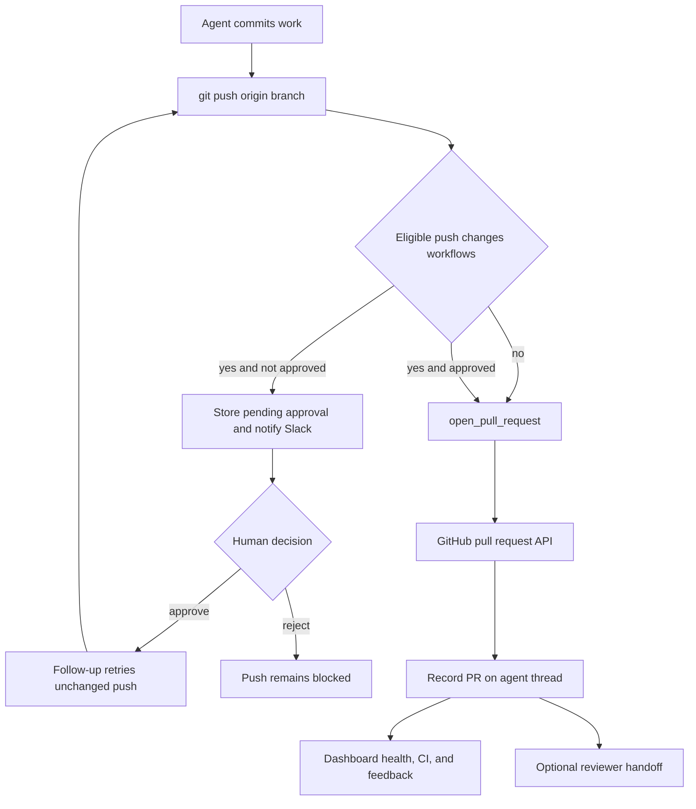

# Pull-request delivery and approval

The delivery path is **commit → push → open or update PR → CI and review feedback**. New PR creation is centralized in `open_pull_request` so it can use the triggering person's credential where available. Two middleware boundaries protect this flow: one prevents a shell fallback from creating an unattributed PR, and the other requires a human decision before a push carries changes to GitHub Actions workflows. Thread PR records connect the delivery result to Slack, dashboard status, lifecycle updates, and follow-up automation.

Caption: PR delivery is gated before the push only when an eligible push changes `.github/workflows`; approval authorizes the exact fingerprinted change.

## Create a PR through the attributed tool

Push the branch to `origin` first, then call `open_pull_request(owner, repo, head, base, title, body, draft=True, resolves_thread=False)`—not `gh pr create`. The result carries the PR URL, number, author, token kind, and a `created` flag. Use `gh pr edit` for later edits to an existing PR. On a 422 creation response, the tool looks up an open PR for the same head and returns it with `created=False`, avoiding a duplicate.

`_resolve_pr_author_token` obtains the run's PR-author login. When one exists, it resolves that login's valid OAuth token and uses it as a user token; otherwise it uses the GitHub App installation token as a bot token. If a user identity exists but has no valid OAuth token, it raises `GitHubUserAuthRequired` rather than silently changing the PR author. Before creating with a user token, the tool also verifies that the target repository belongs to the workspace installation unless a private credential login is in effect.

Before posting, preflight reads the repository and base branch, and reads the head branch when it belongs to the target owner. It distinguishes inaccessible repository/App access (`github_app_access_missing_or_repo_not_found`), an invisible branch (`github_pr_branch_not_visible`), and other preflight failures (`github_pr_preflight_failed`). Failures describe GitHub's status, selected diagnostic headers, and a bounded response body; no available token is separately reported as `no_github_token`.

### Drafts, references, and thread completion

The `draft` argument is a default, not the final policy. `open_pull_request` uses `RunConfig.draft_prs` whenever it is set. Agent construction populates that setting from the sender profile, whose `draft_prs` preference defaults to `True`; an already-existing PR is returned unchanged.

Unless the supplied body already contains `## References`, the tool may append a dashboard plan link and a link back to the source Slack thread, Linear ticket, or GitHub issue. Source links are appended only after GitHub positively confirms that the destination repository is private. An unavailable or ambiguous visibility lookup therefore fails closed for source links.

Set `resolves_thread=True` on a PR intended to finish the work. Lifecycle webhooks update the registered PR and thread metadata by persisted PR URL. A thread auto-resolves only after **all** tracked PRs are closed or merged and at least one tracked PR carries that flag. If all are terminal without that flag, it receives `attention_reason="prs_closed"`; a reopened PR clears an automatic resolution or that attention mark.

## Recording delivery and reporting health

After creation or duplicate discovery, `_record_pr_telemetry` fetches full PR details, records agent PR usage and opening feedback, then upserts a normalized record in thread `pull_requests` metadata while retaining legacy PR fields and `pr_urls`. It also saves a `PullRequest` registry record linked to the agent thread. A normalized state is `draft`, `open`, `closed`, or `merged`.

For an active Slack code-channel session, recording refreshes the repository context bar, registers the PR as an agent resource, and sets a diff view only when GitHub returns a nonempty diff. This telemetry sequence is best effort: an exception is logged rather than changing a successful PR creation result into failure. The sequence is not transactional, so an early exception can prevent later bookkeeping.

The dashboard's thread PR-status handler reads every tracked `pull_requests` record (or legacy `pr_url` fallback) and obtains live GitHub status independently. Its response can include open/closed/merged state, draft state, merge-conflict state, linked failing checks, pending and inconclusive check counts, and unresolved GraphQL review threads. `statusAvailable`, `checksAvailable`, and `commentsAvailable` explicitly distinguish unavailable data—such as missing permission or transient GitHub errors—from a healthy PR; consumers must honor those flags.

## Mutation guards

### Stop unattributed creation fallbacks

`PullRequestCreationGuardMiddleware` wraps `execute` and `background_execute`. It blocks shell attempts to create a PR outside `open_pull_request`: `gh pr create`, `gh api` submission to a `/pulls` endpoint, and `curl` submission to GitHub's pulls endpoint. It expands supported `bash`, `dash`, `sh`, and `zsh` `-c` commands only to a bounded depth; an expansion beyond the bound is itself blocked.

The result is the non-recoverable `PullRequestCreationFallbackBlocked` error with code `pr_creation_fallback_blocked`. This preserves the attributed-tool failure instead of concealing it with an unattributed substitute. Main and subagent stacks install this guard for non-local runs; both stacks install `WorkflowPushGuardMiddleware`, including local runs.

### Require approval for workflow pushes

`WorkflowPushGuardMiddleware` considers only conservative standalone `git push origin <refspec>` forms, with limited support for `git -C`, `cd … &&`, and `--set-upstream`. Unsafe shell syntax or unsupported push shapes are passed through without interpretation. For an eligible current-branch push, it compares the target against the remote branch or merge base and searches the resulting range under `.github/workflows/`. If no workflow file changed, the original push proceeds.

For workflow changes, it captures the binary diff, a bounded preview, file/addition/deletion statistics, base and head SHA, normalized remote, and a SHA-256 fingerprint of the exact change identity. Approval records are stored per thread in `workflow_push_approvals`, keyed by fingerprint. A record holds review fields, notification state, and decision metadata; persistence retains only the 20 most recent records.

An approved fingerprint lets the middleware replace the requested push command with an explicit `<head_sha>:refs/heads/<branch>` refspec. For any other state, it returns `WorkflowPushApprovalRequired`, ensures a pending record, and sends a Slack interactive request only when that record has not been notified. It marks notification complete only after Slack returns a timestamp with no error. A workflow-file change produces a new fingerprint, so it needs a new decision.

The REST surface is rooted at `/dashboard/api/workflow-approval`. Reading needs an authenticated session and a readable thread; approval and rejection additionally require a promptable thread, and all routes apply same-origin mutation protection. Approval records the session subject and dispatches a follow-up telling the agent to retry the blocked push without changing workflows. Rejection only persists the denial, leaving the push blocked.

## CI, feedback, and review

`request_pr_review` is a handoff rather than PR creation. It parses a GitHub PR URL, resolves the active Slack thread plus triggering identity from run configuration, and delegates to the GitHub review trigger. Use it only when review should start; see [PR Review](pr-review.md).

CI readers paginate GitHub check runs and legacy commit statuses and return `None` on permission or HTTP failures, keeping webhook handling best effort. The auto-fix candidate set includes only completed check runs with `failure`, `timed_out`, or `action_required` conclusions, excludes Open SWE's own check names, and excludes failure names already failing on the base SHA. The no-explicit-mention auto-fix path fails closed unless the requester has `write`, `maintain`, or `admin` repository permission.

Webhook helpers normalize the branch, head SHA, and completed-failure decision across `check_run`, `check_suite`, `workflow_run`, and legacy `status` events. The baby-sit handler does nothing until a completed failure has repository identity and a head SHA and matches an active watch by SHA or branch. See [Scheduling and Baby-sit](scheduling-and-baby-sit.md).

For GitHub feedback, `fetch_pr_comments_since_last_tag` merges issue comments, inline comments, and nonempty reviews chronologically. A first Open SWE mention returns the full conversation; later mentions return content after the preceding mention. Mention matching uses configured deployment handles and rejects a match that is only a prefix of a longer handle. Before prompt use, comment bodies are sanitized and untrusted authors' text is wrapped.

## Focused verification

`tests/github/test_open_pull_request.py` covers credential selection, preflight diagnostics, duplicate handling, references, and PR metadata behavior. `tests/github/test_pr_creation_guard.py` covers direct and nested-shell fallback detection. `agent/test_workflow_push_guard.py` covers safe command parsing, workflow diff/fingerprint construction, pending notification, and approved ref rewriting. `tests/dashboard/test_workflow_approval_api.py` covers approval-record response shaping; `tests/dashboard/test_pull_request_status.py` covers availability semantics. `tests/github/test_github_ci.py` covers CI payload classification and extraction.
