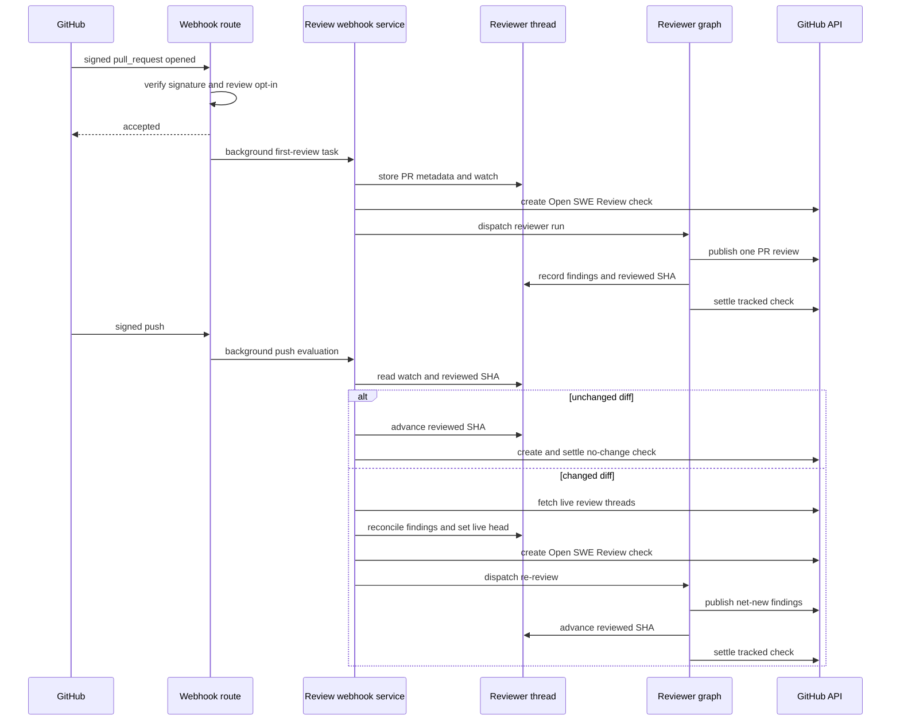

# Pull-request review and re-review

Open SWE treats review as a durable per-pull-request workflow, not a set of isolated model calls. Initial review, watched pushes, and replies to Open SWE findings all target the same canonical reviewer thread, whose metadata owns the review cursor, watch state, check state, and evolving findings list. See [Reviewer and Analyzer Architecture](../architecture/reviewer-and-analyzer.md), [Invocation Workflow](invocation.md), and [PR Creation Workflow](pr-creation.md) for related boundaries.

## Admission and entrypoints

`POST /webhooks/github` is the signed GitHub ingress. It verifies `X-Hub-Signature-256`, rejects malformed signatures with 401, ignores unsupported event types and PR actions, checks that a repository is owned by a workspace, and schedules accepted work as FastAPI background tasks. A temporary workspace-lookup failure returns 503 so GitHub can retry; a repository with no owning workspace is ignored. Automatic-review events are also opt-in: the enabled-review repository record defaults to disabled and an unavailable store is treated as not opted in rather than turning a delivery into a 500.

The review-specific entrypoints are:

- **Automatic initial review:** `pull_request` actions `opened` and `ready_for_review` are eligible after the repository opt-in and public-repository organization gate. A draft is reviewed only when the author-level `review_draft_prs` override, or its workspace fallback, permits it.
- **Explicit request:** the `request_pr_review` tool parses a GitHub PR URL, retains an active Slack thread when available, and delegates to `trigger_pr_review_from_ref`. The dashboard re-review action calls the same trigger. It fetches PR metadata, ensures the canonical thread, records PR metadata and `watch=True`, posts an in-progress status comment, and dispatches the reviewer graph.
- **Watched push:** a branch push first resolves the open PR and then requires its existing reviewer thread to be watching. It does not create review state for an otherwise unreviewed PR.
- **Finding reply:** a reply to an inline review comment is routed before ordinary mention processing. Only a reply that can be matched to an Open SWE finding reaches the reviewer.

This sequence shows the initial review, watched-push decision, re-review, and the check lifecycle; delivery acknowledgement precedes asynchronous work.

## Canonical state and invariants

`reviewer_thread_id(owner, repo, pr_number)` is UUIDv5 over `"{owner}/{repo}/pr/{pr_number}/reviewer"`. Webhooks, dashboard operations, and reviewer code re-derive that ID from the same PR identity. It is therefore a persisted routing contract: changing the formula strands live reviewer threads.

The LangGraph thread metadata is the durable state owner. It carries `kind="reviewer"`, PR identity, `head_sha`, `last_reviewed_sha`, `watch`, Slack origin when applicable, in-progress comment/check identifiers, the current reviewer run, and `findings`. This survives sandbox eviction and can be queried across threads. Dispatch uses `assistant_id="reviewer"`, which maps to `agent.graphs.reviewer:traced_reviewer_agent`.

A finding has a lifecycle (`open`, `resolved`, or `dismissed`), a fingerprint, changed-line anchor data, severity and confidence, and GitHub publication identities. Reads pass through `coerce_finding`, which converts older singular GitHub IDs and nested `surface` data to canonical identity lists plus `surface_state`. Writes use a per-thread/event-loop lock and fresh read-modify-write: no-op mutations do not overwrite concurrent updates, snapshot replacement merges by finding ID, and `append_finding` deduplicates only against open findings with the same fingerprint. If the backing reviewer thread is missing, the storage layer raises `ReviewerThreadMissingError`; tools return a structured, explicit do-not-retry response instead of burning the run on retries.

## Review preparation and finding discipline

Before the model runs, `PrepareReviewerRunMiddleware` acquires a GitHub App token, caches it for the reviewer thread, and prepares a per-thread sandbox. An unreachable sandbox may be replaced because the durable thread outlives its disposable checkout. The middleware prepares the requested checkout, materializes either the PR range or the range since `last_reviewed_sha`, and injects both diff text and a per-file/per-side changed-line set. It also obtains existing review threads and reconciles stored findings where possible.

The reviewer graph exposes review-specific tools such as `fetch_review_diff`, finding management, finding-thread reply/resolution, and `publish_review`. Its guidance asks for defensible changed-line defects rather than style-only, speculative, pre-existing, or out-of-diff criticism. PR descriptions and existing thread bodies are delimited as untrusted data to resist prompt injection. Organization guidelines, repository style, base-branch instructions, and applicable skills can refine the review bar but do not make untrusted PR text authoritative.

`add_finding` normalizes a one-ended range, requires a generated non-default title, validates severity, confidence, side, and line ordering, and checks anchors against the changed-line set. Out-of-diff anchors return `success: false`, `in_diff: false`, and a do-not-retry instruction. A file-level finding is storable but cannot become an inline GitHub comment. Suggestions over `MAX_SUGGESTION_LINES` (4) are dropped while the description-only finding remains.

## Publishing and reconciliation

Normal publication selects open, in-diff findings at or above the requested severity threshold (default `medium`) and orders them by severity descending then file and line; confidence is recorded but does not gate publication. Normal publishing is uncapped, while evaluation dry runs use `REVIEW_FINDING_CAP` (6) unless an evaluation cap is configured. Re-reviews additionally select only unsurfaced findings first seen at the live head, preventing duplicate inline comments.

`publish_review` resolves the live head from thread metadata because a mid-run push can make the run configuration stale. It first backfills from GitHub review threads, then posts one GitHub PR Review with a marker-bearing summary and inline comments (`path`, `line`, `side`, and ranges where applicable). Each inline comment embeds a finding marker, title, description, line reference, and an optional fenced suggestion. After GitHub accepts the review, its review and comment identities are recorded together on the findings; marker-based backfill protects recovery if a comment ID was not recorded.

An empty re-review with an existing Open SWE summary avoids another noisy summary, but still resolves fixed threads and advances `last_reviewed_sha`. Evaluation mode is a dry run and posts nothing. A numeric `review_id` with neither `dry_run` nor `skipped_empty_re_review` is the confirmation that GitHub received a review. If GitHub rejects a batch with an unresolved-anchor 422, the tool identifies and drops invalid anchors, retries the remaining batch once, and reports `unresolvable_findings` rather than inviting an identical retry.

Reconciliation is the bridge between persisted findings and GitHub's live review threads. It matches marker identity first, then stored thread/comment IDs; backfills publication identity; records the latest human reply after the bot comment as an interaction needing reassessment; and resolves a finding only when all matched threads are resolved. An outdated thread is terminal but is not evidence of resolution. A non-bot reply webhook reconciles, locates the parent finding, records the reply, and starts a focused `reviewer_event="finding_reply"` run.

## Watch, suppression, and completion

Watch is lifecycle-controlled: closing disables it, reopening enables it, and conversion to draft disables it only if effective draft-review settings are off. For a watched branch push, the service short-circuits on branch deletion, no open PR, no canonical reviewer thread, `watch=false`, or a head already equal to `last_reviewed_sha`.

When a new head has a diff provably unchanged since the previous review, no agent runs. The service advances `last_reviewed_sha` and creates then completes a **No new changes to review** success check on the new head, because GitHub displays checks on the current commit. A changed diff reconciles threads, refreshes PR metadata and live `head_sha`, creates an in-progress **Open SWE Review** check, and dispatches `re_review=True` with the prior reviewed SHA. `ready_for_review` follows the same re-review instruction after a prior review, but skips dispatch when its head already equals `last_reviewed_sha`.

Automatic first-review and changed-push dispatches persist `review_check_run_id`. Publishing computes and applies the completion result, clearing that ID only after the GitHub completion PATCH succeeds. On a transient PATCH failure, the intended result is retained as `review_check_pending_result`; the after-agent middleware retries it. If the agent exits without publishing and no real result is pending, the middleware settles the still-open check as `neutral`, explicitly treating an incomplete review as reviewer infrastructure failure rather than a failure in the pull request.

## Operations and focused tests

Enable automatic review explicitly through the enabled-review-repositories record; GitHub App installation does not opt every repository in. When a review appears stuck, inspect canonical thread metadata for `watch`, `head_sha`, `last_reviewed_sha`, `review_check_run_id`, and `review_check_pending_result`, then check GitHub token availability and sandbox preparation. Treat `thread_not_found` as terminal for that agent run.

`tests/reviewer/` covers automatic PR/draft gating in `test_pr_ready_auto_review.py`; watched pushes, diff-unchanged suppression, check creation, and token scoping in `test_reviewer_watch.py`; finding persistence and validation in `test_reviewer_findings.py` and `test_reviewer_tools.py`; reconciliation in `test_reviewer_reconcile.py` and `test_reconcile_sweep.py`; and publication, markers, status comments, retries, and outcomes in `test_reviewer_publish.py` and `test_reviewer_outcomes.py`.
