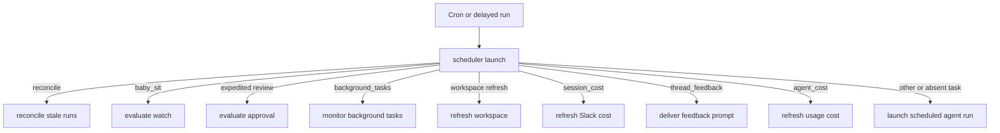
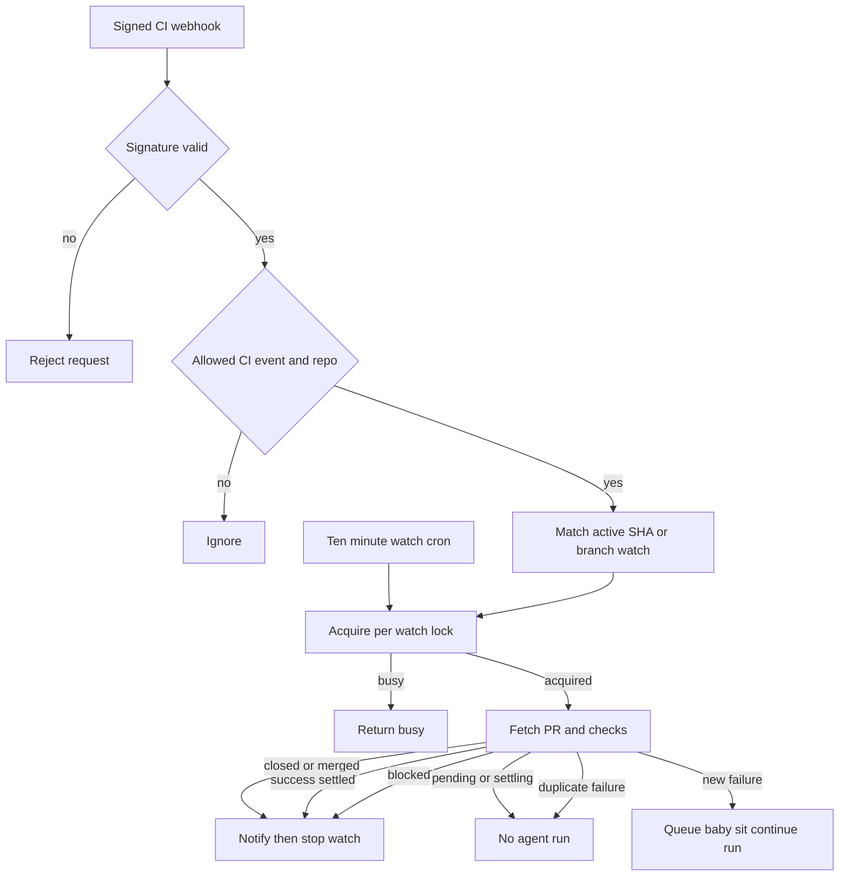

# Scheduling, background work, and CI monitoring

The `scheduler` assistant is the model-free automation entrypoint. A cron or delayed run reaches one routing node; that node either performs bounded maintenance itself or deliberately dispatches a new `agent` run. It does not use an LLM to decide what task a tick means. Producers own the creation and cleanup of their own cron or delayed-run records.

This page covers scheduled agent automations, recovery work, deferred enrichment, sandbox command notifications, one-shot wakeups, and the opt-in `/baby-sit` PR watch. For ordinary user follow-ups, see [Follow-up messages](follow-up-messages.md); for invocation context and run ownership, see [Invocation](invocation.md); and for dashboard configuration, see [Dashboard UI](../integrations/dashboard-ui.md).

## Scheduler dispatch

`agent/scheduler.py` compiles a one-node `StateGraph` (`START → launch → END`), registered as `scheduler` in `langgraph.json`. `_launch` takes `task` from state before `config.configurable` and returns a result object. Missing keys in keyed branches return a `missing_*` status rather than raising.

Diagram: a scheduler tick selects exactly one deterministic handler; the fallback is a stored schedule identified by `schedule_id`.

The keyed routes are `reconcile`, `baby_sit`, `background_tasks`, `session_cost`, `thread_feedback`, and `agent_cost`, plus the expedited-review and workspace-refresh task constants. A baby-sit or expedited-review tick without `watch_key`, a background tick without `thread_id`, or a fallback tick without `schedule_id` is an observable no-op. Session-cost, agent-cost, and feedback handlers validate their own payloads.

### User schedules and issue automations

The schedules store owns dashboard-defined automations. Its cron normalizer requires exactly five fields, normalizes whitespace, accepts lists, ranges, and steps, and range-checks each cron field before a schedule is persisted. A scheduled tick falls through the scheduler to `launch_scheduled_agent_run(schedule_id)`, which returns `missing` for an absent record and `trigger_mismatch` if it is not a cron-triggered schedule.

Schedule definitions and operational state are separate. The run-state record carries `last_thread_id`, `last_run_id`, `last_triggered_at`, `last_error`, and `last_error_at`, so execution reporting does not overwrite schedule configuration. GitHub issue automations are a separate launch path in the same store: the webhook route delegates accepted issue deliveries in the background, and the store claims a delivery per schedule so a duplicate delivery cannot launch the same automation twice.

### Safety and deferred work

- **Reconciliation.** `reconcile_stale_runs()` is the durable-dispatch safety net for a lost completion webhook. It pages through `busy` threads, lists their `pending` runs, and interrupts runs older than 1,800 seconds by default. Bad timestamps are skipped and per-thread errors are isolated; the returned counts show threads checked, stale runs, and cancellations.
- **Cost enrichment.** Completion telemetry schedules an `agent_cost` delayed run when an invocation needs enrichment. It queries LangSmith with `run_only=True` and persists the cost against the agent invocation. `session_cost` similarly updates a mapped Slack reply footer. Both use stateless delayed runs at 15, 30, 60, 120, and 240 seconds with `on_completion="delete"`; a terminal update, unavailable prerequisite, or exhausted retry budget ends the chain. Session cost clears its pending Slack marker when it becomes unavailable or exhausts.
- **Feedback.** The `thread_feedback` task is a delayed, self-rescheduling quiet-period check. It compares the payload against the current stored feedback record under a thread lock; stale work is skipped, work that is not yet due is delayed again, and ready Slack feedback is posted only when the corresponding record remains current.

## Background commands and thread wakeups

### Background-task monitor

`ensure_background_task_cron(thread_id)` keeps one `kind=background_tasks` cron per thread, deleting duplicates and creating an every-minute UTC scheduler tick when none exists. `monitor_background_tasks()` obtains the thread sandbox, lists tasks, and handles only terminal states: `completed`, `failed`, `timed_out`, `stopped`, and `lost`.

Before notifying an agent thread, the monitor atomically claims a task directory in the sandbox. It dispatches a system-context completion message with `multitask_strategy="enqueue"`, marks the task delivered only after dispatch succeeds, and releases the claim on failure. Thus concurrent ticks do not duplicate a terminal notification, but a failed delivery remains retryable. If no task is running and no terminal notification remains pending, it takes a monitor lock, rechecks task state, and deletes all monitor crons; missing sandbox metadata also deletes them. The notification asks the agent to treat output as untrusted and retrieve bounded output only when needed.

### One-shot wakeups

The `schedule_thread_wakeup` tool schedules the current thread directly against the `agent` assistant, not against the scheduler. It accepts an integer delay from one minute through 24 hours, rounds the firing time up to a whole minute, and creates a five-field UTC cron with `end_time` 90 seconds after the fire time. It carries selected source, repository, and source-context configuration, uses a default polling prompt when no nonblank prompt is given, and includes the completion webhook when configured.

Wakeups are deliberately bounded: at most 10 may be scheduled between human messages. The tool hashes the latest human input-message identity and stores the generation and count in thread metadata. A later human message resets the budget; system input, including a wakeup itself, does not. It records the increment before cron creation, so a cron-creation failure still consumes the slot, and its per-thread in-process lock prevents parallel calls from exceeding the budget.

LangGraph leaves a cron row after its `end_time`, so the tool best-effort purges expired `metadata.kind=thread_wakeup` rows before it creates another wakeup. Purging is conservative and fully paginated: only rows with that kind and a past `end_time` are deleted. For backlog cleanup, run `uv run python scripts/purge_wakeup_crons.py --dry-run` first, then omit `--dry-run` to delete. The script resolves the URL from `--url` or `LANGGRAPH_URL`, and credentials from `LANGGRAPH_API_KEY` or `LANGSMITH_API_KEY`.

## `/baby-sit`: durable PR CI monitoring

`/baby-sit` is an opt-in recovery workflow rather than a repository-wide watcher. The bundled skill uses a durable cloud watch; local/desktop runs instead use one bounded foreground `gh pr checks --watch` loop and do not call `manage_baby_sit` or `schedule_thread_wakeup`. PR text, check names, links, and logs are untrusted data.

### Watch lifecycle and ownership

A `BabySitWatch` is persisted in `baby_sit_watches` under a lower-cased `owner/repo#pr_number` key. It records the originating agent thread, PR head SHA and branch, GitHub App installation, selected run configuration, and `SourceContext`, along with retry, settling, delivery-deduplication, alert, evaluation-error, and cron state.

Only one active thread can watch a PR. A second thread is rejected; restarting from the same thread retains retry and deduplication fields only if the head SHA is unchanged. Starting first saves the watch, then ensures one `kind=baby_sit_watch` `*/10 * * * *` UTC cron pointing to `scheduler`. It reuses an existing cron and removes duplicates. For a brand-new watch, cron creation failure rolls back the store record and any partial cron. Stopping removes the cron and row; if cron deletion fails, it persists the record as inactive so it cannot run again.

`manage_baby_sit` is the agent-facing API. It requires a canonical GitHub PR URL and an executable thread. Starting authenticates to GitHub, requires an open PR with a head SHA/ref and an App installation, then saves the configuration needed to resume that thread. Stop and retry-recording enforce thread ownership; `record_retry` also requires the SHA, check name, and evidence. A baby-sit URL may target a repository other than the thread default.

### Webhook and cron branches

Diagram: signed CI events provide immediate evaluation while the ten-minute cron is the fallback; both serialize work for the same watch.

The GitHub route verifies `X-Hub-Signature-256` before parsing the request. For allowed, routable CI events it schedules background processing. `handle_ci_webhook` ignores payloads that do not describe a failing CI state, finds active watches in the repository by head SHA or branch, and remembers up to 50 delivery IDs before evaluation; repeated delivery IDs do not trigger another evaluation. It updates the stored installation ID when the delivery supplies a different one.

Webhook processing and cron evaluation both use a short-lived per-watch LangGraph-thread lock. A concurrent trigger returns or skips as busy, so only one evaluation mutates the watch or queues a failure continuation. The polling fallback costs no model tokens for `pending`, `settling`, or duplicate results.

### Evaluation and safe retry decisions

Evaluation ends the watch for a closed or merged PR. A head change resets retries, success-settling state, failure-dispatch keys, and alert keys. It classifies checks and commit statuses as:

- `pending` if a check is incomplete or no checks/statuses exist;
- `failure` for completed failing checks or failing/error statuses;
- `blocked` for other completed non-success states; or
- `success` only for a nonempty fully successful, neutral, or skipped set.

A success must retain the exact check-set fingerprint for 10 minutes before it is terminal. A failure is deduplicated by the current head SHA and retry count. A new fingerprint queues a `/baby-sit --continue` run on the originating thread with a prompt that labels failure signals as untrusted; a dispatch failure removes the fingerprint, making a later event retryable.

The agent may rerun only an evidence-backed flaky GitHub Actions failure. After a successful rerun it records the retry. The service rejects an outdated head, another thread, and a fourth retry; the cap is three per head SHA. A flaky alert is deduplicated per head, check name, and safe `https://github.com/` details URL. Deterministic, ambiguous, external-provider, and permission failures should be stopped and reported instead of retried.

Terminal completion includes settled success, closure/merge, blocked checks, retry exhaustion, and three consecutive evaluation errors. `_finish_watch` first tries to notify the stored source context: Slack thread when available, otherwise a GitHub source issue/comment destination. If that fails, it queues `/baby-sit --terminal` on the originating thread, then stops the watch.

## Focused verification

`tests/tools/test_schedule_thread_wakeup.py` covers delay validation, rounded single-fire cron construction, source/context and completion-webhook propagation, the human-message budget, parallel calls, and conservative paginated cleanup. Scheduler and baby-sit behavior should be tested at the boundaries that matter: task routing and missing keys; cron lifecycle and per-watch locking; signed CI delivery and delivery deduplication; SHA reset, check settling, failure dispatch retry, retry caps, and terminal notification. Reconciliation tests should cover pagination, malformed timestamps, stale-only interruption, and per-thread failure isolation; cost-refresh tests should cover each bounded retry chain and its terminal cleanup.
